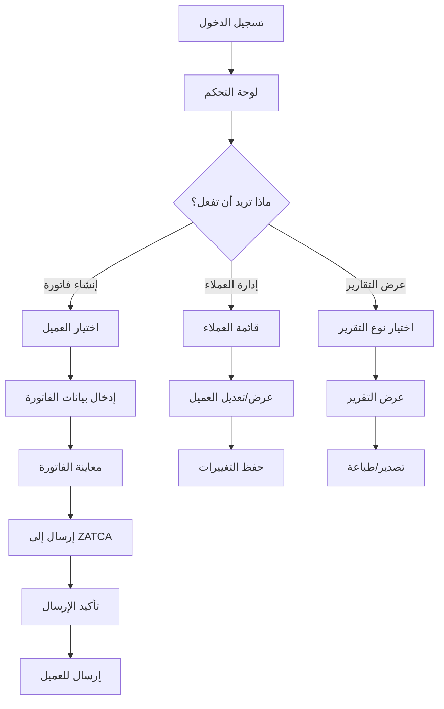

# التصميم الشامل المتكامل لمشروع بصير

## نظرة عامة على التصميم

بناءً على التحليل الشامل للمساحات والأرشيف، تم تطوير تصميم متكامل يجمع بين أفضل الممارسات والدروس المستفادة لضمان نجاح مشروع بصير.

## فلسفة التصميم

### المبادئ الأساسية
```yaml
design_philosophy:
  arabic_first: "تصميم مخصص للمستخدم العربي من الأساس"
  simplicity_with_power: "بساطة ظاهرة مع قوة تقنية عالية"
  progressive_disclosure: "كشف تدريجي للميزات حسب احتياجات المستخدم"
  contextual_intelligence: "ذكاء سياقي يفهم البيئة العربية"
  trust_through_transparency: "بناء الثقة من خلال الشفافية الكاملة"
```

### التطور التدريجي للتصميم
```yaml
design_evolution:
  phase_1_foundation:
    focus: "حل مشكلة ZATCA بتميز"
    complexity: "بساطة قصوى"
    features: "أساسية ومركزة"
    
  phase_2_intelligence:
    focus: "إضافة الذكاء والأتمتة"
    complexity: "متوسطة مع إخفاء التعقيد"
    features: "ذكية ومتقدمة"
    
  phase_3_ecosystem:
    focus: "منصة متكاملة وشاملة"
    complexity: "عالية مع تجربة سلسة"
    features: "شاملة ومترابطة"
```

## البنية المعمارية للتصميم

### هيكل المعلومات
```yaml
information_architecture:
  level_1_primary:
    - "لوحة التحكم الرئيسية"
    - "الفواتير"
    - "العملاء"
    - "التقارير"
    - "الإعدادات"
    
  level_2_secondary:
    invoices:
      - "إنشاء فاتورة جديدة"
      - "الفواتير المرسلة"
      - "المسودات"
      - "الفواتير المدفوعة"
      
    customers:
      - "قائمة العملاء"
      - "إضافة عميل جديد"
      - "تحليلات العملاء"
      
    reports:
      - "تقرير المبيعات"
      - "التقرير الضريبي"
      - "تحليل الأداء"
```

### تدفق المستخدم الأساسي


## تصميم واجهة المستخدم

### نظام الألوان العربي
```yaml
color_system:
  primary_colors:
    emerald: "#059669" # الأخضر الزمردي - الثقة والنمو
    sapphire: "#0369A1" # الأزرق الياقوتي - الاحترافية والأمان
    amber: "#D97706" # العنبر - التحفيز والطاقة
    
  semantic_colors:
    success: "#10B981" # نجاح العمليات
    warning: "#F59E0B" # تنبيهات مهمة
    error: "#EF4444" # أخطاء وتحذيرات
    info: "#3B82F6" # معلومات إضافية
    
  neutral_colors:
    gray_900: "#111827" # النصوص الأساسية
    gray_600: "#4B5563" # النصوص الثانوية
    gray_300: "#D1D5DB" # الحدود والفواصل
    gray_50: "#F9FAFB" # الخلفيات الفاتحة
```

### نظام الخطوط العربية
```yaml
typography_system:
  arabic_fonts:
    primary: "Noto Sans Arabic"
    weights: [400, 500, 600, 700]
    features: ["contextual alternates", "ligatures"]
    
  english_fonts:
    primary: "Inter"
    weights: [400, 500, 600, 700]
    features: ["tabular numbers", "case sensitive forms"]
    
  font_scales:
    display: "32px / 40px" # العناوين الرئيسية
    heading_1: "24px / 32px" # عناوين الصفحات
    heading_2: "20px / 28px" # عناوين الأقسام
    body_large: "16px / 24px" # النصوص الأساسية
    body_medium: "14px / 20px" # النصوص الثانوية
    caption: "12px / 16px" # التسميات والملاحظات
```

### نظام التخطيط والمسافات
```yaml
layout_system:
  grid_system:
    base_unit: "8px"
    columns: 12
    gutters: "16px"
    margins: "24px"
    
  spacing_scale:
    xs: "4px"
    sm: "8px"
    md: "16px"
    lg: "24px"
    xl: "32px"
    xxl: "48px"
    
  breakpoints:
    mobile: "320px - 767px"
    tablet: "768px - 1023px"
    desktop: "1024px - 1439px"
    large: "1440px+"
```

## مكونات واجهة المستخدم

### المكونات الأساسية
```yaml
core_components:
  buttons:
    primary: "للإجراءات الأساسية (إنشاء، حفظ، إرسال)"
    secondary: "للإجراءات الثانوية (إلغاء، تراجع)"
    ghost: "للإجراءات الخفيفة (تعديل، عرض)"
    
  forms:
    input_fields: "حقول إدخال مع دعم RTL كامل"
    select_dropdowns: "قوائم منسدلة مع بحث"
    date_pickers: "منتقي التواريخ الهجرية والميلادية"
    file_uploads: "رفع الملفات مع معاينة"
    
  navigation:
    top_navigation: "شريط علوي مع الشعار والإعدادات"
    side_navigation: "قائمة جانبية قابلة للطي"
    breadcrumbs: "مسار التنقل الحالي"
    tabs: "تبويبات للمحتوى المترابط"
```

### المكونات المتخصصة
```yaml
specialized_components:
  invoice_builder:
    description: "منشئ الفواتير التفاعلي"
    features:
      - "إضافة/حذف البنود بسهولة"
      - "حساب تلقائي للضرائب"
      - "معاينة فورية للفاتورة"
      - "قوالب جاهزة قابلة للتخصيص"
      
  customer_selector:
    description: "منتقي العملاء الذكي"
    features:
      - "بحث سريع بالاسم أو الرقم"
      - "إضافة عميل جديد فورياً"
      - "عرض تاريخ المعاملات"
      - "اقتراحات ذكية"
      
  zatca_status_indicator:
    description: "مؤشر حالة ZATCA"
    features:
      - "حالة الإرسال الفورية"
      - "رسائل الخطأ الواضحة"
      - "إعادة الإرسال التلقائية"
      - "سجل المحاولات"
```

## تصميم تجربة المستخدم

### رحلة المستخدم الجديد
```yaml
onboarding_journey:
  step_1_welcome:
    duration: "30 seconds"
    goal: "ترحيب وتعريف بالمنتج"
    content: "فيديو قصير يوضح الفوائد الأساسية"
    
  step_2_setup:
    duration: "2 minutes"
    goal: "إعداد الملف الشخصي والشركة"
    content: "نموذج بسيط مع التحقق من البيانات"
    
  step_3_first_invoice:
    duration: "3 minutes"
    goal: "إنشاء أول فاتورة بنجاح"
    content: "جولة تفاعلية مع بيانات تجريبية"
    
  step_4_zatca_setup:
    duration: "2 minutes"
    goal: "ربط الحساب مع ZATCA"
    content: "شرح مبسط مع خطوات واضحة"
```

### أنماط التفاعل
```yaml
interaction_patterns:
  progressive_disclosure:
    principle: "عرض المعلومات تدريجياً حسب الحاجة"
    examples:
      - "تفاصيل الفاتورة تظهر عند النقر"
      - "خيارات متقدمة مخفية افتراضياً"
      - "مساعدة سياقية عند الحاجة"
      
  contextual_actions:
    principle: "الإجراءات متاحة في السياق المناسب"
    examples:
      - "زر 'إرسال' يظهر عند اكتمال الفاتورة"
      - "خيارات العميل تظهر عند تحديده"
      - "تصدير التقرير متاح عند عرضه"
      
  smart_defaults:
    principle: "قيم افتراضية ذكية تقلل الجهد"
    examples:
      - "تاريخ اليوم كتاريخ الفاتورة"
      - "آخر عميل تم التعامل معه"
      - "معدل الضريبة الافتراضي 15%"
```

## التصميم المتجاوب

### استراتيجية Mobile-First
```yaml
responsive_strategy:
  mobile_320px:
    priority: "الميزات الأساسية فقط"
    layout: "عمود واحد، قوائم عمودية"
    navigation: "قائمة سفلية مع 4 عناصر"
    
  tablet_768px:
    priority: "ميزات متوسطة مع تفاصيل أكثر"
    layout: "عمودين، جداول مبسطة"
    navigation: "قائمة جانبية قابلة للطي"
    
  desktop_1024px:
    priority: "جميع الميزات مع تفاصيل كاملة"
    layout: "متعدد الأعمدة، جداول شاملة"
    navigation: "قائمة جانبية ثابتة"
```

### تحسينات الأداء
```yaml
performance_optimizations:
  loading_strategies:
    - "تحميل تدريجي للمحتوى"
    - "تخزين مؤقت ذكي للبيانات"
    - "ضغط الصور والأصول"
    - "تحميل كسول للمكونات"
    
  interaction_feedback:
    - "مؤشرات التحميل الفورية"
    - "تأكيدات الإجراءات الواضحة"
    - "رسائل الخطأ المفيدة"
    - "حالات الانتظار المريحة"
```

## التصميم للذكاء الاصطناعي

### واجهات الذكاء الاصطناعي
```yaml
ai_interfaces:
  smart_categorization:
    display: "اقتراحات تصنيف مع مستوى الثقة"
    interaction: "قبول/رفض/تعديل الاقتراح"
    learning: "تحسن الاقتراحات مع الاستخدام"
    
  predictive_insights:
    display: "رسوم بيانية تفاعلية مع توقعات"
    interaction: "استكشاف السيناريوهات المختلفة"
    explanation: "شرح واضح لكيفية الوصول للتوقع"
    
  intelligent_assistant:
    display: "محادثة طبيعية مع الذكاء الاصطناعي"
    interaction: "أسئلة وأجوبة باللغة العربية"
    capabilities: "مساعدة في المهام المالية المعقدة"
```

### تصميم الثقة في الذكاء الاصطناعي
```yaml
ai_trust_design:
  transparency:
    - "شرح واضح لكيفية عمل الذكاء الاصطناعي"
    - "عرض مصادر البيانات المستخدمة"
    - "إمكانية مراجعة وتصحيح القرارات"
    
  control:
    - "إمكانية تشغيل/إيقاف الميزات الذكية"
    - "تخصيص مستوى التدخل الذكي"
    - "حفظ التفضيلات الشخصية"
    
  feedback:
    - "تقييم جودة الاقتراحات"
    - "تقديم ملاحظات للتحسين"
    - "تتبع تحسن الأداء مع الوقت"
```

## إمكانية الوصول والشمولية

### معايير إمكانية الوصول
```yaml
accessibility_standards:
  wcag_compliance: "WCAG 2.1 AA"
  
  visual_accessibility:
    - "تباين ألوان عالي (4.5:1 للنصوص العادية)"
    - "دعم تكبير النص حتى 200%"
    - "بدائل نصية لجميع الصور"
    - "مؤشرات بصرية واضحة للتركيز"
    
  motor_accessibility:
    - "أهداف لمس كبيرة (44px minimum)"
    - "دعم التنقل بلوحة المفاتيح"
    - "مهلة زمنية قابلة للتمديد"
    - "تجنب الحركات المعقدة"
    
  cognitive_accessibility:
    - "لغة بسيطة وواضحة"
    - "تعليمات خطوة بخطوة"
    - "رسائل خطأ مفيدة"
    - "تجنب المحتوى الوامض"
```

### التصميم الشامل
```yaml
inclusive_design:
  language_support:
    - "دعم كامل للغة العربية مع RTL"
    - "دعم اللهجات المحلية في المحتوى"
    - "مصطلحات مالية مألوفة محلياً"
    
  cultural_sensitivity:
    - "ألوان وصور مناسبة ثقافياً"
    - "تجنب الرموز المثيرة للجدل"
    - "احترام التقاليد المالية المحلية"
    
  technical_inclusivity:
    - "دعم الأجهزة منخفضة المواصفات"
    - "عمل مع سرعات إنترنت بطيئة"
    - "دعم المتصفحات القديمة"
```

## نظام التصميم والمكونات

### مكتبة المكونات
```yaml
component_library:
  documentation: "توثيق شامل لكل مكون"
  examples: "أمثلة تفاعلية للاستخدام"
  guidelines: "إرشادات التصميم والتطوير"
  
  component_categories:
    basic: "أزرار، حقول إدخال، تسميات"
    layout: "شبكات، حاويات، فواصل"
    navigation: "قوائم، روابط، مسارات"
    feedback: "تنبيهات، رسائل، مؤشرات"
    data_display: "جداول، بطاقات، قوائم"
    specialized: "منشئ الفواتير، محرر التقارير"
```

### إدارة التصميم
```yaml
design_management:
  design_tokens:
    - "ألوان، خطوط، مسافات معرفة كرموز"
    - "مزامنة تلقائية بين التصميم والكود"
    - "إدارة مركزية للتغييرات"
    
  version_control:
    - "تتبع تغييرات التصميم"
    - "مراجعة وموافقة التحديثات"
    - "توثيق أسباب التغييرات"
    
  collaboration:
    - "أدوات تعاون بين المصممين والمطورين"
    - "مراجعات التصميم المنتظمة"
    - "اختبار المستخدمين المستمر"
```

## الخلاصة التصميمية

هذا التصميم الشامل يضمن:

### التميز التقني
- بنية معمارية قابلة للتوسع
- مكونات قابلة لإعادة الاستخدام
- أداء عالي عبر جميع المنصات

### التميز في التجربة
- تجربة عربية أصيلة ومتقنة
- سهولة استخدام استثنائية
- ذكاء اصطناعي مفيد وموثوق

### التميز في الشمولية
- إمكانية وصول كاملة
- تصميم شامل لجميع المستخدمين
- حساسية ثقافية عالية

هذا التصميم يوفر أساساً قوياً لبناء منتج متميز يحقق أهداف مشروع بصير ويتفوق على المنافسين في السوق.