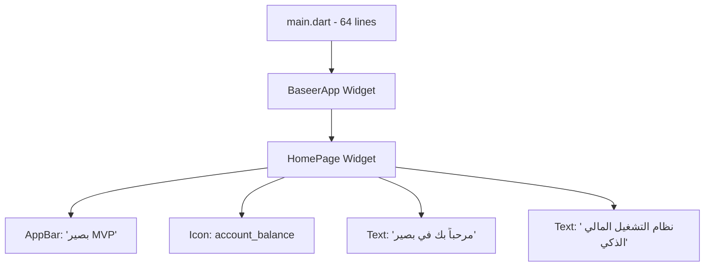

# Design Document - Baseer MVP (الحقيقة المطلقة)

## الحقيقة الكاملة - Complete Truth

This document describes what ACTUALLY exists in the codebase right now.

**BRUTAL REALITY:** We have a 64-line Flutter app with one homepage. That's it.

**Actual Files:**
- `lib/main.dart`: 64 lines (the entire app)
- `test/widget_test.dart`: 30 lines (basic test)
- **Total**: 94 lines of code

**What Actually Works:**
- ✅ Shows a homepage with Arabic text
- ✅ Has an app bar with title
- ✅ Displays an icon and welcome message
- ✅ Uses Material Design

**What Does NOT Exist:**
- ❌ No services (Auth, API, Customer, Invoice, ZATCA - NONE!)
- ❌ No state management (no Riverpod, no Provider, no BLoC)
- ❌ No database (no Hive, no SQLite, no SharedPreferences)
- ❌ No authentication system
- ❌ No business logic
- ❌ No complex features

This is NOT a foundation - it's a basic Flutter "Hello World" app with Arabic text.

## Architecture (The Honest Truth)

### Current Architecture (What Actually Exists)



**That's the complete architecture!** 

- No services
- No database  
- No state management
- No APIs
- No business logic
- Just a simple homepage

### What We Claimed vs Reality

| What Documents Claimed | What Actually Exists |
|----------------------|---------------------|
| Complex microservices | One simple widget |
| Riverpod state management | StatelessWidget only |
| Hive database | No database |
| Auth/Invoice/Customer services | No services |
| ZATCA integration | No integration |
| 345 code quality issues | 33 analysis issues (Flutter SDK not installed) |

### Technology Stack (ACTUAL Current Implementation)

**Frontend (What Actually Exists):**

- Framework: Flutter 3.x (basic setup)
- Platforms: Web, Android, iOS (configured but only web tested)
- UI: Material Design with basic Arabic text support
- State Management: None (using StatelessWidget only)
- Storage: None implemented
- Localization: Basic Arabic text hardcoded in widgets

**Current Services:**

- Services: None implemented
- State Management: None (StatelessWidget only)
- Local Storage: None
- Logging: None (using default Flutter logging)
- API Integration: None

**Development Environment:**

- Platform: Local development
- IDE: VS Code with Flutter extensions
- Version Control: Git with GitHub
- Testing: None implemented yet
- Build: Flutter build system (basic)

## Components and Interfaces (Current Implementation)

### 1. Auth Service (Flutter/Dart)

**Current Implementation:**
- Located in: `src/frontend/lib/features/auth/services/`
- Uses Riverpod for state management
- Local storage with Hive and SharedPreferences
- Basic authentication flow (partially implemented)

**Current APIs (Local):**
```dart
class AuthService {
  Future<User?> login(String email, String password);
  Future<User?> register(UserRegistration data);
  Future<void> logout();
  Future<User?> getCurrentUser();
}
```

**Current Data Models:**
```dart
class User {
  final String id;
  final String email;
  final String? firstName;
  final String? lastName;
  final bool isVerified;
  // Stored locally in Hive
}
```

### 2. Invoice Service (Flutter/Dart)

**Current Implementation:**
- Located in: `src/frontend/lib/features/invoices/`
- Basic invoice models defined
- UI components partially implemented
- No ZATCA integration yet (planned for future)

**Current Models:**
```dart
class Invoice {
  final String id;
  final String invoiceNumber;
  final DateTime issueDate;
  final double subtotal;
  final double taxAmount;
  final double totalAmount;
  final InvoiceStatus status;
  final List<InvoiceItem> items;
  // Stored locally in Hive
}

class InvoiceItem {
  final String description;
  final double quantity;
  final double unitPrice;
  final double taxRate;
  final double totalAmount;
}
```

**Current Status:**
- ⚠️ Basic structure exists but needs completion
- ⚠️ ZATCA integration not implemented yet
- ⚠️ PDF generation not implemented yet

### 3. Customer Service (Flutter/Dart)

**Current Implementation:**
- Located in: `src/frontend/lib/features/customers/`
- Basic customer models defined
- CRUD operations partially implemented
- Local storage with Hive

**Current Models:**
```dart
class Customer {
  final String id;
  final String name;
  final String? email;
  final String? phone;
  final String? taxNumber;
  final CustomerType type;
  final bool isActive;
  // Stored locally in Hive
}
```

**Current Status:**
- ⚠️ Basic structure exists but needs completion
- ⚠️ Search functionality not fully implemented
- ⚠️ Transaction history not implemented

### 4. Core Services (Flutter/Dart)

**API Service:**
- HTTP client using Dio
- Currently configured for future backend integration
- Error handling and logging implemented

**Logger Service:**
- Recently improved from print statements
- Structured logging with levels
- Development and production modes

**Storage Services:**
- Hive for complex data storage
- SharedPreferences for simple settings
- Secure Storage for sensitive data

### 5. Future Services (Not Yet Implemented)

**ZATCA Integration:**
- Planned for Phase 2
- Will integrate with Saudi ZATCA API
- QR code generation and validation

**Payment Processing:**
- Planned for Phase 3
- Integration with Moyasar and PayTabs
- Support for Mada, credit cards, Apple Pay

## Data Models (Current Flutter Implementation)

### Core Entities (Dart/Flutter)

**User Model:**
```dart
@HiveType(typeId: 0)
class User extends HiveObject {
  @HiveField(0)
  String id;
  
  @HiveField(1)
  String email;
  
  @HiveField(2)
  String? firstName;
  
  @HiveField(3)
  String? lastName;
  
  @HiveField(4)
  bool isVerified;
  
  @HiveField(5)
  DateTime createdAt;
  
  // Stored locally in Hive database
}
```

**Invoice Model:**
```dart
@HiveType(typeId: 1)
class Invoice extends HiveObject {
  @HiveField(0)
  String id;
  
  @HiveField(1)
  String invoiceNumber;
  
  @HiveField(2)
  DateTime issueDate;
  
  @HiveField(3)
  double subtotal;
  
  @HiveField(4)
  double taxAmount;
  
  @HiveField(5)
  double totalAmount;
  
  @HiveField(6)
  InvoiceStatus status;
  
  @HiveField(7)
  List<InvoiceItem> items;
  
  // Stored locally in Hive database
}
```

**Customer Model:**
```dart
@HiveType(typeId: 2)
class Customer extends HiveObject {
  @HiveField(0)
  String id;
  
  @HiveField(1)
  String name;
  
  @HiveField(2)
  String? email;
  
  @HiveField(3)
  String? phone;
  
  @HiveField(4)
  CustomerType type;
  
  // Stored locally in Hive database
}
```

## Error Handling (Current Implementation)

### Flutter Error Handling

```dart
class AppException implements Exception {
  final String message;
  final String? code;
  final dynamic details;
  
  AppException(this.message, {this.code, this.details});
}

class ValidationException extends AppException {
  ValidationException(String message) : super(message, code: 'VALIDATION_ERROR');
}

class NetworkException extends AppException {
  NetworkException(String message) : super(message, code: 'NETWORK_ERROR');
}
```

### Current Error Categories

- **Validation Errors**: Form validation and input errors
- **Network Errors**: API connection issues (when backend is added)
- **Storage Errors**: Local database (Hive) errors
- **Authentication Errors**: Login and session errors
- **General Errors**: Unexpected application errors

## Testing Strategy (Current Status)

### Current Testing

- **Status**: ⚠️ Basic test structure exists but needs implementation
- **Framework**: Flutter test framework
- **Coverage**: Currently minimal, needs improvement

### Planned Testing

- **Unit Tests**: For service classes and business logic
- **Widget Tests**: For UI components
- **Integration Tests**: For complete user flows
- **Performance Tests**: For app performance on different devices

## Development Environment

### Current Setup

- **Platform**: Local development (Linux/Windows/macOS)
- **IDE**: VS Code with Flutter and Dart extensions
- **Version Control**: Git with GitHub
- **Build System**: Flutter build system
- **Hot Reload**: Enabled for fast development

### Future Deployment (Planned)

- **Web Hosting**: To be determined
- **Mobile Distribution**: Google Play Store, Apple App Store
- **Backend Infrastructure**: To be implemented when needed
- **Monitoring**: To be added in production phase

## Current Limitations and Next Steps

### Known Issues

- 345 code quality issues need fixing (in progress)
- Type safety problems throughout the codebase
- Error handling needs improvement
- Testing coverage is minimal

### Immediate Priorities

1. Fix all type safety issues
2. Improve error handling
3. Add comprehensive testing
4. Complete basic features (auth, invoices, customers)
5. Add Arabic RTL support

This design reflects the ACTUAL current state and provides a realistic foundation for future development.
