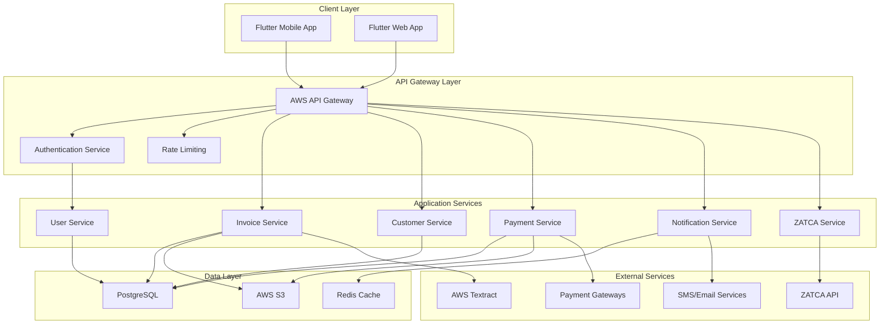
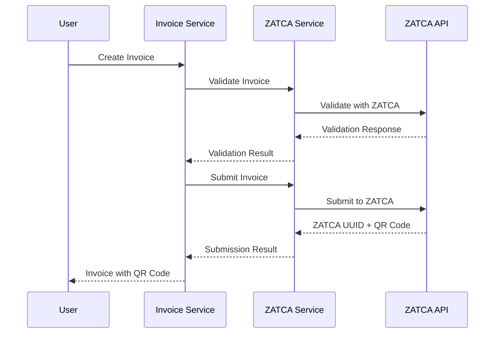

# Design Document - Baseer MVP

## Overview

This document provides the detailed technical design for the Baseer MVP, transforming the strategic vision and requirements into a concrete implementation plan. The design follows a microservices architecture with API-first approach, optimized for rapid development and future scalability.

The MVP focuses on delivering core ZATCA-compliant invoicing functionality while establishing the foundation for a comprehensive financial platform.

## Architecture

### High-Level Architecture



### Technology Stack

**Frontend:**
- Framework: Flutter 3.x with Riverpod state management
- Platforms: Web (primary), Android (secondary), iOS (future)
- UI: Material Design 3 with Arabic customization
- Offline: Hive for local storage

**Backend:**
- Language: Go 1.21+ with Gin framework
- Architecture: Microservices with API Gateway
- Database: PostgreSQL 15+ with GORM
- Cache: Redis 7+ for sessions and API responses
- Storage: AWS S3 for files and documents

**Infrastructure:**
- Cloud: AWS (Middle East - Bahrain region)
- Orchestration: AWS EKS (Kubernetes)
- CI/CD: GitHub Actions with blue-green deployment
- Monitoring: Prometheus + Grafana + ELK Stack

## Components and Interfaces

### 1. User Service

**Responsibilities:**
- User registration and authentication
- Profile management and business information
- Role-based access control
- Session management

**Key APIs:**
```go
POST   /v1/users/register
POST   /v1/users/login
POST   /v1/users/refresh-token
GET    /v1/users/profile
PUT    /v1/users/profile
POST   /v1/users/verify-otp
POST   /v1/users/reset-password
```

**Database Schema:**
```sql
CREATE TABLE users (
    id UUID PRIMARY KEY DEFAULT gen_random_uuid(),
    email VARCHAR(255) UNIQUE NOT NULL,
    phone VARCHAR(20) UNIQUE NOT NULL,
    password_hash VARCHAR(255) NOT NULL,
    is_verified BOOLEAN DEFAULT FALSE,
    is_active BOOLEAN DEFAULT TRUE,
    mfa_enabled BOOLEAN DEFAULT FALSE,
    mfa_secret VARCHAR(255),
    created_at TIMESTAMP DEFAULT CURRENT_TIMESTAMP,
    updated_at TIMESTAMP DEFAULT CURRENT_TIMESTAMP
);

CREATE TABLE user_profiles (
    id UUID PRIMARY KEY DEFAULT gen_random_uuid(),
    user_id UUID REFERENCES users(id) ON DELETE CASCADE,
    first_name VARCHAR(100) NOT NULL,
    last_name VARCHAR(100) NOT NULL,
    business_name VARCHAR(255),
    tax_number VARCHAR(50),
    commercial_registration VARCHAR(50),
    address JSONB,
    business_type VARCHAR(50),
    created_at TIMESTAMP DEFAULT CURRENT_TIMESTAMP,
    updated_at TIMESTAMP DEFAULT CURRENT_TIMESTAMP
);
```

### 2. Invoice Service

**Responsibilities:**
- Invoice creation and management
- ZATCA compliance validation
- PDF generation with QR codes
- Invoice status tracking

**Key APIs:**
```go
POST   /v1/invoices
GET    /v1/invoices
GET    /v1/invoices/{id}
PUT    /v1/invoices/{id}
DELETE /v1/invoices/{id}
POST   /v1/invoices/{id}/submit-zatca
GET    /v1/invoices/{id}/pdf
POST   /v1/invoices/{id}/send-email
```

**Database Schema:**
```sql
CREATE TABLE invoices (
    id UUID PRIMARY KEY DEFAULT gen_random_uuid(),
    user_id UUID REFERENCES users(id) ON DELETE CASCADE,
    customer_id UUID REFERENCES customers(id),
    invoice_number VARCHAR(50) UNIQUE NOT NULL,
    invoice_type VARCHAR(20) CHECK (invoice_type IN ('standard', 'simplified', 'debit_note', 'credit_note')),
    status VARCHAR(20) DEFAULT 'draft' CHECK (status IN ('draft', 'sent', 'paid', 'cancelled', 'overdue')),
    issue_date DATE NOT NULL,
    due_date DATE,
    subtotal DECIMAL(15,2) NOT NULL,
    tax_amount DECIMAL(15,2) NOT NULL,
    total_amount DECIMAL(15,2) NOT NULL,
    currency VARCHAR(3) DEFAULT 'SAR',
    zatca_uuid VARCHAR(255),
    zatca_status VARCHAR(20),
    zatca_qr_code TEXT,
    notes TEXT,
    created_at TIMESTAMP DEFAULT CURRENT_TIMESTAMP,
    updated_at TIMESTAMP DEFAULT CURRENT_TIMESTAMP
);

CREATE TABLE invoice_items (
    id UUID PRIMARY KEY DEFAULT gen_random_uuid(),
    invoice_id UUID REFERENCES invoices(id) ON DELETE CASCADE,
    description VARCHAR(500) NOT NULL,
    quantity DECIMAL(10,2) NOT NULL,
    unit_price DECIMAL(15,2) NOT NULL,
    tax_rate DECIMAL(5,2) NOT NULL,
    tax_amount DECIMAL(15,2) NOT NULL,
    total_amount DECIMAL(15,2) NOT NULL,
    created_at TIMESTAMP DEFAULT CURRENT_TIMESTAMP
);
```

### 3. Customer Service

**Responsibilities:**
- Customer profile management
- Customer categorization and segmentation
- Transaction history tracking
- Customer search and filtering

**Key APIs:**
```go
POST   /v1/customers
GET    /v1/customers
GET    /v1/customers/{id}
PUT    /v1/customers/{id}
DELETE /v1/customers/{id}
GET    /v1/customers/search?q={query}
GET    /v1/customers/{id}/transactions
```

**Database Schema:**
```sql
CREATE TABLE customers (
    id UUID PRIMARY KEY DEFAULT gen_random_uuid(),
    user_id UUID REFERENCES users(id) ON DELETE CASCADE,
    name VARCHAR(255) NOT NULL,
    email VARCHAR(255),
    phone VARCHAR(20),
    tax_number VARCHAR(50),
    customer_type VARCHAR(20) CHECK (customer_type IN ('individual', 'business')),
    address JSONB,
    is_active BOOLEAN DEFAULT TRUE,
    total_invoiced DECIMAL(15,2) DEFAULT 0,
    last_invoice_date DATE,
    created_at TIMESTAMP DEFAULT CURRENT_TIMESTAMP,
    updated_at TIMESTAMP DEFAULT CURRENT_TIMESTAMP
);

CREATE INDEX idx_customers_user_id ON customers(user_id);
CREATE INDEX idx_customers_name ON customers USING gin(to_tsvector('arabic', name));
```

### 4. Payment Service

**Responsibilities:**
- Payment gateway integration
- Payment processing and tracking
- Refund management
- Webhook handling

**Key APIs:**
```go
POST   /v1/payments/process
GET    /v1/payments/{id}
POST   /v1/payments/{id}/refund
GET    /v1/payments/history
POST   /v1/payments/webhooks/moyasar
POST   /v1/payments/webhooks/paytabs
```

**Database Schema:**
```sql
CREATE TABLE payments (
    id UUID PRIMARY KEY DEFAULT gen_random_uuid(),
    invoice_id UUID REFERENCES invoices(id),
    amount DECIMAL(15,2) NOT NULL,
    currency VARCHAR(3) DEFAULT 'SAR',
    payment_method VARCHAR(50) NOT NULL,
    gateway VARCHAR(20) NOT NULL,
    gateway_transaction_id VARCHAR(255),
    status VARCHAR(20) DEFAULT 'pending' CHECK (status IN ('pending', 'completed', 'failed', 'refunded')),
    gateway_response JSONB,
    processed_at TIMESTAMP,
    created_at TIMESTAMP DEFAULT CURRENT_TIMESTAMP
);

CREATE TABLE refunds (
    id UUID PRIMARY KEY DEFAULT gen_random_uuid(),
    payment_id UUID REFERENCES payments(id),
    amount DECIMAL(15,2) NOT NULL,
    reason TEXT,
    status VARCHAR(20) DEFAULT 'pending',
    gateway_refund_id VARCHAR(255),
    processed_at TIMESTAMP,
    created_at TIMESTAMP DEFAULT CURRENT_TIMESTAMP
);
```

### 5. ZATCA Service

**Responsibilities:**
- ZATCA API integration
- Invoice validation and submission
- QR code generation
- Compliance status tracking

**Key APIs:**
```go
POST   /v1/zatca/validate-invoice
POST   /v1/zatca/submit-invoice
GET    /v1/zatca/status/{zatca_uuid}
POST   /v1/zatca/generate-qr
```

**Integration Flow:**


## Data Models

### Core Entities

**User Entity:**
```go
type User struct {
    ID           uuid.UUID `json:"id" gorm:"type:uuid;primary_key;default:gen_random_uuid()"`
    Email        string    `json:"email" gorm:"uniqueIndex;not null"`
    Phone        string    `json:"phone" gorm:"uniqueIndex;not null"`
    PasswordHash string    `json:"-" gorm:"not null"`
    IsVerified   bool      `json:"is_verified" gorm:"default:false"`
    IsActive     bool      `json:"is_active" gorm:"default:true"`
    MFAEnabled   bool      `json:"mfa_enabled" gorm:"default:false"`
    MFASecret    string    `json:"-"`
    Profile      UserProfile `json:"profile" gorm:"foreignKey:UserID"`
    CreatedAt    time.Time `json:"created_at"`
    UpdatedAt    time.Time `json:"updated_at"`
}

type UserProfile struct {
    ID                     uuid.UUID `json:"id" gorm:"type:uuid;primary_key;default:gen_random_uuid()"`
    UserID                 uuid.UUID `json:"user_id" gorm:"type:uuid;not null"`
    FirstName              string    `json:"first_name" gorm:"not null"`
    LastName               string    `json:"last_name" gorm:"not null"`
    BusinessName           string    `json:"business_name"`
    TaxNumber              string    `json:"tax_number"`
    CommercialRegistration string    `json:"commercial_registration"`
    Address                Address   `json:"address" gorm:"type:jsonb"`
    BusinessType           string    `json:"business_type"`
    CreatedAt              time.Time `json:"created_at"`
    UpdatedAt              time.Time `json:"updated_at"`
}
```

**Invoice Entity:**
```go
type Invoice struct {
    ID            uuid.UUID     `json:"id" gorm:"type:uuid;primary_key;default:gen_random_uuid()"`
    UserID        uuid.UUID     `json:"user_id" gorm:"type:uuid;not null"`
    CustomerID    *uuid.UUID    `json:"customer_id" gorm:"type:uuid"`
    InvoiceNumber string        `json:"invoice_number" gorm:"uniqueIndex;not null"`
    InvoiceType   InvoiceType   `json:"invoice_type" gorm:"not null"`
    Status        InvoiceStatus `json:"status" gorm:"default:'draft'"`
    IssueDate     time.Time     `json:"issue_date" gorm:"not null"`
    DueDate       *time.Time    `json:"due_date"`
    Subtotal      decimal.Decimal `json:"subtotal" gorm:"type:decimal(15,2);not null"`
    TaxAmount     decimal.Decimal `json:"tax_amount" gorm:"type:decimal(15,2);not null"`
    TotalAmount   decimal.Decimal `json:"total_amount" gorm:"type:decimal(15,2);not null"`
    Currency      string        `json:"currency" gorm:"default:'SAR'"`
    ZATCAUuid     string        `json:"zatca_uuid"`
    ZATCAStatus   string        `json:"zatca_status"`
    ZATCAQRCode   string        `json:"zatca_qr_code"`
    Notes         string        `json:"notes"`
    Items         []InvoiceItem `json:"items" gorm:"foreignKey:InvoiceID"`
    Customer      *Customer     `json:"customer" gorm:"foreignKey:CustomerID"`
    CreatedAt     time.Time     `json:"created_at"`
    UpdatedAt     time.Time     `json:"updated_at"`
}
```

## Error Handling

### Error Response Format
```go
type ErrorResponse struct {
    Error   ErrorDetail `json:"error"`
    TraceID string      `json:"trace_id"`
}

type ErrorDetail struct {
    Code    string `json:"code"`
    Message string `json:"message"`
    Details string `json:"details,omitempty"`
}
```

### Error Categories
- **Validation Errors (400)**: Invalid input data
- **Authentication Errors (401)**: Invalid credentials or expired tokens
- **Authorization Errors (403)**: Insufficient permissions
- **Not Found Errors (404)**: Resource not found
- **Conflict Errors (409)**: Resource already exists
- **Rate Limit Errors (429)**: Too many requests
- **Server Errors (500)**: Internal server errors
- **Service Unavailable (503)**: External service failures

### ZATCA-Specific Error Handling
```go
type ZATCAError struct {
    Code        string `json:"code"`
    Message     string `json:"message"`
    MessageAR   string `json:"message_ar"`
    Field       string `json:"field,omitempty"`
    Suggestion  string `json:"suggestion,omitempty"`
}
```

## Testing Strategy

### Unit Testing
- **Coverage Target**: 80%+ for all services
- **Framework**: Go's built-in testing + Testify
- **Mocking**: Mockery for external dependencies
- **Database**: In-memory SQLite for fast tests

### Integration Testing
- **API Testing**: Automated tests for all endpoints
- **Database Testing**: Real PostgreSQL with test containers
- **External Services**: Mock servers for ZATCA and payment gateways
- **End-to-End**: Critical user journeys automated

### Performance Testing
- **Load Testing**: k6 for API performance
- **Database Performance**: Query optimization and indexing
- **Caching Strategy**: Redis performance testing
- **Mobile Performance**: Flutter performance profiling

### Security Testing
- **Static Analysis**: SonarQube and Snyk
- **Dynamic Testing**: OWASP ZAP
- **Penetration Testing**: Quarterly security assessments
- **Compliance Testing**: ZATCA and PDPL compliance validation

## Deployment and Operations

### Deployment Strategy
- **Environment**: Staging → Production
- **Method**: Blue-Green deployment with Kubernetes
- **Rollback**: Automatic rollback on health check failures
- **Database Migrations**: Versioned migrations with rollback support

### Monitoring and Observability
- **Metrics**: Prometheus for application and infrastructure metrics
- **Logging**: Structured logging with ELK stack
- **Tracing**: Jaeger for distributed tracing
- **Alerting**: AlertManager with PagerDuty integration

### Security Measures
- **Encryption**: AES-256 at rest, TLS 1.3 in transit
- **Authentication**: JWT with RS256 signing
- **Authorization**: RBAC with fine-grained permissions
- **Secrets**: AWS Secrets Manager for sensitive data
- **Network**: VPC with private subnets and security groups

### Backup and Recovery
- **Database**: Automated daily backups with 30-day retention
- **Files**: S3 cross-region replication
- **Configuration**: Infrastructure as Code with Terraform
- **Recovery**: RTO 4 hours, RPO 1 hour

This design provides a solid foundation for the Baseer MVP while maintaining flexibility for future enhancements and scalability requirements.