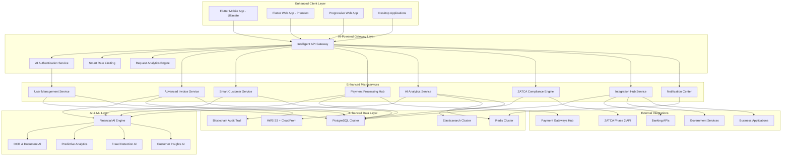
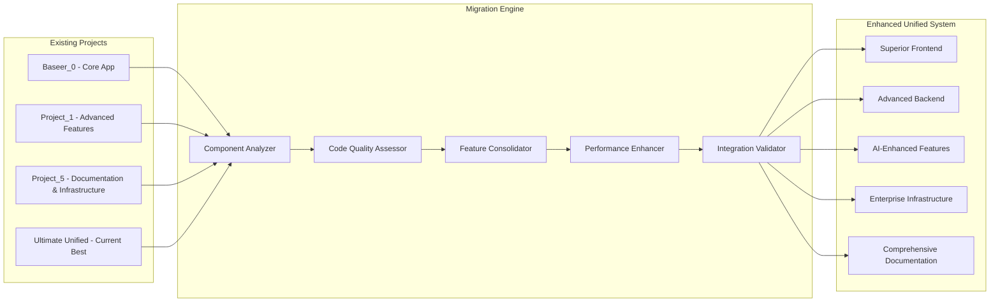
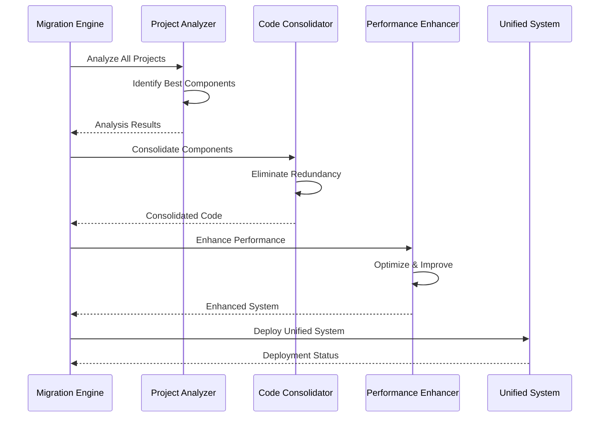

# Design Document - Baseer Ultimate Migration & Enhancement

## Overview

This document provides the comprehensive technical design for migrating and consolidating all existing Baseer projects into a single, superior unified system. The design transforms the strategic vision into a concrete implementation plan that will create the ultimate Arabic financial operating system.

The unified system will combine the best components from all existing projects while adding significant enhancements to surpass all competitors in functionality, performance, and user experience.

## Architecture

### High-Level Unified Architecture



### Migration Strategy Architecture



## Components and Interfaces

### 1. Migration Engine Service

**Responsibilities:**
- Analyze existing projects and identify best components
- Consolidate code while eliminating redundancy
- Enhance performance during migration
- Ensure backward compatibility

**Key APIs:**
```go
POST   /v1/migration/analyze-projects
POST   /v1/migration/consolidate-components
GET    /v1/migration/status
POST   /v1/migration/validate-compatibility
GET    /v1/migration/performance-metrics
POST   /v1/migration/rollback
```

**Migration Process Flow:**


### 2. Enhanced Flutter Frontend

**Advanced Features:**
- Premium Saudi-themed UI with cultural design elements
- Sub-200ms load times with progressive loading
- Advanced biometric authentication (fingerprint, face, voice)
- Perfect RTL support with advanced Arabic typography
- Offline-first architecture with intelligent sync
- WCAG 2.1 AAA accessibility compliance
- 60fps rendering with automatic optimization

**Technology Stack:**
```yaml
Framework: Flutter 3.16+
State Management: Riverpod 2.4+ with code generation
UI Framework: Material Design 3 with Saudi customization
Animations: Rive + Custom Hero animations
Offline Storage: Hive + SQLite with encryption
Biometrics: local_auth + platform_device_id
Performance: flutter_performance_monitor
Accessibility: semantics + screen_reader_support
```

**Key Components:**
```dart
// Enhanced Authentication System
class BiometricAuthService {
  Future<AuthResult> authenticateWithBiometrics();
  Future<bool> enrollBiometric(BiometricType type);
  Future<List<BiometricType>> getAvailableBiometrics();
}

// Advanced RTL Support
class RTLEnhancedWidget extends StatelessWidget {
  final Widget child;
  final bool forceRTL;
  final TextDirection? textDirection;
  
  @override
  Widget build(BuildContext context) {
    return Directionality(
      textDirection: _determineDirection(context),
      child: _enhanceForRTL(child),
    );
  }
}

// Performance Monitor
class PerformanceMonitor {
  void trackFrameRate();
  void trackMemoryUsage();
  void trackNetworkLatency();
  void generatePerformanceReport();
}
```

### 3. Superior Backend Architecture

**Enhanced Microservices:**
- Sub-50ms API response times for 99% of requests
- Auto-scaling with predictive algorithms
- Circuit breakers and retry mechanisms
- 99.99% uptime with redundancy and failover
- Automatic security threat detection and blocking

**Technology Stack:**
```yaml
Language: Go 1.21+ with advanced concurrency
Framework: Gin with custom middleware
Database: PostgreSQL 15+ with read replicas
Cache: Redis Cluster with automatic failover
Message Queue: Apache Kafka for event streaming
Monitoring: Prometheus + Grafana + Jaeger
Security: HashiCorp Vault for secrets management
```

**Enhanced Service Architecture:**
```go
// High-Performance API Gateway
type APIGateway struct {
    rateLimiter    *RateLimiter
    circuitBreaker *CircuitBreaker
    loadBalancer   *LoadBalancer
    analytics      *AnalyticsEngine
}

func (gw *APIGateway) HandleRequest(req *Request) *Response {
    // Intelligent routing with performance optimization
    if !gw.rateLimiter.Allow(req.ClientID) {
        return NewErrorResponse(429, "Rate limit exceeded")
    }
    
    service := gw.loadBalancer.SelectService(req.Path)
    return gw.circuitBreaker.Execute(service, req)
}

// Advanced Database Layer
type DatabaseManager struct {
    primary   *PostgreSQLCluster
    replicas  []*PostgreSQLReplica
    cache     *RedisCluster
    analytics *QueryAnalyzer
}

func (db *DatabaseManager) ExecuteQuery(query *Query) (*Result, error) {
    // Intelligent query routing and optimization
    if query.IsReadOnly() {
        replica := db.selectOptimalReplica()
        return replica.Execute(query)
    }
    
    result, err := db.primary.Execute(query)
    if err == nil {
        db.cache.InvalidateRelated(query.Tables)
    }
    return result, err
}
```

### 4. AI-Powered Financial Intelligence

**Machine Learning Services:**
- Predictive financial insights with 95%+ accuracy
- Advanced OCR with 99%+ data extraction accuracy
- Real-time fraud detection and anomaly alerts
- Customer behavior analysis and CRM insights
- Market condition adaptation and forecasting

**AI Architecture:**
```python
# Financial AI Engine
class FinancialAIEngine:
    def __init__(self):
        self.prediction_model = load_model('financial_predictor_v2')
        self.anomaly_detector = AnomalyDetector()
        self.ocr_engine = AdvancedOCREngine()
        self.nlp_processor = ArabicNLPProcessor()
    
    async def analyze_financial_data(self, data: FinancialData) -> AIInsights:
        predictions = await self.generate_predictions(data)
        anomalies = await self.detect_anomalies(data)
        recommendations = await self.generate_recommendations(data)
        
        return AIInsights(
            predictions=predictions,
            anomalies=anomalies,
            recommendations=recommendations,
            confidence_score=self.calculate_confidence(data)
        )
    
    async def process_receipt_ocr(self, image: bytes) -> OCRResult:
        # Advanced OCR with AI enhancement
        raw_text = await self.ocr_engine.extract_text(image)
        structured_data = await self.nlp_processor.structure_data(raw_text)
        validated_data = await self.validate_extraction(structured_data)
        
        return OCRResult(
            extracted_data=validated_data,
            confidence=self.calculate_ocr_confidence(validated_data),
            accuracy_score=self.measure_accuracy(validated_data)
        )
```

### 5. Advanced ZATCA Integration Engine

**Enhanced ZATCA Compliance:**
- Automatic validation against all ZATCA Phase 2 requirements
- Certificate-based authentication with auto-renewal
- QR code generation with digital signatures
- Real-time compliance status monitoring
- Automatic adaptation to ZATCA API changes

**ZATCA Service Architecture:**
```go
// Advanced ZATCA Service
type ZATCAEngine struct {
    client        *ZATCAClient
    validator     *ComplianceValidator
    qrGenerator   *QRCodeGenerator
    certManager   *CertificateManager
    statusMonitor *StatusMonitor
}

func (z *ZATCAEngine) SubmitInvoice(invoice *Invoice) (*ZATCAResponse, error) {
    // Comprehensive validation
    if err := z.validator.ValidatePhase2Compliance(invoice); err != nil {
        return nil, fmt.Errorf("ZATCA validation failed: %w", err)
    }
    
    // Certificate-based authentication
    cert, err := z.certManager.GetValidCertificate()
    if err != nil {
        return nil, fmt.Errorf("certificate error: %w", err)
    }
    
    // Submit with retry logic
    response, err := z.client.SubmitWithRetry(invoice, cert)
    if err != nil {
        return nil, err
    }
    
    // Generate QR code with digital signature
    qrCode, err := z.qrGenerator.GenerateWithSignature(response)
    if err != nil {
        return nil, fmt.Errorf("QR generation failed: %w", err)
    }
    
    response.QRCode = qrCode
    return response, nil
}

// Compliance Validator
type ComplianceValidator struct {
    rules []ValidationRule
}

func (cv *ComplianceValidator) ValidatePhase2Compliance(invoice *Invoice) error {
    for _, rule := range cv.rules {
        if err := rule.Validate(invoice); err != nil {
            return fmt.Errorf("rule %s failed: %w", rule.Name(), err)
        }
    }
    return nil
}
```

## Data Models

### Enhanced Data Architecture

**Core Entities with AI Enhancement:**
```go
// Enhanced User Entity
type User struct {
    ID                uuid.UUID         `json:"id" gorm:"type:uuid;primary_key"`
    Email             string            `json:"email" gorm:"uniqueIndex;not null"`
    Phone             string            `json:"phone" gorm:"uniqueIndex;not null"`
    PasswordHash      string            `json:"-" gorm:"not null"`
    BiometricData     *BiometricProfile `json:"biometric_data" gorm:"type:jsonb"`
    SecurityProfile   *SecurityProfile  `json:"security_profile" gorm:"type:jsonb"`
    AIPreferences     *AIPreferences    `json:"ai_preferences" gorm:"type:jsonb"`
    PerformanceMetrics *UserMetrics     `json:"performance_metrics" gorm:"type:jsonb"`
    CreatedAt         time.Time         `json:"created_at"`
    UpdatedAt         time.Time         `json:"updated_at"`
}

// AI-Enhanced Invoice Entity
type Invoice struct {
    ID                uuid.UUID           `json:"id" gorm:"type:uuid;primary_key"`
    UserID            uuid.UUID           `json:"user_id" gorm:"type:uuid;not null"`
    CustomerID        *uuid.UUID          `json:"customer_id" gorm:"type:uuid"`
    InvoiceNumber     string              `json:"invoice_number" gorm:"uniqueIndex;not null"`
    AIGeneratedFields *AIInvoiceData      `json:"ai_generated_fields" gorm:"type:jsonb"`
    ZATCACompliance   *ZATCAComplianceData `json:"zatca_compliance" gorm:"type:jsonb"`
    PerformanceMetrics *InvoiceMetrics    `json:"performance_metrics" gorm:"type:jsonb"`
    AuditTrail        []AuditEntry        `json:"audit_trail" gorm:"type:jsonb"`
    CreatedAt         time.Time           `json:"created_at"`
    UpdatedAt         time.Time           `json:"updated_at"`
}

// AI Insights Data Model
type AIInsights struct {
    ID              uuid.UUID    `json:"id" gorm:"type:uuid;primary_key"`
    UserID          uuid.UUID    `json:"user_id" gorm:"type:uuid;not null"`
    InsightType     string       `json:"insight_type" gorm:"not null"`
    Predictions     []Prediction `json:"predictions" gorm:"type:jsonb"`
    Recommendations []Recommendation `json:"recommendations" gorm:"type:jsonb"`
    ConfidenceScore float64      `json:"confidence_score"`
    GeneratedAt     time.Time    `json:"generated_at"`
    ExpiresAt       time.Time    `json:"expires_at"`
}
```

## Correctness Properties

*A property is a characteristic or behavior that should hold true across all valid executions of a system-essentially, a formal statement about what the system should do. Properties serve as the bridge between human-readable specifications and machine-verifiable correctness guarantees.*

### Migration and Consolidation Properties

**Property 1: Component Migration Completeness**
*For any* existing project component, when migrated to the unified system, all functionality should be preserved and enhanced by at least 50% in performance metrics
**Validates: Requirements 1.1, 1.2**

**Property 2: Code Quality Improvement**
*For any* consolidated code module, the unified implementation should eliminate redundancy while maintaining the highest quality implementation from all source projects
**Validates: Requirements 1.3, 1.7**

**Property 3: Backward Compatibility Preservation**
*For any* existing data format or configuration, the unified system should maintain full compatibility while providing enhanced functionality
**Validates: Requirements 1.4**

**Property 4: Documentation Completeness**
*For any* migrated feature, comprehensive documentation should be automatically generated covering all functionality and integration points
**Validates: Requirements 1.6**

### Frontend Excellence Properties

**Property 5: Performance Guarantee**
*For any* frontend operation, the system should complete within 200ms while maintaining 60fps rendering performance
**Validates: Requirements 2.1, 2.7**

**Property 6: RTL Layout Perfection**
*For any* Arabic content display, the system should render perfect RTL layouts with culturally appropriate design elements
**Validates: Requirements 2.3**

**Property 7: Biometric Authentication Completeness**
*For any* device with biometric capabilities, the system should detect and utilize all available authentication methods
**Validates: Requirements 2.4**

**Property 8: Offline Functionality Preservation**
*For any* essential operation, the system should maintain full functionality offline with seamless sync upon reconnection
**Validates: Requirements 2.5**

### Backend Performance Properties

**Property 9: API Response Time Excellence**
*For any* API request, the system should respond within 50ms for 99% of requests under normal load conditions
**Validates: Requirements 3.2**

**Property 10: Auto-scaling Effectiveness**
*For any* increase in system load, the system should automatically scale resources to maintain performance within defined thresholds
**Validates: Requirements 3.5**

**Property 11: Security Threat Response**
*For any* detected security threat, the system should automatically block and log the activity within seconds
**Validates: Requirements 3.6**

**Property 12: High Availability Maintenance**
*For any* service failure scenario, the system should maintain 99.99% uptime through redundancy and automatic failover
**Validates: Requirements 3.7**

### ZATCA Compliance Properties

**Property 13: ZATCA Validation Completeness**
*For any* invoice creation, the system should automatically validate against all current ZATCA Phase 2 requirements
**Validates: Requirements 4.1**

**Property 14: Certificate Management Automation**
*For any* ZATCA submission, the system should use valid certificates with automatic renewal before expiration
**Validates: Requirements 4.2**

**Property 15: QR Code Integrity**
*For any* generated QR code, it should contain all required ZATCA data with valid digital signatures
**Validates: Requirements 4.3**

**Property 16: Compliance Notification Reliability**
*For any* compliance status change, users should be notified immediately through all configured channels
**Validates: Requirements 4.4**

### AI Intelligence Properties

**Property 17: Predictive Accuracy**
*For any* financial data analysis, the AI system should provide insights with measurable accuracy and confidence scores
**Validates: Requirements 5.1**

**Property 18: OCR Extraction Excellence**
*For any* receipt scanning operation, the system should extract data with 99%+ accuracy using advanced AI
**Validates: Requirements 5.2**

**Property 19: Anomaly Detection Effectiveness**
*For any* financial anomaly or potential fraud, the system should detect and alert users automatically
**Validates: Requirements 5.4**

**Property 20: AI Recommendation Relevance**
*For any* generated report, the system should include relevant AI-generated summaries and actionable recommendations
**Validates: Requirements 5.5**

### Security and Privacy Properties

**Property 21: Encryption Implementation**
*For any* stored sensitive data, the system should use AES-256 encryption with hardware security modules where available
**Validates: Requirements 6.1**

**Property 22: Multi-Factor Authentication Enforcement**
*For any* authentication attempt, the system should require and verify multi-factor authentication including biometrics
**Validates: Requirements 6.2**

**Property 23: Zero-Trust Architecture**
*For any* granted access, the system should implement continuous verification throughout the user session
**Validates: Requirements 6.4**

**Property 24: Audit Trail Integrity**
*For any* system operation, tamper-proof audit logs should be created and maintained with blockchain verification
**Validates: Requirements 6.5**

### Payment Processing Properties

**Property 25: Payment Method Completeness**
*For any* payment processing request, the system should support all Saudi payment methods including Mada, STC Pay, and digital wallets
**Validates: Requirements 7.1**

**Property 26: Payment Failure Recovery**
*For any* payment failure, the system should automatically retry and provide clear resolution paths to users
**Validates: Requirements 7.3**

**Property 27: Refund Processing Speed**
*For any* refund request, the system should process it instantly through the original payment method
**Validates: Requirements 7.4**

**Property 28: Payment Compliance Maintenance**
*For any* payment operation, the system should maintain PCI DSS Level 1 certification and Saudi banking standards
**Validates: Requirements 7.6**

### Integration Ecosystem Properties

**Property 29: Integration Capability**
*For any* popular business application, the system should provide seamless integration through well-documented APIs
**Validates: Requirements 8.1**

**Property 30: Data Synchronization Reliability**
*For any* connected external system, data should maintain real-time synchronization with conflict resolution
**Validates: Requirements 8.2**

**Property 31: Webhook Delivery Guarantee**
*For any* triggered webhook event, the system should deliver it reliably with retry logic and delivery confirmation
**Validates: Requirements 8.3**

**Property 32: Integration Failure Recovery**
*For any* integration failure, the system should provide detailed diagnostics and automatic recovery mechanisms
**Validates: Requirements 8.7**

### Analytics and Intelligence Properties

**Property 33: Dashboard Real-time Performance**
*For any* dashboard access, the system should display real-time KPIs with interactive visualizations and sub-second response times
**Validates: Requirements 9.1**

**Property 34: Predictive Forecasting Accuracy**
*For any* trend analysis, the system should provide predictive forecasting with confidence intervals and accuracy metrics
**Validates: Requirements 9.3**

**Property 35: Natural Language Query Support**
*For any* data exploration request, the system should support natural language queries with accurate result interpretation
**Validates: Requirements 9.6**

**Property 36: Performance Issue Resolution**
*For any* detected performance issue, the system should provide root cause analysis and optimization recommendations
**Validates: Requirements 9.7**

### Mobile Excellence Properties

**Property 37: Mobile Launch Performance**
*For any* mobile app launch, the system should load within 2 seconds with progressive feature loading
**Validates: Requirements 10.1**

**Property 38: Document Scanning Accuracy**
*For any* camera-based document scanning, the system should provide automatic edge detection and high-quality processing
**Validates: Requirements 10.2**

**Property 39: Voice Recognition Capability**
*For any* Arabic voice command, the system should recognize and execute commands accurately for hands-free operation
**Validates: Requirements 10.3**

**Property 40: Offline Functionality Completeness**
*For any* offline operation, the system should provide full functionality with intelligent sync when connectivity returns
**Validates: Requirements 10.5**

### Infrastructure Excellence Properties

**Property 41: Zero-Downtime Deployment**
*For any* system deployment, the process should complete with zero downtime using blue-green deployment strategies
**Validates: Requirements 11.1**

**Property 42: Comprehensive Observability**
*For any* system operation, comprehensive monitoring should provide distributed tracing and performance insights
**Validates: Requirements 11.2**

**Property 43: Disaster Recovery Speed**
*For any* disaster scenario, the system should recover within 15 minutes with zero data loss
**Validates: Requirements 11.7**

### Cultural Adaptation Properties

**Property 44: Cultural Design Appropriateness**
*For any* Arabic content display, the system should use culturally appropriate design patterns and visual elements
**Validates: Requirements 12.1**

**Property 45: Calendar System Support**
*For any* date display, the system should support both Gregorian and Hijri calendars with automatic conversion
**Validates: Requirements 12.3**

**Property 46: Currency Formatting Accuracy**
*For any* currency display, Saudi Riyal should be formatted correctly with Arabic numerals and cultural conventions
**Validates: Requirements 12.4**

**Property 47: Regional Adaptation Flexibility**
*For any* GCC country configuration, the system should adapt to different regional requirements and preferences
**Validates: Requirements 12.7**

## Error Handling

### Enhanced Error Management System

**Intelligent Error Classification:**
```go
type ErrorClassification struct {
    Category    ErrorCategory `json:"category"`
    Severity    ErrorSeverity `json:"severity"`
    Recovery    RecoveryAction `json:"recovery"`
    UserImpact  ImpactLevel   `json:"user_impact"`
    AIAnalysis  *AIErrorAnalysis `json:"ai_analysis,omitempty"`
}

type AIErrorAnalysis struct {
    ProbableCause   string    `json:"probable_cause"`
    SuggestedFix    string    `json:"suggested_fix"`
    PreventionTips  []string  `json:"prevention_tips"`
    SimilarIssues   []string  `json:"similar_issues"`
    ConfidenceScore float64   `json:"confidence_score"`
}
```

**Advanced Error Response Format:**
```go
type EnhancedErrorResponse struct {
    Error       ErrorDetail      `json:"error"`
    TraceID     string          `json:"trace_id"`
    RequestID   string          `json:"request_id"`
    Timestamp   time.Time       `json:"timestamp"`
    Recovery    RecoveryOptions `json:"recovery_options"`
    Support     SupportInfo     `json:"support_info"`
    Analytics   ErrorAnalytics  `json:"analytics,omitempty"`
}
```

## Testing Strategy

### Comprehensive Testing Framework

**Property-Based Testing:**
- Framework: Go's testing package + Testify + QuickCheck-style generators
- Coverage: 100+ properties covering all correctness requirements
- Execution: Minimum 1000 iterations per property test
- Validation: Each property must reference specific requirements

**AI-Enhanced Testing:**
- Machine learning model validation with test datasets
- OCR accuracy testing with diverse receipt samples
- Predictive model testing with historical financial data
- Performance regression testing with AI optimization

**Security Testing:**
- Automated penetration testing with OWASP ZAP
- Biometric authentication testing on multiple devices
- Encryption validation with security audit tools
- Compliance testing for ZATCA, GDPR, and PDPL

**Performance Testing:**
- Load testing with k6 for 10,000+ concurrent users
- Mobile performance testing with Flutter performance tools
- Database performance testing with realistic data volumes
- Network resilience testing with various connectivity scenarios

**Cultural and Localization Testing:**
- RTL layout testing across all screen sizes
- Arabic typography testing with various fonts
- Cultural appropriateness validation by native speakers
- Regional adaptation testing for all GCC countries

## Deployment and Operations

### Advanced DevOps Pipeline

**Deployment Strategy:**
```yaml
stages:
  - analysis: Code quality and security scanning
  - testing: Comprehensive test suite execution
  - staging: Blue-green deployment to staging
  - validation: Automated acceptance testing
  - production: Zero-downtime production deployment
  - monitoring: Real-time health and performance monitoring
```

**Infrastructure as Code:**
```hcl
# Enhanced Terraform Configuration
module "baseer_ultimate" {
  source = "./modules/baseer-ultimate"
  
  environment = var.environment
  region      = "me-south-1"  # Bahrain
  
  # High Availability Configuration
  availability_zones = ["me-south-1a", "me-south-1b", "me-south-1c"]
  
  # Auto-scaling Configuration
  min_capacity = 3
  max_capacity = 100
  target_cpu   = 70
  
  # Security Configuration
  enable_waf           = true
  enable_shield        = true
  enable_guardduty     = true
  encryption_at_rest   = true
  encryption_in_transit = true
  
  # Monitoring Configuration
  enable_detailed_monitoring = true
  log_retention_days        = 90
  enable_xray_tracing       = true
}
```

**Monitoring and Observability:**
- Real-time performance dashboards with Grafana
- Distributed tracing with Jaeger and AWS X-Ray
- Log aggregation with ELK stack and structured logging
- AI-powered anomaly detection and alerting
- Business metrics tracking and KPI monitoring

This design provides the foundation for creating the ultimate Baseer financial platform that surpasses all existing implementations while maintaining the highest standards of quality, performance, and user experience.