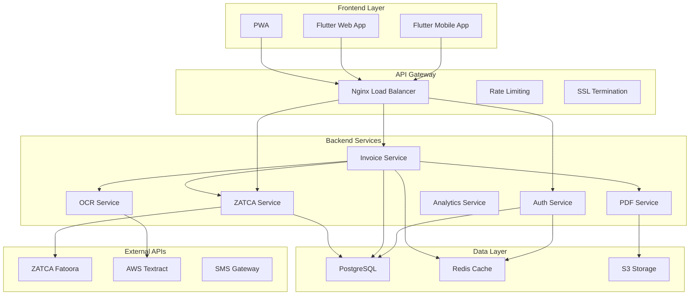
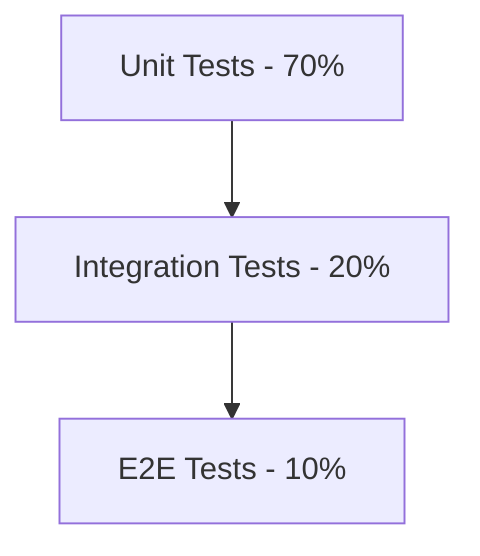
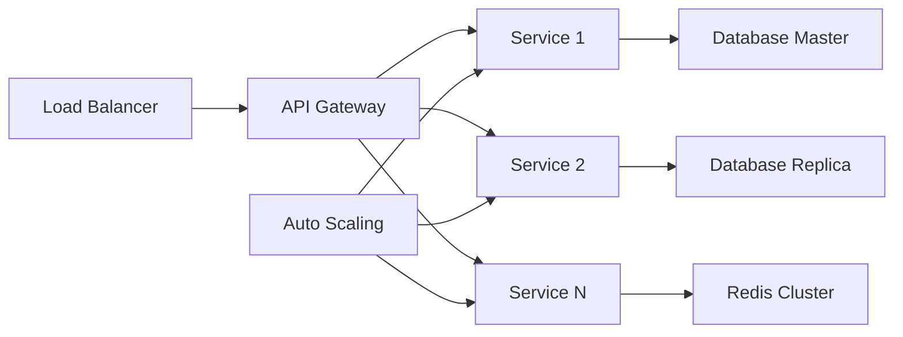

# تصميم MVP بصير - النظام التشغيلي المالي الذكي

## نظرة عامة

بصير MVP هو نظام فواتير إلكترونية ذكي مصمم خصيصاً للسوق السعودي مع التركيز على الامتثال الكامل لمتطلبات ZATCA Phase 1 & 2. النظام يجمع بين الذكاء الاصطناعي والأتمتة الكاملة لتوفير تجربة سلسة وموثوقة.

## البنية المعمارية

### 🏗️ **البنية العامة**



### 🔧 **المكونات الأساسية**

#### 1. **Frontend (Flutter)**
- **Framework:** Flutter 3.16+ مع Material Design 3
- **State Management:** Riverpod للإدارة المتقدمة للحالة
- **Localization:** دعم كامل للعربية مع RTL
- **Platforms:** Android, iOS, Web (PWA)

#### 2. **Backend (Go)**
- **Framework:** Gin Web Framework للأداء العالي
- **Architecture:** Clean Architecture مع Dependency Injection
- **Database:** PostgreSQL مع GORM ORM
- **Cache:** Redis للتخزين المؤقت والجلسات
- **Authentication:** JWT + TOTP للمصادقة الثنائية

#### 3. **ZATCA Integration Engine**
- **Certificate Management:** إدارة شهادات ZATCA
- **Digital Signing:** التوقيع الرقمي للفواتير
- **QR Code Generation:** توليد رموز QR المطلوبة
- **API Integration:** تكامل مع منصة فاتورة

## المكونات والواجهات

### 🔐 **خدمة المصادقة (Auth Service)**

```go
type AuthService interface {
    Register(req RegisterRequest) (*User, error)
    Login(req LoginRequest) (*AuthResponse, error)
    RefreshToken(token string) (*AuthResponse, error)
    EnableMFA(userID uuid.UUID) (*MFASetup, error)
    VerifyMFA(userID uuid.UUID, code string) error
    Logout(userID uuid.UUID, sessionID string) error
}
```

**الميزات الأساسية:**
- تسجيل المستخدمين مع التحقق من الهوية
- مصادقة ثنائية إجبارية بـ TOTP
- إدارة الجلسات مع انتهاء صلاحية ذكي
- حماية من هجمات Brute Force

### 📄 **خدمة الفواتير (Invoice Service)**

```go
type InvoiceService interface {
    CreateInvoice(req CreateInvoiceRequest) (*Invoice, error)
    UpdateInvoice(id uuid.UUID, req UpdateInvoiceRequest) (*Invoice, error)
    GetInvoice(id uuid.UUID) (*Invoice, error)
    ListInvoices(filters InvoiceFilters) (*InvoiceList, error)
    GeneratePDF(id uuid.UUID) ([]byte, error)
    SubmitToZATCA(id uuid.UUID) (*ZATCAResponse, error)
}
```

**الميزات الأساسية:**
- إنشاء فواتير ذكية مع ملء تلقائي
- تحديث الفواتير مع تتبع التغييرات
- توليد PDF احترافي
- تكامل مباشر مع ZATCA

### 🏛️ **خدمة ZATCA (ZATCA Service)**

```go
type ZATCAService interface {
    ValidateInvoice(invoice *Invoice) (*ValidationResult, error)
    SignInvoice(invoice *Invoice) (*SignedInvoice, error)
    GenerateQRCode(invoice *Invoice) (string, error)
    SubmitInvoice(invoice *SignedInvoice) (*SubmissionResult, error)
    CheckStatus(submissionID string) (*StatusResult, error)
    GetCertificate(companyID uuid.UUID) (*Certificate, error)
}
```

**الميزات المتقدمة:**
- التحقق من صحة البيانات قبل الإرسال
- التوقيع الرقمي المتوافق مع ZATCA
- توليد QR Code مع التشفير المطلوب
- إعادة المحاولة الذكية عند الفشل
- تتبع حالة الإرسال في الوقت الفعلي

### 📱 **خدمة OCR (OCR Service)**

```go
type OCRService interface {
    ProcessReceipt(image []byte) (*ReceiptData, error)
    ExtractInvoiceData(image []byte) (*InvoiceData, error)
    ValidateExtraction(data *ReceiptData) (*ValidationResult, error)
}
```

**الذكاء الاصطناعي:**
- استخراج النصوص العربية والإنجليزية
- تحديد البيانات المالية تلقائياً
- التحقق من صحة البيانات المستخرجة
- تحسين الدقة بالتعلم المستمر

## نماذج البيانات

### 📊 **نموذج الفاتورة المتقدم**

```go
type Invoice struct {
    ID                uuid.UUID    `json:"id"`
    CompanyID         uuid.UUID    `json:"company_id"`
    CustomerID        uuid.UUID    `json:"customer_id"`
    InvoiceNumber     string       `json:"invoice_number"`
    InvoiceType       string       `json:"invoice_type"` // standard, simplified, debit_note, credit_note
    
    // ZATCA Required Fields
    ZATCAInvoiceHash  string       `json:"zatca_invoice_hash"`
    ZATCAUUID         string       `json:"zatca_uuid"`
    ZATCAQRCode       string       `json:"zatca_qr_code"`
    ZATCASignature    string       `json:"zatca_signature"`
    
    // Invoice Details
    IssueDate         time.Time    `json:"issue_date"`
    DueDate           *time.Time   `json:"due_date"`
    SupplyDate        time.Time    `json:"supply_date"`
    
    // Financial Data
    SubTotal          float64      `json:"sub_total"`
    TaxAmount         float64      `json:"tax_amount"`
    DiscountAmount    float64      `json:"discount_amount"`
    TotalAmount       float64      `json:"total_amount"`
    Currency          string       `json:"currency"`
    
    // Status and Metadata
    Status            string       `json:"status"` // draft, pending, submitted, approved, rejected
    Notes             string       `json:"notes"`
    CreatedAt         time.Time    `json:"created_at"`
    UpdatedAt         time.Time    `json:"updated_at"`
    
    // Relationships
    Company           Company      `json:"company"`
    Customer          Customer     `json:"customer"`
    Items             []InvoiceItem `json:"items"`
    Payments          []Payment    `json:"payments"`
    ZATCASubmissions  []ZATCASubmission `json:"zatca_submissions"`
}
```

### 🏢 **نموذج الشركة المحسن**

```go
type Company struct {
    ID                uuid.UUID `json:"id"`
    UserID            uuid.UUID `json:"user_id"`
    
    // Basic Information
    NameArabic        string    `json:"name_arabic"`
    NameEnglish       string    `json:"name_english"`
    TaxNumber         string    `json:"tax_number"`
    CommercialRegister string   `json:"commercial_register"`
    
    // ZATCA Configuration
    ZATCAEnvironment  string    `json:"zatca_environment"` // sandbox, production
    ZATCACertificate  string    `json:"-"` // Encrypted
    ZATCAPrivateKey   string    `json:"-"` // Encrypted
    ZATCACSID         string    `json:"zatca_csid"`
    ZATCASecret       string    `json:"-"` // Encrypted
    
    // Business Settings
    DefaultCurrency   string    `json:"default_currency"`
    DefaultTaxRate    float64   `json:"default_tax_rate"`
    InvoicePrefix     string    `json:"invoice_prefix"`
    NextInvoiceNumber int       `json:"next_invoice_number"`
    
    // Status
    IsActive          bool      `json:"is_active"`
    IsZATCAConfigured bool      `json:"is_zatca_configured"`
    CreatedAt         time.Time `json:"created_at"`
    UpdatedAt         time.Time `json:"updated_at"`
}
```

## معالجة الأخطاء

### 🛡️ **استراتيجية معالجة الأخطاء المتقدمة**

```go
type ErrorHandler struct {
    Logger    *logrus.Logger
    Notifier  NotificationService
    Metrics   MetricsCollector
}

type APIError struct {
    Code      string    `json:"code"`
    Message   string    `json:"message"`
    Details   string    `json:"details,omitempty"`
    Timestamp time.Time `json:"timestamp"`
    RequestID string    `json:"request_id"`
}
```

**مستويات الأخطاء:**
1. **أخطاء المستخدم (4xx):** تحقق من البيانات، صلاحيات
2. **أخطاء النظام (5xx):** قاعدة البيانات، خدمات خارجية
3. **أخطاء ZATCA:** إعادة محاولة ذكية، تسجيل مفصل
4. **أخطاء الأمان:** حجب فوري، تنبيه إداري

### 🔄 **آلية إعادة المحاولة الذكية**

```go
type RetryConfig struct {
    MaxAttempts   int           `json:"max_attempts"`
    BaseDelay     time.Duration `json:"base_delay"`
    MaxDelay      time.Duration `json:"max_delay"`
    Multiplier    float64       `json:"multiplier"`
    Jitter        bool          `json:"jitter"`
}

func (s *ZATCAService) SubmitWithRetry(invoice *Invoice) error {
    return retry.Do(
        func() error {
            return s.submitToZATCA(invoice)
        },
        retry.Attempts(3),
        retry.Delay(time.Second),
        retry.DelayType(retry.BackOffDelay),
    )
}
```

## استراتيجية الاختبار

### 🧪 **هرم الاختبارات**



#### 1. **اختبارات الوحدة (Unit Tests)**
- اختبار كل دالة بشكل منفصل
- Mock للخدمات الخارجية
- تغطية 90%+ من الكود

#### 2. **اختبارات التكامل (Integration Tests)**
- اختبار تكامل قاعدة البيانات
- اختبار APIs الخارجية
- اختبار تدفق البيانات الكامل

#### 3. **اختبارات شاملة (E2E Tests)**
- اختبار سيناريوهات المستخدم الكاملة
- اختبار الواجهات مع Backend
- اختبار الأداء تحت الضغط

### 🔍 **اختبارات ZATCA المتخصصة**

```go
func TestZATCAIntegration(t *testing.T) {
    tests := []struct {
        name     string
        invoice  *Invoice
        expected *ZATCAResponse
        wantErr  bool
    }{
        {
            name: "Valid Standard Invoice",
            invoice: createValidInvoice(),
            expected: &ZATCAResponse{Status: "CLEARED"},
            wantErr: false,
        },
        {
            name: "Invalid Tax Number",
            invoice: createInvalidTaxInvoice(),
            expected: nil,
            wantErr: true,
        },
    }
    
    for _, tt := range tests {
        t.Run(tt.name, func(t *testing.T) {
            result, err := zatcaService.SubmitInvoice(tt.invoice)
            assert.Equal(t, tt.wantErr, err != nil)
            if !tt.wantErr {
                assert.Equal(t, tt.expected.Status, result.Status)
            }
        })
    }
}
```

## الأمان والامتثال

### 🔐 **طبقات الأمان المتعددة**

1. **أمان الشبكة:**
   - TLS 1.3 لجميع الاتصالات
   - Certificate Pinning للتطبيق المحمول
   - WAF للحماية من الهجمات

2. **أمان التطبيق:**
   - JWT مع انتهاء صلاحية قصير
   - TOTP للمصادقة الثنائية
   - Rate Limiting متقدم

3. **أمان البيانات:**
   - تشفير AES-256 للبيانات الحساسة
   - تشفير قاعدة البيانات
   - نسخ احتياطية مشفرة

4. **أمان ZATCA:**
   - إدارة آمنة للشهادات
   - تشفير المفاتيح الخاصة
   - تدقيق شامل للعمليات

### 📋 **متطلبات الامتثال**

```go
type ComplianceChecker struct {
    ZATCAValidator  ZATCAValidator
    DataProtection  DataProtectionService
    AuditLogger     AuditService
}

func (c *ComplianceChecker) ValidateInvoice(invoice *Invoice) error {
    // ZATCA Phase 1 & 2 Validation
    if err := c.ZATCAValidator.ValidateStructure(invoice); err != nil {
        return fmt.Errorf("ZATCA validation failed: %w", err)
    }
    
    // Data Protection Compliance
    if err := c.DataProtection.ValidateDataHandling(invoice); err != nil {
        return fmt.Errorf("data protection validation failed: %w", err)
    }
    
    // Audit Trail
    c.AuditLogger.LogInvoiceValidation(invoice.ID, "PASSED")
    
    return nil
}
```

## الأداء والقابلية للتوسع

### ⚡ **مؤشرات الأداء المستهدفة**

| المقياس | الهدف | الحد الأقصى |
|---------|--------|-------------|
| وقت استجابة API | < 200ms | 500ms |
| توليد PDF | < 3s | 10s |
| إرسال ZATCA | < 5s | 15s |
| OCR Processing | < 10s | 30s |
| Database Query | < 50ms | 200ms |

### 📈 **استراتيجية التوسع**



**التوسع الأفقي:**
- Kubernetes للتوسع التلقائي
- Database Sharding للبيانات الكبيرة
- CDN للملفات الثابتة
- Redis Clustering للتخزين المؤقت

## المراقبة والتحليلات

### 📊 **نظام المراقبة الشامل**

```go
type MonitoringService struct {
    Prometheus  *prometheus.Registry
    Grafana     GrafanaClient
    AlertManager AlertManagerClient
    Logger      *logrus.Logger
}

func (m *MonitoringService) TrackInvoiceSubmission(duration time.Duration, success bool) {
    invoiceSubmissionDuration.Observe(duration.Seconds())
    if success {
        invoiceSubmissionSuccess.Inc()
    } else {
        invoiceSubmissionFailure.Inc()
    }
}
```

**المقاييس الأساسية:**
- عدد الفواتير المرسلة يومياً
- معدل نجاح ZATCA
- أوقات الاستجابة
- استخدام الموارد
- أخطاء النظام

### 🚨 **نظام التنبيهات الذكي**

```yaml
alerts:
  - name: ZATCA_Submission_Failure_Rate
    condition: rate(zatca_submission_failures[5m]) > 0.05
    severity: critical
    message: "ZATCA submission failure rate exceeded 5%"
    
  - name: High_Response_Time
    condition: avg(api_response_time) > 1000
    severity: warning
    message: "API response time is high"
```

## خطة النشر والتشغيل

### 🚀 **استراتيجية النشر**

1. **البيئة التطويرية:** Docker Compose محلي
2. **بيئة الاختبار:** Kubernetes على AWS EKS
3. **بيئة الإنتاج:** Blue-Green Deployment

### 🔄 **CI/CD Pipeline**

```yaml
stages:
  - build
  - test
  - security_scan
  - deploy_staging
  - integration_tests
  - deploy_production

build:
  script:
    - go build ./...
    - flutter build web
    - docker build -t baseer-mvp .

test:
  script:
    - go test -v -cover ./...
    - flutter test
    - npm run test:e2e

security_scan:
  script:
    - gosec ./...
    - snyk test
    - trivy image baseer-mvp
```

هذا التصميم الشامل يضمن بناء نظام قوي وقابل للتوسع يلبي جميع متطلبات ZATCA مع توفير تجربة مستخدم متميزة.