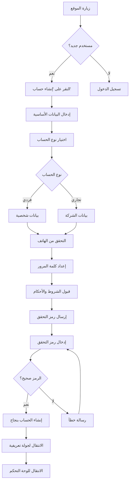
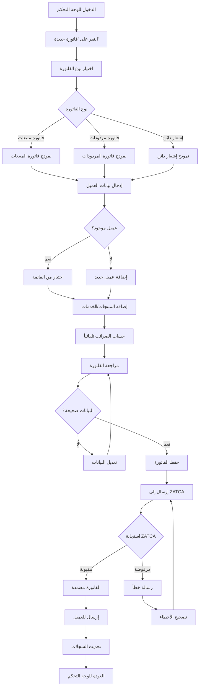
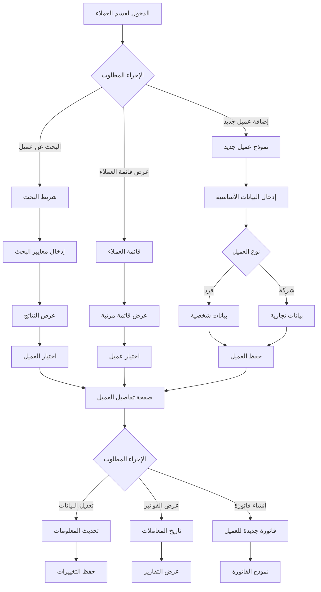
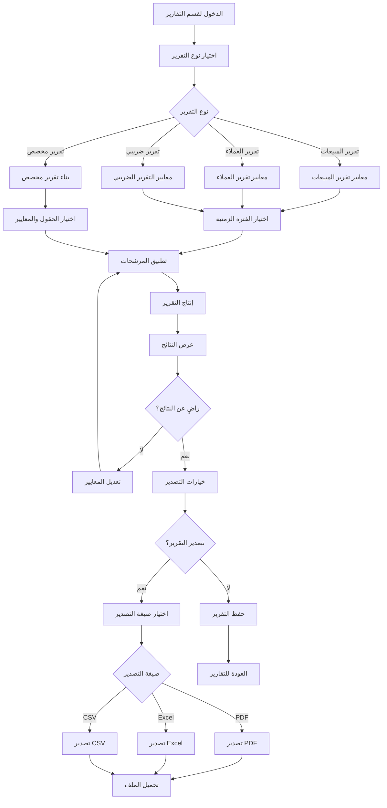
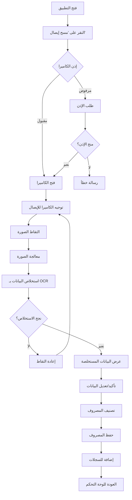
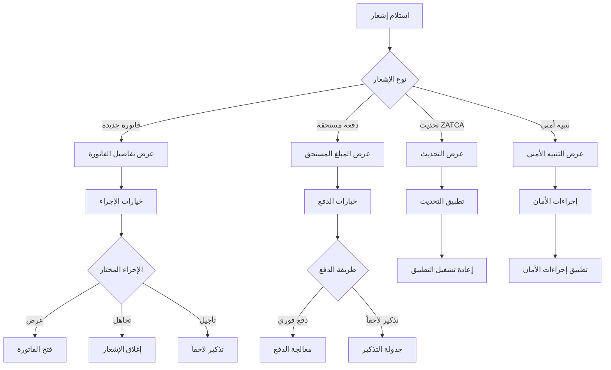
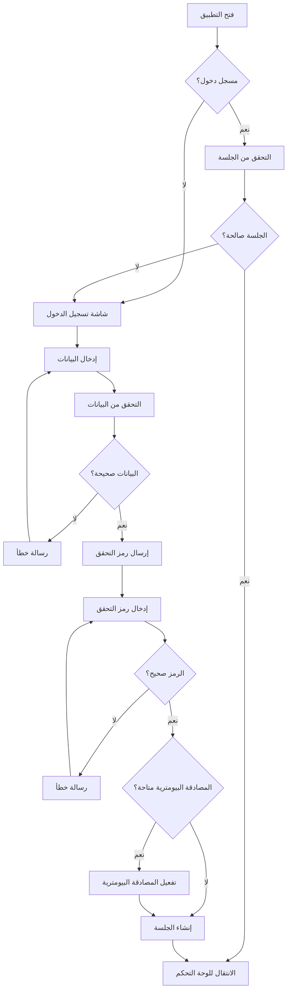
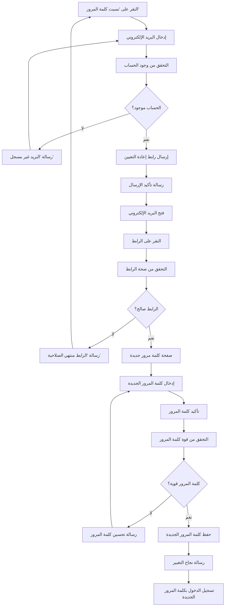
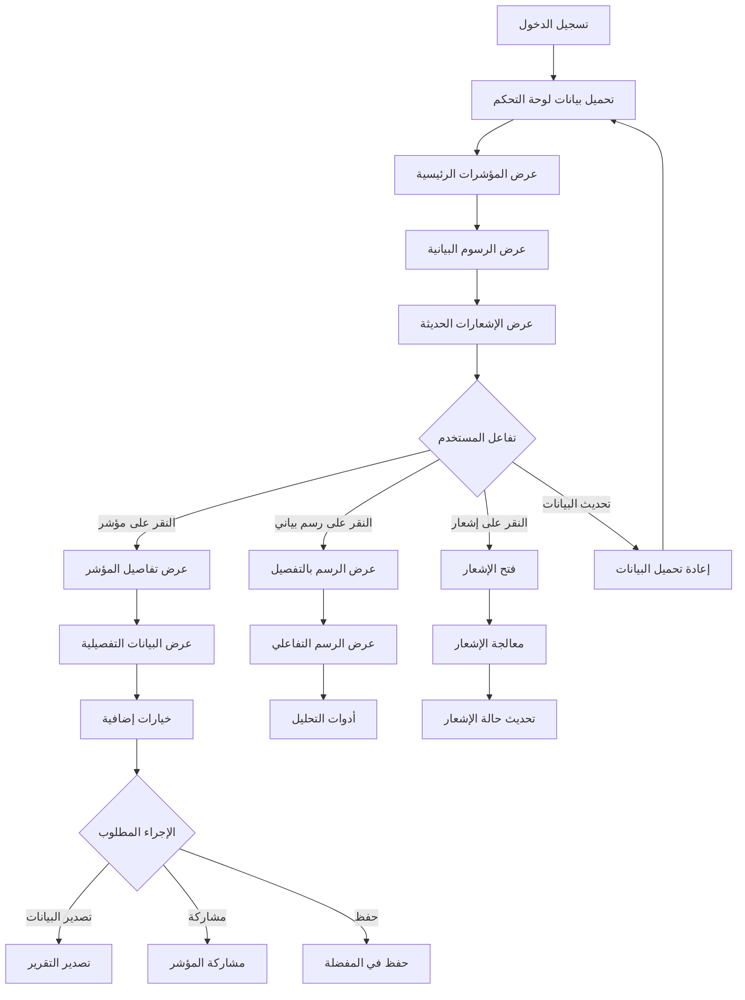
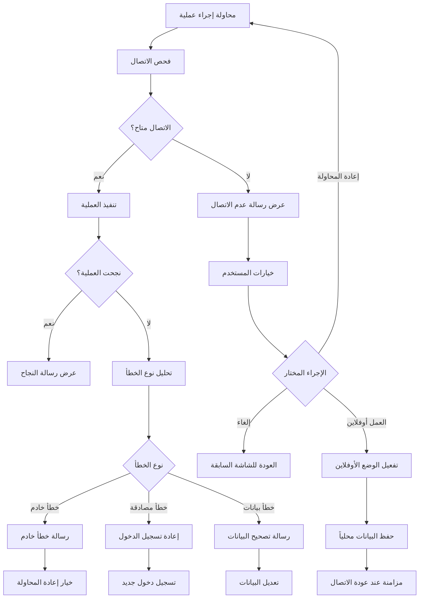

# 🔄 تدفقات المستخدم - مشروع "بصير" (User Flows)

## معلومات الوثيقة
```yaml
document_type: "User Flows Documentation"
version: "1.0"
created_date: "2025-10-11"
last_updated: "2025-10-11"
status: "Active"
classification: "Internal"
owner: "فريق تطوير مشروع بصير"
```

## 🎯 نظرة عامة (Overview)

تحدد هذه الوثيقة جميع تدفقات المستخدم الأساسية في منصة "بصير"، مع التركيز على تجربة المستخدم العربي وسهولة الاستخدام.

## 👤 التدفقات الأساسية للمستخدم (Core User Flows)

### UF-001: تسجيل مستخدم جديد (New User Registration)



**تفاصيل التدفق:**
```yaml
flow_details:
  estimated_time: "3-5 minutes"
  steps_count: 8
  drop_off_points:
    - "إدخال بيانات الشركة (15% drop-off)"
    - "التحقق من الهاتف (10% drop-off)"
  
  success_criteria:
    - "معدل إكمال التسجيل > 80%"
    - "وقت التسجيل < 5 دقائق"
    - "معدل أخطاء < 5%"
  
  error_handling:
    - "رسائل خطأ واضحة بالعربية"
    - "إمكانية تصحيح البيانات"
    - "دعم فوري عند الحاجة"
```

### UF-002: إنشاء فاتورة جديدة (Create New Invoice)



**تفاصيل التدفق:**
```yaml
flow_details:
  estimated_time: "2-3 minutes"
  steps_count: 12
  automation_level: "70%"
  
  success_criteria:
    - "إنشاء فاتورة في < 2 دقيقة"
    - "معدل نجاح ZATCA > 99%"
    - "معدل أخطاء < 1%"
  
  smart_features:
    - "اقتراح العملاء تلقائياً"
    - "حساب الضرائب تلقائياً"
    - "حفظ المسودات تلقائياً"
    - "التحقق من البيانات قبل الإرسال"
```

### UF-003: إدارة العملاء (Customer Management)



### UF-004: عرض التقارير والتحليلات (Reports & Analytics)



## 📱 تدفقات التطبيق المحمول (Mobile App Flows)

### UF-005: مسح الإيصالات (Receipt Scanning)



### UF-006: الإشعارات والتنبيهات (Notifications)



## 🔐 تدفقات الأمان (Security Flows)

### UF-007: تسجيل الدخول الآمن (Secure Login)



### UF-008: إعادة تعيين كلمة المرور (Password Reset)



## 📊 تدفقات التحليلات (Analytics Flows)

### UF-009: عرض لوحة التحكم (Dashboard View)



## 🔄 تدفقات الأخطاء والاستثناءات (Error Handling Flows)

### UF-010: معالجة أخطاء الشبكة (Network Error Handling)



## 📋 معايير تقييم التدفقات (Flow Evaluation Criteria)

### معايير الأداء
```yaml
performance_criteria:
  loading_time: "< 3 seconds per screen"
  transition_time: "< 300ms between screens"
  error_recovery: "< 5 seconds to recover from errors"
  offline_capability: "Core functions work offline"

usability_criteria:
  task_completion_rate: "> 90%"
  error_rate: "< 5%"
  user_satisfaction: "> 4.0/5.0"
  learning_curve: "< 30 minutes for new users"

accessibility_criteria:
  keyboard_navigation: "Full keyboard support"
  screen_reader: "Compatible with Arabic screen readers"
  color_contrast: "WCAG 2.1 AA compliant"
  touch_targets: "Minimum 44px touch targets"
```

### معايير التحسين
```yaml
optimization_targets:
  reduce_steps: "Minimize steps in critical flows"
  smart_defaults: "Use intelligent defaults"
  progressive_disclosure: "Show information progressively"
  contextual_help: "Provide help when needed"

arabic_ux_considerations:
  rtl_layout: "Proper right-to-left layout"
  arabic_typography: "Optimized Arabic text rendering"
  cultural_context: "Culturally appropriate interactions"
  local_patterns: "Follow local UX patterns"
```

---

## 📊 ملخص التدفقات (Flows Summary)

### إحصائيات التدفقات
```yaml
total_flows: 10
critical_flows: 4
average_steps: 8
estimated_completion_time: "2-5 minutes per flow"

complexity_distribution:
  simple: 3
  medium: 5
  complex: 2

platform_coverage:
  web: 10
  mobile: 8
  tablet: 10
```

### أولويات التطوير
```yaml
phase_1_flows:
  - "User Registration"
  - "Create Invoice"
  - "Customer Management"
  - "Secure Login"

phase_2_flows:
  - "Receipt Scanning"
  - "Reports & Analytics"
  - "Notifications"

phase_3_flows:
  - "Advanced Analytics"
  - "Error Handling"
  - "Dashboard Customization"
```

---

*هذه التدفقات تضمن تجربة مستخدم سلسة ومتسقة عبر جميع أجزاء المنصة، مع التركيز على الاحتياجات الخاصة للمستخدم العربي.*