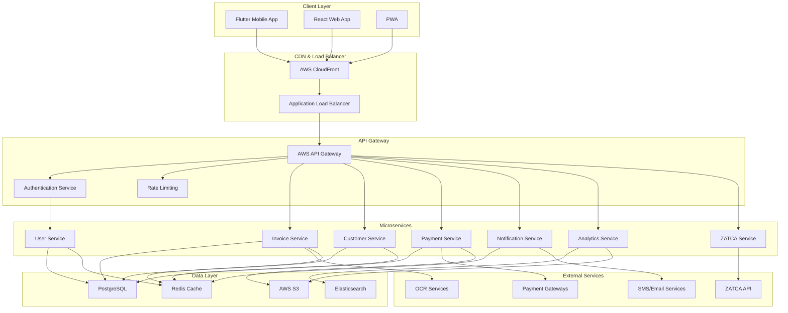

# 🏗️ وثيقة التصميم التقني - مشروع "بصير" (Technical Design Document)

## معلومات الوثيقة
```yaml
document_type: "Technical Design Document"
version: "1.0"
created_date: "2025-10-11"
last_updated: "2025-10-11"
status: "Active"
classification: "Confidential"
owner: "فريق تطوير مشروع بصير"
dependencies: ["04_Business_Requirements_Document.md", "05_Product_Requirements_Document.md"]
```

## 🎯 نظرة عامة على النظام (System Overview)

### رؤية النظام التقني
```yaml
system_vision: "بنية تقنية حديثة وقابلة للتوسع تدعم النمو السريع والأمان العالي"
architecture_style: "Microservices with API-First approach"
deployment_model: "Cloud-Native on AWS"
scalability_target: "Support 100,000+ concurrent users"
availability_target: "99.99% uptime"
```

### المبادئ التقنية الأساسية
```yaml
core_principles:
  - "API-First Design"
  - "Security by Design"
  - "Scalability from Day One"
  - "Observability and Monitoring"
  - "Automated Testing and Deployment"
  - "Data Privacy and Compliance"
  - "Performance Optimization"
  - "Fault Tolerance and Resilience"
```

## 🏛️ البنية المعمارية (System Architecture)

### البنية العامة للنظام
```yaml
architecture_layers:
  presentation_layer:
    - "Flutter Mobile Apps (iOS/Android)"
    - "React Web Application"
    - "Progressive Web App (PWA)"
  
  api_gateway_layer:
    - "AWS API Gateway"
    - "Authentication & Authorization"
    - "Rate Limiting & Throttling"
    - "Request/Response Transformation"
  
  application_layer:
    - "User Management Service"
    - "Invoice Management Service"
    - "Customer Management Service"
    - "Payment Processing Service"
    - "Notification Service"
    - "Analytics Service"
    - "ZATCA Integration Service"
  
  data_layer:
    - "PostgreSQL (Primary Database)"
    - "Redis (Caching & Sessions)"
    - "Elasticsearch (Search & Analytics)"
    - "AWS S3 (File Storage)"
  
  infrastructure_layer:
    - "AWS EKS (Kubernetes)"
    - "AWS RDS (Managed PostgreSQL)"
    - "AWS ElastiCache (Managed Redis)"
    - "AWS CloudFront (CDN)"
```

### مخطط البنية المعمارية


## 🛠️ الحزمة التقنية (Technology Stack)

### Frontend Technologies
```yaml
web_frontend:
  framework: "React 18+"
  state_management: "Redux Toolkit + RTK Query"
  ui_library: "Material-UI v5 (customized for Arabic)"
  styling: "Emotion + CSS-in-JS"
  build_tool: "Vite"
  testing: "Jest + React Testing Library"
  
mobile_frontend:
  framework: "Flutter 3.x"
  state_management: "Riverpod"
  ui_components: "Material Design 3 (customized)"
  local_storage: "Hive"
  networking: "Dio"
  testing: "Flutter Test + Integration Tests"

shared_frontend:
  internationalization: "i18n with Arabic RTL support"
  analytics: "Firebase Analytics"
  crash_reporting: "Sentry"
  performance_monitoring: "Firebase Performance"
```

### Backend Technologies
```yaml
core_services:
  language: "Go 1.21+"
  framework: "Gin Web Framework"
  orm: "GORM"
  validation: "go-playground/validator"
  logging: "Logrus"
  configuration: "Viper"
  
api_design:
  specification: "OpenAPI 3.0"
  documentation: "Swagger UI"
  versioning: "URL versioning (/v1/, /v2/)"
  authentication: "JWT with RS256"
  authorization: "RBAC (Role-Based Access Control)"

data_processing:
  language: "Python 3.11+"
  framework: "FastAPI"
  ml_libraries: "TensorFlow, scikit-learn"
  data_processing: "Pandas, NumPy"
  ocr_service: "AWS Textract + Custom models"
```

### Database & Storage
```yaml
primary_database:
  engine: "PostgreSQL 15+"
  hosting: "AWS RDS with Multi-AZ"
  connection_pooling: "PgBouncer"
  backup_strategy: "Automated daily backups + Point-in-time recovery"
  
caching_layer:
  engine: "Redis 7+"
  hosting: "AWS ElastiCache"
  use_cases: ["Session storage", "API response caching", "Rate limiting"]
  
search_engine:
  engine: "Elasticsearch 8+"
  hosting: "AWS OpenSearch"
  use_cases: ["Full-text search", "Analytics", "Log aggregation"]
  
file_storage:
  service: "AWS S3"
  cdn: "AWS CloudFront"
  use_cases: ["Invoice PDFs", "Receipt images", "User uploads"]
```

### Infrastructure & DevOps
```yaml
container_orchestration:
  platform: "Kubernetes (AWS EKS)"
  container_runtime: "Docker"
  service_mesh: "Istio (future consideration)"
  
ci_cd_pipeline:
  source_control: "GitHub"
  ci_cd: "GitHub Actions"
  container_registry: "AWS ECR"
  deployment_strategy: "Blue-Green deployment"
  
monitoring_observability:
  metrics: "Prometheus + Grafana"
  logging: "ELK Stack (Elasticsearch, Logstash, Kibana)"
  tracing: "Jaeger"
  alerting: "AlertManager + PagerDuty"
  uptime_monitoring: "Pingdom"
  
security:
  secrets_management: "AWS Secrets Manager"
  certificate_management: "AWS Certificate Manager"
  vulnerability_scanning: "Snyk"
  security_scanning: "SonarQube"
```

## 🔧 تصميم الخدمات المصغرة (Microservices Design)

### خدمة إدارة المستخدمين (User Management Service)
```yaml
service_name: "user-service"
responsibilities:
  - "User registration and authentication"
  - "Profile management"
  - "Role and permission management"
  - "Password reset and security"

api_endpoints:
  - "POST /v1/users/register"
  - "POST /v1/users/login"
  - "GET /v1/users/profile"
  - "PUT /v1/users/profile"
  - "POST /v1/users/reset-password"
  - "POST /v1/users/verify-otp"

database_schema:
  tables:
    - "users"
    - "user_profiles"
    - "user_roles"
    - "user_sessions"
    - "password_reset_tokens"

external_dependencies:
  - "SMS service for OTP"
  - "Email service for notifications"
  - "Redis for session storage"
```

### خدمة إدارة الفواتير (Invoice Management Service)
```yaml
service_name: "invoice-service"
responsibilities:
  - "Invoice creation and management"
  - "ZATCA compliance and submission"
  - "Invoice templates and customization"
  - "Invoice status tracking"

api_endpoints:
  - "POST /v1/invoices"
  - "GET /v1/invoices"
  - "GET /v1/invoices/{id}"
  - "PUT /v1/invoices/{id}"
  - "DELETE /v1/invoices/{id}"
  - "POST /v1/invoices/{id}/submit-zatca"
  - "GET /v1/invoices/{id}/pdf"

database_schema:
  tables:
    - "invoices"
    - "invoice_items"
    - "invoice_templates"
    - "zatca_submissions"
    - "invoice_attachments"

external_dependencies:
  - "ZATCA API"
  - "PDF generation service"
  - "Customer service"
  - "Tax calculation service"
```

### خدمة إدارة العملاء (Customer Management Service)
```yaml
service_name: "customer-service"
responsibilities:
  - "Customer profile management"
  - "Customer categorization"
  - "Transaction history tracking"
  - "Customer analytics"

api_endpoints:
  - "POST /v1/customers"
  - "GET /v1/customers"
  - "GET /v1/customers/{id}"
  - "PUT /v1/customers/{id}"
  - "DELETE /v1/customers/{id}"
  - "GET /v1/customers/{id}/transactions"
  - "GET /v1/customers/search"

database_schema:
  tables:
    - "customers"
    - "customer_addresses"
    - "customer_contacts"
    - "customer_categories"
    - "customer_transactions"

external_dependencies:
  - "Invoice service"
  - "Analytics service"
```

### خدمة معالجة المدفوعات (Payment Processing Service)
```yaml
service_name: "payment-service"
responsibilities:
  - "Payment gateway integration"
  - "Payment processing and tracking"
  - "Refund management"
  - "Payment analytics"

api_endpoints:
  - "POST /v1/payments/process"
  - "GET /v1/payments/{id}"
  - "POST /v1/payments/{id}/refund"
  - "GET /v1/payments/history"
  - "POST /v1/payments/webhooks/{gateway}"

database_schema:
  tables:
    - "payments"
    - "payment_methods"
    - "payment_gateways"
    - "refunds"
    - "payment_webhooks"

external_dependencies:
  - "Payment gateways (Moyasar, PayTabs)"
  - "Invoice service"
  - "Notification service"
```

## 🔐 تصميم الأمان (Security Design)

### استراتيجية الأمان الشاملة
```yaml
security_layers:
  network_security:
    - "VPC with private subnets"
    - "Security groups and NACLs"
    - "WAF (Web Application Firewall)"
    - "DDoS protection via CloudFlare"
  
  application_security:
    - "JWT authentication with short expiry"
    - "Role-based access control (RBAC)"
    - "Input validation and sanitization"
    - "SQL injection prevention"
    - "XSS protection"
  
  data_security:
    - "Encryption at rest (AES-256)"
    - "Encryption in transit (TLS 1.3)"
    - "Database encryption"
    - "Secure key management"
  
  infrastructure_security:
    - "Container security scanning"
    - "Vulnerability assessments"
    - "Security patches automation"
    - "Audit logging"
```

### مصادقة وتفويض المستخدمين
```yaml
authentication_flow:
  primary_method: "JWT with RS256 signing"
  token_expiry: "15 minutes (access) / 7 days (refresh)"
  mfa_requirement: "Mandatory for all users"
  biometric_support: "Face ID / Touch ID on mobile"
  
authorization_model:
  type: "Role-Based Access Control (RBAC)"
  roles:
    - "admin: Full system access"
    - "business_owner: Business account management"
    - "accountant: Financial data access"
    - "employee: Limited access"
  
  permissions:
    - "invoice.create"
    - "invoice.read"
    - "invoice.update"
    - "invoice.delete"
    - "customer.manage"
    - "reports.view"
    - "settings.manage"
```

### حماية البيانات الحساسة
```yaml
data_classification:
  highly_sensitive:
    - "Payment information"
    - "Tax identification numbers"
    - "Bank account details"
    encryption: "AES-256 with separate key per record"
  
  sensitive:
    - "Personal information"
    - "Business information"
    - "Financial data"
    encryption: "AES-256 with service-level keys"
  
  internal:
    - "Application logs"
    - "System metrics"
    encryption: "Standard TLS encryption"

key_management:
  service: "AWS KMS"
  rotation_policy: "Automatic rotation every 90 days"
  access_control: "IAM roles with least privilege"
  audit_logging: "All key operations logged"
```

## 📊 تصميم قاعدة البيانات (Database Design)

### نموذج البيانات الأساسي
```sql
-- Users and Authentication
CREATE TABLE users (
    id UUID PRIMARY KEY DEFAULT gen_random_uuid(),
    email VARCHAR(255) UNIQUE NOT NULL,
    phone VARCHAR(20) UNIQUE NOT NULL,
    password_hash VARCHAR(255) NOT NULL,
    is_verified BOOLEAN DEFAULT FALSE,
    is_active BOOLEAN DEFAULT TRUE,
    created_at TIMESTAMP DEFAULT CURRENT_TIMESTAMP,
    updated_at TIMESTAMP DEFAULT CURRENT_TIMESTAMP
);

CREATE TABLE user_profiles (
    id UUID PRIMARY KEY DEFAULT gen_random_uuid(),
    user_id UUID REFERENCES users(id) ON DELETE CASCADE,
    first_name VARCHAR(100) NOT NULL,
    last_name VARCHAR(100) NOT NULL,
    business_name VARCHAR(255),
    tax_number VARCHAR(50),
    commercial_registration VARCHAR(50),
    address JSONB,
    created_at TIMESTAMP DEFAULT CURRENT_TIMESTAMP,
    updated_at TIMESTAMP DEFAULT CURRENT_TIMESTAMP
);

-- Customers
CREATE TABLE customers (
    id UUID PRIMARY KEY DEFAULT gen_random_uuid(),
    user_id UUID REFERENCES users(id) ON DELETE CASCADE,
    name VARCHAR(255) NOT NULL,
    email VARCHAR(255),
    phone VARCHAR(20),
    tax_number VARCHAR(50),
    customer_type VARCHAR(20) CHECK (customer_type IN ('individual', 'business')),
    address JSONB,
    is_active BOOLEAN DEFAULT TRUE,
    created_at TIMESTAMP DEFAULT CURRENT_TIMESTAMP,
    updated_at TIMESTAMP DEFAULT CURRENT_TIMESTAMP
);

-- Invoices
CREATE TABLE invoices (
    id UUID PRIMARY KEY DEFAULT gen_random_uuid(),
    user_id UUID REFERENCES users(id) ON DELETE CASCADE,
    customer_id UUID REFERENCES customers(id),
    invoice_number VARCHAR(50) UNIQUE NOT NULL,
    invoice_type VARCHAR(20) CHECK (invoice_type IN ('standard', 'simplified', 'debit_note', 'credit_note')),
    status VARCHAR(20) DEFAULT 'draft' CHECK (status IN ('draft', 'sent', 'paid', 'cancelled')),
    issue_date DATE NOT NULL,
    due_date DATE,
    subtotal DECIMAL(15,2) NOT NULL,
    tax_amount DECIMAL(15,2) NOT NULL,
    total_amount DECIMAL(15,2) NOT NULL,
    currency VARCHAR(3) DEFAULT 'SAR',
    zatca_uuid VARCHAR(255),
    zatca_status VARCHAR(20),
    zatca_qr_code TEXT,
    notes TEXT,
    created_at TIMESTAMP DEFAULT CURRENT_TIMESTAMP,
    updated_at TIMESTAMP DEFAULT CURRENT_TIMESTAMP
);

CREATE TABLE invoice_items (
    id UUID PRIMARY KEY DEFAULT gen_random_uuid(),
    invoice_id UUID REFERENCES invoices(id) ON DELETE CASCADE,
    description VARCHAR(500) NOT NULL,
    quantity DECIMAL(10,2) NOT NULL,
    unit_price DECIMAL(15,2) NOT NULL,
    tax_rate DECIMAL(5,2) NOT NULL,
    tax_amount DECIMAL(15,2) NOT NULL,
    total_amount DECIMAL(15,2) NOT NULL,
    created_at TIMESTAMP DEFAULT CURRENT_TIMESTAMP
);

-- Payments
CREATE TABLE payments (
    id UUID PRIMARY KEY DEFAULT gen_random_uuid(),
    invoice_id UUID REFERENCES invoices(id),
    amount DECIMAL(15,2) NOT NULL,
    currency VARCHAR(3) DEFAULT 'SAR',
    payment_method VARCHAR(50) NOT NULL,
    gateway_transaction_id VARCHAR(255),
    status VARCHAR(20) DEFAULT 'pending' CHECK (status IN ('pending', 'completed', 'failed', 'refunded')),
    gateway_response JSONB,
    processed_at TIMESTAMP,
    created_at TIMESTAMP DEFAULT CURRENT_TIMESTAMP
);
```

### استراتيجية التحسين
```yaml
indexing_strategy:
  primary_indexes:
    - "users(email, phone)"
    - "invoices(user_id, status, created_at)"
    - "customers(user_id, name)"
    - "payments(invoice_id, status)"
  
  composite_indexes:
    - "invoices(user_id, status, created_at)"
    - "invoice_items(invoice_id, created_at)"
    - "customers(user_id, customer_type, is_active)"

partitioning_strategy:
  invoices: "Partition by created_at (monthly)"
  payments: "Partition by created_at (monthly)"
  audit_logs: "Partition by created_at (weekly)"

archival_strategy:
  retention_period: "7 years (regulatory requirement)"
  archival_frequency: "Quarterly"
  archival_storage: "AWS S3 Glacier"
```

## 🔄 تصميم APIs (API Design)

### معايير تصميم API
```yaml
api_standards:
  specification: "OpenAPI 3.0"
  style: "RESTful with resource-based URLs"
  versioning: "URL versioning (/v1/, /v2/)"
  content_type: "application/json"
  character_encoding: "UTF-8"
  
naming_conventions:
  resources: "Plural nouns (users, invoices, customers)"
  endpoints: "HTTP verbs + resource names"
  parameters: "snake_case"
  response_fields: "camelCase"

error_handling:
  format: "RFC 7807 Problem Details"
  status_codes: "Standard HTTP status codes"
  error_messages: "Localized (Arabic/English)"
  correlation_ids: "For request tracking"
```

### مثال على تصميم API
```yaml
invoice_api_example:
  create_invoice:
    method: "POST"
    path: "/v1/invoices"
    request_body:
      type: "application/json"
      schema:
        type: "object"
        required: ["customerId", "items"]
        properties:
          customerId:
            type: "string"
            format: "uuid"
          invoiceType:
            type: "string"
            enum: ["standard", "simplified"]
          items:
            type: "array"
            items:
              type: "object"
              properties:
                description: { type: "string" }
                quantity: { type: "number" }
                unitPrice: { type: "number" }
                taxRate: { type: "number" }
    
    responses:
      201:
        description: "Invoice created successfully"
        content:
          application/json:
            schema:
              type: "object"
              properties:
                id: { type: "string", format: "uuid" }
                invoiceNumber: { type: "string" }
                status: { type: "string" }
                totalAmount: { type: "number" }
                createdAt: { type: "string", format: "date-time" }
      
      400:
        description: "Bad request"
        content:
          application/json:
            schema:
              $ref: "#/components/schemas/Error"
```

## 🚀 تصميم الأداء والتوسع (Performance & Scalability Design)

### استراتيجية التخزين المؤقت
```yaml
caching_layers:
  application_cache:
    technology: "Redis"
    use_cases:
      - "User sessions"
      - "API response caching"
      - "Rate limiting counters"
    ttl_strategy:
      sessions: "24 hours"
      api_responses: "5-60 minutes"
      rate_limits: "1 hour"
  
  database_cache:
    technology: "PostgreSQL query cache + Redis"
    use_cases:
      - "Frequently accessed customer data"
      - "Invoice templates"
      - "Tax calculation rules"
  
  cdn_cache:
    technology: "AWS CloudFront"
    use_cases:
      - "Static assets (CSS, JS, images)"
      - "Generated PDF files"
      - "Public API documentation"
```

### استراتيجية التوسع الأفقي
```yaml
horizontal_scaling:
  application_tier:
    strategy: "Stateless microservices"
    load_balancing: "AWS Application Load Balancer"
    auto_scaling: "Kubernetes HPA based on CPU/memory"
    scaling_metrics:
      - "CPU utilization > 70%"
      - "Memory utilization > 80%"
      - "Request queue depth > 100"
  
  database_tier:
    read_replicas: "3 read replicas across AZs"
    connection_pooling: "PgBouncer with 100 connections per service"
    query_optimization: "Automated query analysis and optimization"
  
  storage_tier:
    file_storage: "AWS S3 with automatic scaling"
    cdn: "Global CloudFront distribution"
```

### مؤشرات الأداء المستهدفة
```yaml
performance_targets:
  response_times:
    api_endpoints: "< 200ms (95th percentile)"
    database_queries: "< 100ms (95th percentile)"
    page_load_times: "< 2 seconds"
  
  throughput:
    api_requests: "10,000 requests/second"
    concurrent_users: "100,000 users"
    invoice_generation: "1,000 invoices/minute"
  
  availability:
    uptime: "99.99% (52 minutes downtime/year)"
    error_rate: "< 0.1%"
    recovery_time: "< 5 minutes"
```

## 📡 تصميم التكاملات الخارجية (External Integrations Design)

### تكامل ZATCA
```yaml
zatca_integration:
  api_version: "ZATCA Phase 2 API"
  authentication: "Certificate-based authentication"
  endpoints:
    - "Invoice submission"
    - "Invoice status check"
    - "Certificate management"
  
  error_handling:
    retry_strategy: "Exponential backoff (max 3 retries)"
    timeout: "30 seconds"
    circuit_breaker: "Open after 5 consecutive failures"
  
  compliance_features:
    - "Real-time invoice submission"
    - "QR code generation"
    - "Digital signature"
    - "Tax calculation validation"
```

### تكامل بوابات الدفع
```yaml
payment_gateways:
  supported_providers:
    - name: "Moyasar"
      methods: ["Credit Card", "Mada", "Apple Pay"]
      webhook_support: true
    
    - name: "PayTabs"
      methods: ["Credit Card", "Mada", "STC Pay"]
      webhook_support: true
  
  integration_pattern:
    type: "Webhook-based"
    security: "HMAC signature verification"
    retry_mechanism: "Exponential backoff"
    idempotency: "Request ID based"
```

## 🔍 تصميم المراقبة والتشخيص (Monitoring & Observability Design)

### استراتيجية المراقبة الشاملة
```yaml
monitoring_stack:
  metrics_collection:
    tool: "Prometheus"
    exporters:
      - "Node Exporter (system metrics)"
      - "PostgreSQL Exporter"
      - "Redis Exporter"
      - "Custom application metrics"
  
  visualization:
    tool: "Grafana"
    dashboards:
      - "System overview"
      - "Application performance"
      - "Business metrics"
      - "Error tracking"
  
  logging:
    aggregation: "ELK Stack"
    log_levels: ["ERROR", "WARN", "INFO", "DEBUG"]
    structured_logging: "JSON format"
    retention: "30 days (hot) + 1 year (cold)"
  
  tracing:
    tool: "Jaeger"
    sampling_rate: "1% in production"
    trace_correlation: "Request ID propagation"
```

### تنبيهات وإشعارات
```yaml
alerting_rules:
  critical_alerts:
    - "Service down (> 5 minutes)"
    - "Database connection failure"
    - "ZATCA API failure rate > 5%"
    - "Payment processing failure rate > 2%"
  
  warning_alerts:
    - "High response time (> 1 second)"
    - "High error rate (> 1%)"
    - "High CPU usage (> 80%)"
    - "High memory usage (> 85%)"
  
  notification_channels:
    - "PagerDuty (critical)"
    - "Slack (warnings)"
    - "Email (daily summaries)"
```

## 🧪 استراتيجية الاختبار (Testing Strategy)

### هرم الاختبار
```yaml
testing_pyramid:
  unit_tests:
    coverage_target: "> 80%"
    tools: "Go testing, Jest"
    scope: "Individual functions and methods"
  
  integration_tests:
    coverage_target: "> 60%"
    tools: "Testcontainers, Cypress"
    scope: "Service interactions and APIs"
  
  end_to_end_tests:
    coverage_target: "> 40%"
    tools: "Playwright, Flutter integration tests"
    scope: "Complete user workflows"
  
  performance_tests:
    tools: "k6, JMeter"
    scope: "Load testing and stress testing"
```

### استراتيجية اختبار الأمان
```yaml
security_testing:
  static_analysis:
    tools: ["SonarQube", "Snyk", "Semgrep"]
    frequency: "Every commit"
  
  dynamic_analysis:
    tools: ["OWASP ZAP", "Burp Suite"]
    frequency: "Weekly"
  
  penetration_testing:
    frequency: "Quarterly"
    scope: "Full application security assessment"
```

## 📋 خطة النشر والتشغيل (Deployment & Operations Plan)

### استراتيجية النشر
```yaml
deployment_strategy:
  type: "Blue-Green Deployment"
  automation: "GitOps with ArgoCD"
  rollback_capability: "Automatic rollback on health check failure"
  
  environments:
    development:
      purpose: "Feature development and testing"
      auto_deploy: "On every commit to develop branch"
    
    staging:
      purpose: "Pre-production testing"
      auto_deploy: "On every commit to main branch"
    
    production:
      purpose: "Live user traffic"
      deploy_trigger: "Manual approval after staging validation"

pipeline_stages:
  - "Code checkout"
  - "Dependency installation"
  - "Unit tests"
  - "Security scanning"
  - "Build Docker images"
  - "Integration tests"
  - "Deploy to staging"
  - "E2E tests"
  - "Performance tests"
  - "Manual approval"
  - "Deploy to production"
  - "Health checks"
  - "Smoke tests"
```

### خطة التشغيل
```yaml
operational_procedures:
  backup_strategy:
    database: "Daily automated backups with 30-day retention"
    files: "Real-time replication to S3"
    testing: "Monthly backup restoration tests"
  
  disaster_recovery:
    rto: "4 hours (Recovery Time Objective)"
    rpo: "1 hour (Recovery Point Objective)"
    strategy: "Multi-AZ deployment with automated failover"
  
  maintenance_windows:
    frequency: "Monthly"
    duration: "2 hours"
    timing: "Saturday 2:00-4:00 AM (low traffic period)"
```

---

## 📊 ملخص التصميم التقني (Technical Design Summary)

### المؤشرات الرئيسية
```yaml
architecture_metrics:
  services_count: 7
  databases: 3
  external_integrations: 8
  deployment_environments: 3
  
scalability_targets:
  concurrent_users: "100,000+"
  requests_per_second: "10,000+"
  data_storage: "100TB+"
  
reliability_targets:
  uptime: "99.99%"
  recovery_time: "< 5 minutes"
  data_durability: "99.999999999%"
```

### الجدول الزمني للتنفيذ
```yaml
implementation_phases:
  phase_1_foundation: "Months 1-2"
  phase_2_core_services: "Months 3-4"
  phase_3_integrations: "Months 5-6"
  phase_4_optimization: "Months 7-8"
  phase_5_production: "Months 9-10"
```

---

*هذا التصميم التقني يوفر أساساً قوياً وقابلاً للتوسع لبناء منصة "بصير" بأعلى معايير الجودة والأمان والأداء.*