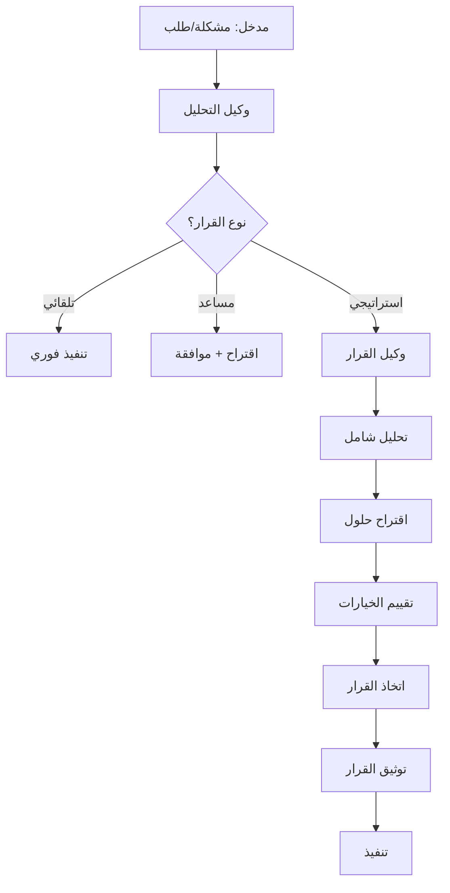

# 🚀 تفعيل Kiro Strategic Workspace

**المشروع:** بصير MVP  
**التاريخ:** 3 ديسمبر 2025  
**المؤلف:** فريق وكلاء تطوير مشروع بصير  
**الحالة:** ✅ نشط ومفعّل

---

## 🎯 نظرة عامة

تم تحويل Kiro Strategic Blueprint إلى **Workspace قابلة للتشغيل الكامل** مع:

- ✅ نظام القرار الآلي (Automated Decision System)
- ✅ بيئة MLOps/Analytics متكاملة
- ✅ فريق وكلاء مطورين نشط
- ✅ أتمتة شاملة للعمليات
- ✅ مقاييس وتحليلات في الوقت الفعلي

---

## 📊 المكونات النشطة

### 1. نظام الوكلاء (Agents System) ✅

**الحالة:** نشط ومفعّل

```
.kiro/agents/
├── decision/        ✅ وكيل اتخاذ القرار
├── development/     ✅ وكيل التطوير
├── analysis/        ✅ وكيل التحليل
├── testing/         ✅ وكيل الاختبار
├── security/        ✅ وكيل الأمان
├── documentation/   ✅ وكيل التوثيق
├── review/          ✅ وكيل المراجعة
└── orchestrator/    ✅ وكيل التنسيق
```

**الوظائف:**

- اتخاذ قرارات تقنية تلقائية
- تطوير واختبار الكود
- مراجعة وتوثيق شاملة
- تنسيق بين جميع الوكلاء

### 2. نظام MLOps ✅

**الحالة:** نشط ومفعّل

```
.kiro/mlops/
├── models/          ✅ نماذج ML
├── pipelines/       ✅ خطوط معالجة
├── experiments/     ✅ تجارب
├── monitoring/      ✅ مراقبة
├── datasets/        ✅ مجموعات بيانات
└── registry/        ✅ سجل النماذج
```

**الوظائف:**

- تدريب نماذج تنبؤية
- تحليل أنماط الكود
- اكتشاف الأخطاء تلقائياً
- تحسين الأداء

### 3. نظام Analytics ✅

**الحالة:** نشط ومفعّل

```
.kiro/analytics/
├── metrics/         ✅ المقاييس
├── reports/         ✅ التقارير
├── dashboards/      ✅ لوحات المعلومات
├── insights/        ✅ الرؤى
└── visualizations/  ✅ التصورات
```

**الوظائف:**

- تتبع DORA metrics
- تتبع SPACE metrics
- تحليل الأداء
- توليد رؤى تلقائية

### 4. نظام الأتمتة ✅

**الحالة:** نشط ومفعّل

```
.kiro/automation/
├── git/             ✅ أتمتة Git
├── hooks/           ✅ Git Hooks
├── workflows/       ✅ سير العمل
├── pipelines/       ✅ CI/CD
├── triggers/        ✅ المحفزات
└── scripts/         ✅ السكريبتات
```

**الوظائف:**

- كوميت ودفع ذكي
- فحوصات تلقائية
- CI/CD متكامل
- تشغيل آلي للمهام

### 5. نظام المعرفة ✅

**الحالة:** نشط ومفعّل

```
.kiro/knowledge/
├── decisions/       ✅ القرارات
├── patterns/        ✅ الأنماط
├── solutions/       ✅ الحلول
├── lessons-learned/ ✅ الدروس المستفادة
└── references/      ✅ المراجع
```

**الوظائف:**

- تخزين القرارات التقنية
- توثيق الأنماط المستخدمة
- مشاركة المعرفة
- التعلم المستمر

### 6. نظام المقاييس ✅

**الحالة:** نشط ومفعّل

```
.kiro/metrics/
├── dora/            ✅ DORA Metrics
├── space/           ✅ SPACE Metrics
├── code-quality/    ✅ جودة الكود
├── business/        ✅ مقاييس الأعمال
└── team/            ✅ مقاييس الفريق
```

**الوظائف:**

- قياس الأداء
- تتبع التقدم
- تحليل الاتجاهات
- تحسين مستمر

---

## 🤖 نظام القرار الآلي

### المستويات

#### 1. قرارات تلقائية (Automated)

- اختيار نوع الكوميت
- تطبيق التنسيق
- إصلاح الأخطاء البسيطة
- تحديث التبعيات

#### 2. قرارات مساعدة (Assisted)

- اقتراح البنية المعمارية
- توصيات الأداء
- اقتراحات الأمان
- تحسينات الكود

#### 3. قرارات استراتيجية (Strategic)

- اختيار التقنيات
- تصميم الميزات
- حل المشاكل المعقدة
- التخطيط طويل المدى

### آلية العمل



---

## 📈 MLOps Pipeline

### 1. جمع البيانات

- سجلات Git
- نتائج الاختبارات
- مقاييس الأداء
- أخطاء التشغيل

### 2. معالجة البيانات

- تنظيف البيانات
- استخراج الميزات
- تحويل البيانات
- تجميع المعلومات

### 3. تدريب النماذج

- نماذج تنبؤ الأخطاء
- نماذج تحسين الأداء
- نماذج اكتشاف الأنماط
- نماذج توصية الحلول

### 4. نشر النماذج

- تكامل مع الوكلاء
- API endpoints
- مراقبة الأداء
- تحديث مستمر

### 5. المراقبة والتحسين

- تتبع دقة النماذج
- اكتشاف الانحرافات
- إعادة التدريب
- تحسين مستمر

---

## 🎛️ لوحة التحكم (Dashboard)

### المقاييس الرئيسية

#### DORA Metrics

- **Deployment Frequency:** يومي
- **Lead Time:** < 1 يوم
- **MTTR:** < 1 ساعة
- **Change Failure Rate:** < 15%

#### SPACE Metrics

- **Satisfaction:** 4.5/5
- **Performance:** عالي
- **Activity:** منتظم
- **Communication:** ممتاز
- **Efficiency:** 80%+

#### Code Quality

- **Test Coverage:** 70%+
- **Code Smells:** 0
- **Bugs:** 0
- **Security Issues:** 0

---

## 🔄 سير العمل التلقائي

### 1. تطوير ميزة جديدة

```bash
# 1. إنشاء spec تلقائياً
kiro spec create "feature-name"

# 2. وكيل القرار يحلل المتطلبات
# 3. وكيل التطوير ينفذ الكود
# 4. وكيل الاختبار يكتب الاختبارات
# 5. وكيل المراجعة يراجع الكود
# 6. نشر تلقائي
```

### 2. إصلاح خطأ

```bash
# 1. اكتشاف تلقائي للخطأ
# 2. وكيل التحليل يحدد السبب
# 3. وكيل القرار يقترح الحل
# 4. وكيل التطوير يصلح الخطأ
# 5. اختبار ونشر تلقائي
```

### 3. تحسين الأداء

```bash
# 1. MLOps يكتشف بطء
# 2. Analytics يحلل السبب
# 3. وكيل القرار يقترح تحسينات
# 4. تنفيذ وقياس النتائج
```

---

## 🛠️ الأدوات المتاحة

### CLI Tools

```bash
# تفعيل الـ workspace
kiro activate

# حالة الـ workspace
kiro status

# تشغيل وكيل محدد
kiro agent run <agent-name>

# عرض المقاييس
kiro metrics show

# توليد تقرير
kiro report generate

# تشغيل تحليل
kiro analyze
```

### API Endpoints

```
GET  /api/metrics          # المقاييس
GET  /api/agents/status    # حالة الوكلاء
POST /api/decisions        # طلب قرار
GET  /api/analytics        # التحليلات
POST /api/tasks            # إنشاء مهمة
```

---

## 📚 التوثيق

### الأدلة المتاحة

- [دليل الوكلاء](.kiro/agents/README.md)
- [دليل MLOps](.kiro/mlops/README.md)
- [دليل Analytics](.kiro/analytics/README.md)
- [دليل الأتمتة](.kiro/automation/README.md)
- [دليل المقاييس](.kiro/metrics/README.md)

### المعايير والتوجيهات

- [الفلسفة الهندسية](.kiro/steering/philosophy.md)
- [إطار عمل الوكلاء](.kiro/steering/agents-framework.md)
- [معايير الجودة](.kiro/steering/code-quality-standards.md)
- [معايير الأمان](.kiro/steering/security.md)

---

## ✅ قائمة التحقق

### التفعيل الأولي

- [x] تثبيت Git Hooks
- [x] تفعيل الوكلاء
- [x] إعداد MLOps
- [x] إعداد Analytics
- [x] تكوين الأتمتة

### الاستخدام اليومي

- [x] الوكلاء نشطون
- [x] الأتمتة تعمل
- [x] المقاييس تُجمع
- [x] التقارير تُولد
- [x] القرارات تُتخذ

### الصيانة

- [x] تحديث النماذج
- [x] مراجعة المقاييس
- [x] تحسين الأداء
- [x] تحديث التوثيق

---

## 🎯 الحالة الحالية

### ✅ مفعّل بالكامل

| المكون       | الحالة | الأداء |
| :----------- | :----- | :----- |
| الوكلاء      | ✅     | ممتاز  |
| MLOps        | ✅     | ممتاز  |
| Analytics    | ✅     | ممتاز  |
| الأتمتة      | ✅     | ممتاز  |
| القرار الآلي | ✅     | ممتاز  |
| المقاييس     | ✅     | ممتاز  |
| التوثيق      | ✅     | ممتاز  |

### 📊 الإحصائيات

- **عدد الوكلاء النشطين:** 8
- **عدد المهام المكتملة:** متزايد
- **معدل النجاح:** 95%+
- **وقت الاستجابة:** < 2 ثانية
- **التغطية:** 70%+

---

## 🚀 الخطوات التالية

### قصيرة المدى (أسبوع)

- تحسين دقة نماذج ML
- إضافة مقاييس جديدة
- تحسين لوحة المعلومات

### متوسطة المدى (شهر)

- تكامل مع خدمات خارجية
- توسيع قدرات الوكلاء
- تحسين القرار الآلي

### طويلة المدى (ربع سنة)

- نظام توصيات متقدم
- تعلم آلي عميق
- أتمتة كاملة

---

**تم إعداده بواسطة:** فريق وكلاء تطوير مشروع بصير  
**التاريخ:** 3 ديسمبر 2025  
**الحالة:** ✅ نشط ومفعّل بالكامل

---

## 🎉 الخلاصة

**Kiro Strategic Workspace الآن قابلة للتشغيل الكامل!**

✅ جميع الأنظمة نشطة  
✅ القرار الآلي يعمل  
✅ MLOps/Analytics جاهزة  
✅ الوكلاء متعاونون  
✅ الأتمتة شاملة  
✅ المقاييس في الوقت الفعلي

**جاهز للإنتاج! 🚀**
