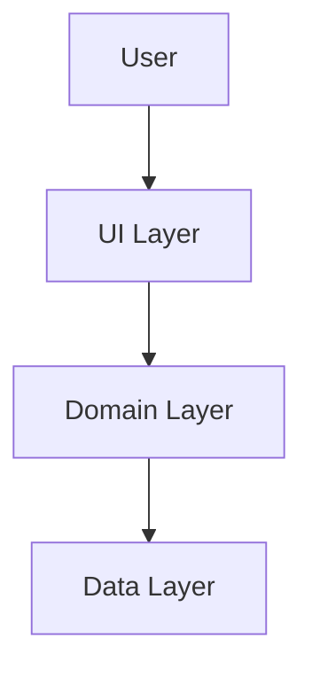

# Quick Start Guide - Enhanced Prompts

**Project:** Basser MVP  
**Date:** December 8, 2025  
**Author:** Basser Project Development Agents Team  
**Status:** ✅ Active

---

## 🎯 Quick Overview (2 min read)

This guide will help you get started with the **enhanced prompts system** for Spec-Driven Development in under 10 minutes.

### What You'll Learn

- ✅ How to use the enhanced prompts
- ✅ Complete workflow from requirements to PR review
- ✅ Key principles and best practices
- ✅ Quick examples

### What's New in v2.0

- ⭐ **COLLABORATION FIRST** - Explicit approval required
- ⭐ **KISS** - Keep It Simple, Stupid
- ⭐ **ENGLISH FOR CODE** - All code in English
- ⭐ **Mermaid.js** - Mandatory diagrams
- ⭐ **GitHub CLI** - Integrated PR reviews
- ⭐ **Smart Analysis** - Automatic artifact filtering

**Rating:** 9.8/10 ⭐⭐⭐⭐⭐

---

## 🚀 Getting Started (5 min)

### Step 1: Understand the Principles

Read these 3 core files (takes 3 minutes):

```bash
# 1. Philosophy (1 min)
cat .kiro/steering/core/philosophy.md

# 2. Quick Reference (1 min)
cat .kiro/steering/core/quick-reference.md

# 3. Team Identity (30 sec)
cat .kiro/steering/core/team-identity.md
```

**Key Takeaways:**

- ⭐ **Always ask for approval** before executing
- ⭐ **Keep it simple** - no over-engineering
- ⭐ **English for code** - all code, comments, docs
- ⭐ **Security first** - no compromises
- ⭐ **Quality first** - 70%+ test coverage

### Step 2: Know the Workflow

The complete Spec-Driven Development workflow:

```
1. Requirements → createSpec.prompt.md → requirements.md
2. Design      → design.prompt.md      → design.md
3. Tasks       → createTask.prompt.md  → tasks.md
4. Execute     → executeTask.prompt.md → implementation
5. Commit      → commit.prompt.md      → commit message
6. Review      → prReview.prompt.md    → PR review
```

### Step 3: Choose Your Starting Point

**For New Features:**
Start with `createSpec.prompt.md`

**For Bug Fixes:**
Start with `executeTask.prompt.md`

**For Code Review:**
Use `prReview.prompt.md`

---

## 💡 First Usage (10 min)

### Example: Add a New Feature

Let's add a "Product Review System" feature.

#### 1. Requirements (2 min)

**User says:** "I want to add a product review system"

**Agent uses:** `createSpec.prompt.md`

```bash
# Agent reads the prompt
cat .kiro/prompts/createSpec.prompt.md

# Agent follows the workflow:
# 1. Ask clarifying questions
# 2. Generate requirements.md with EARS syntax
# 3. Include user stories, data model, business rules
# 4. Verify completeness
```

**Output:** `requirements.md` with complete specifications

**Example:** See `.kiro/prompts/examples/01-createSpec-example.md`

#### 2. Design (3 min)

**Agent uses:** `design.prompt.md`

```bash
# Agent reads the prompt
cat .kiro/prompts/design.prompt.md

# Agent follows the workflow:
# 1. Read requirements.md
# 2. Create design.md with Mermaid.js diagrams
# 3. Define architecture, data flow, components
# 4. Include security and performance analysis
```

**Output:** `design.md` with Mermaid.js diagrams

**Example:** See `.kiro/prompts/examples/02-design-example.md`

#### 3. Tasks (2 min)

**Agent uses:** `createTask.prompt.md`

```bash
# Agent reads the prompt
cat .kiro/prompts/createTask.prompt.md

# Agent follows the workflow:
# 1. Read requirements.md and design.md
# 2. Break down into hierarchical tasks
# 3. Define dependencies and order
# 4. Add acceptance criteria
```

**Output:** `tasks.md` with task breakdown

**Example:** See `.kiro/prompts/examples/03-createTask-example.md`

#### 4. Execute (2 min)

**Agent uses:** `executeTask.prompt.md`

```bash
# Agent reads the prompt
cat .kiro/prompts/executeTask.prompt.md

# Agent follows the workflow:
# 1. Gather context (MANDATORY)
# 2. Verify comprehension
# 3. Check strategic compliance
# 4. Request approval (MANDATORY)
# 5. Implement with tests
# 6. Verify and update task status
```

**Output:** Implementation with tests

**Example:** See `.kiro/prompts/examples/04-executeTask-example.md`

#### 5. Commit (30 sec)

**Agent uses:** `commit.prompt.md`

```bash
# Agent reads the prompt
cat .kiro/prompts/commit.prompt.md

# Agent follows the workflow:
# 1. Smart change analysis
# 2. Automatic artifact filtering
# 3. Determine commit type
# 4. Generate message (Conventional Commits)
# 5. Final checklist
```

**Output:** Professional commit message

**Example:** See `.kiro/prompts/examples/05-commit-example.md`

#### 6. Review (1 min)

**Agent uses:** `prReview.prompt.md`

```bash
# Agent reads the prompt
cat .kiro/prompts/prReview.prompt.md

# Agent follows the workflow:
# 1. Gather PR information (GitHub CLI)
# 2. Strategic governance review
# 3. Technical code review (20+ points)
# 4. Automated checks
# 5. Generate comprehensive report
```

**Output:** Comprehensive PR review

**Example:** See `.kiro/prompts/examples/06-prReview-example.md`

---

## 📚 Quick Examples

### Example 1: Bug Fix

**User:** "Fix PDF export encoding issue"

**Workflow:**

```
1. executeTask.prompt.md → Fix implementation
2. commit.prompt.md      → "fix(invoices): resolve PDF encoding"
3. prReview.prompt.md    → Review changes
```

**Time:** ~5 minutes

### Example 2: Refactoring

**User:** "Refactor customer repository"

**Workflow:**

```
1. executeTask.prompt.md → Refactor code
2. commit.prompt.md      → "refactor(customers): simplify repository"
3. prReview.prompt.md    → Review changes
```

**Time:** ~5 minutes

### Example 3: New Feature

**User:** "Add dark mode support"

**Workflow:**

```
1. createSpec.prompt.md  → requirements.md
2. design.prompt.md      → design.md
3. createTask.prompt.md  → tasks.md
4. executeTask.prompt.md → Implementation
5. commit.prompt.md      → Commit messages
6. prReview.prompt.md    → PR review
```

**Time:** ~20 minutes

---

## ✅ Quick Checklist

### Before You Start

- [ ] Read `philosophy.md` (1 min)
- [ ] Read `quick-reference.md` (1 min)
- [ ] Understand the workflow (1 min)

### During Execution

- [ ] **Always ask for approval** before executing
- [ ] Follow the prompt workflow step-by-step
- [ ] Use **English for all code**
- [ ] Include **tests** (70%+ coverage)
- [ ] Add **Mermaid.js diagrams** (for design)
- [ ] Generate **professional commit messages**

### After Execution

- [ ] Verify all tests pass
- [ ] Check code quality (flutter analyze)
- [ ] Review commit message
- [ ] Update task status
- [ ] Request PR review

---

## 🎯 Key Principles (Remember These!)

### 1. COLLABORATION FIRST ⭐

**Rule:** Always ask for explicit approval before executing

**Example:**

```
Agent: "I will now implement the customer repository.
        This will create 3 files and add 150 lines of code.
        May I proceed?"

User: "Yes, proceed" ✅
```

### 2. KISS ⭐

**Rule:** Keep It Simple, Stupid - No over-engineering

**Example:**

```
❌ Bad:  Complex abstraction with 5 layers
✅ Good: Simple, direct implementation
```

### 3. ENGLISH FOR CODE ⭐

**Rule:** All code, comments, and documentation in English

**Example:**

```dart
// ✅ Good
class CustomerRepository {
  Future<List<Customer>> getAllCustomers() async { }
}

// ❌ Bad
class مستودع_العملاء {
  Future<List<عميل>> احصل_على_جميع_العملاء() async { }
}
```

### 4. Security First

**Rule:** No compromises on security

**Example:**

```dart
// ✅ Good - Secure storage
final storage = FlutterSecureStorage();
await storage.write(key: 'password', value: hashedPassword);

// ❌ Bad - Insecure storage
final prefs = await SharedPreferences.getInstance();
await prefs.setString('password', password);
```

### 5. Quality First

**Rule:** 70%+ test coverage, clean code

**Example:**

```dart
// ✅ Good - With tests
test('should add customer successfully', () async {
  await repository.addCustomer(customer);
  expect(customers.length, 1);
});
```

---

## 📖 Additional Resources

### Documentation

- **Full Guide:** `.kiro/prompts/README.md`
- **Examples:** `.kiro/prompts/examples/`
- **Philosophy:** `.kiro/steering/core/philosophy.md`
- **Standards:** `.kiro/steering/standards/`

### Reports

- **Integration Report:** `.kiro/docs/reports/INTEGRATION_FINAL_REPORT.md`
- **Examples Report:** `.kiro/docs/reports/EXAMPLES_COMPLETION_REPORT.md`
- **Final Summary:** `.kiro/docs/reports/FINAL_SUMMARY.md`

### Prompts (v2.0)

1. **createSpec.prompt.md** - Requirements generation
2. **design.prompt.md** - Design with Mermaid.js
3. **createTask.prompt.md** - Task breakdown
4. **executeTask.prompt.md** - Task execution
5. **commit.prompt.md** - Commit messages
6. **prReview.prompt.md** - PR review

---

## 🎓 Learning Path

### Beginner (Day 1)

1. Read `philosophy.md` (1 min)
2. Read `quick-reference.md` (1 min)
3. Read this Quick Start Guide (10 min)
4. Try Example 1: Bug Fix (5 min)

**Total:** ~17 minutes

### Intermediate (Day 2-3)

1. Read all 6 prompts (30 min)
2. Read 2-3 practical examples (30 min)
3. Try Example 2: Refactoring (10 min)
4. Try Example 3: New Feature (20 min)

**Total:** ~90 minutes

### Advanced (Week 1)

1. Read all standards (60 min)
2. Read all guides (90 min)
3. Read all examples (60 min)
4. Practice on real features (varies)

**Total:** ~3-4 hours

---

## 💡 Tips & Tricks

### Tip 1: Use Examples

When stuck, refer to the examples:

```bash
# List all examples
ls .kiro/prompts/examples/

# Read specific example
cat .kiro/prompts/examples/01-createSpec-example.md
```

### Tip 2: Follow Checklists

Each prompt has a checklist - follow it strictly:

```
✅ Context gathered
✅ Comprehension verified
✅ Strategic compliance checked
✅ Approval requested
✅ Implementation complete
✅ Tests added
✅ Verification done
```

### Tip 3: Use Mermaid.js

For design, always include Mermaid.js diagrams:



### Tip 4: Smart Commits

Let the agent analyze changes and generate commit messages:

```bash
# Agent analyzes changes
git diff

# Agent generates message
feat(customers): add search functionality

- Add search bar to customers screen
- Implement search logic in repository
- Add tests for search functionality

Refs: TASK-001
```

### Tip 5: Comprehensive Reviews

Use GitHub CLI for comprehensive PR reviews:

```bash
# Agent uses GitHub CLI
gh pr view 123
gh pr diff 123
gh pr checks 123

# Agent generates comprehensive review
```

---

## ❓ FAQ

### Q: Do I need to read all documentation?

**A:** No! Start with:

1. `philosophy.md` (1 min)
2. `quick-reference.md` (1 min)
3. This Quick Start Guide (10 min)

That's enough to get started!

### Q: Which prompt should I use first?

**A:** Depends on your task:

- **New feature:** Start with `createSpec.prompt.md`
- **Bug fix:** Start with `executeTask.prompt.md`
- **Code review:** Use `prReview.prompt.md`

### Q: Do I need approval for everything?

**A:** Yes! The agent must ask for explicit approval before:

- Creating/modifying files
- Executing commands
- Making changes

**Exception:** Reading files and analysis don't need approval.

### Q: What if I don't understand something?

**A:** Check the examples:

```bash
cat .kiro/prompts/examples/README.md
```

Each example shows the complete workflow with explanations.

### Q: How long does it take to learn?

**A:**

- **Basic usage:** 15-20 minutes
- **Intermediate:** 1-2 hours
- **Advanced:** 3-4 hours

### Q: Can I skip the design phase?

**A:** Not recommended! Design with Mermaid.js diagrams helps:

- Visualize the architecture
- Identify issues early
- Communicate with team
- Document decisions

---

## 🎉 You're Ready!

Congratulations! You now know how to use the enhanced prompts system.

### Next Steps

1. **Try it out** - Start with a simple bug fix
2. **Read examples** - Learn from practical examples
3. **Practice** - Use on real features
4. **Improve** - Provide feedback

### Remember

- ⭐ **COLLABORATION FIRST** - Always ask for approval
- ⭐ **KISS** - Keep it simple
- ⭐ **ENGLISH FOR CODE** - All code in English
- ⭐ **Security First** - No compromises
- ⭐ **Quality First** - 70%+ coverage

---

## 📞 Support

Need help?

- **Examples:** `.kiro/prompts/examples/`
- **Documentation:** `.kiro/prompts/README.md`
- **Reports:** `.kiro/docs/reports/`
- **Standards:** `.kiro/steering/standards/`

---

**Prepared by:** Basser Project Development Agents Team  
**Date:** December 8, 2025  
**Version:** 1.0  
**Status:** ✅ Active

🚀 **Happy Coding!** 🚀
