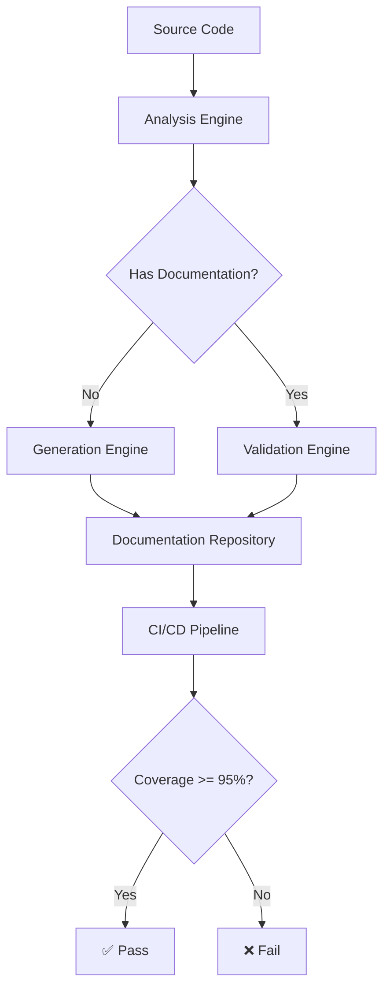

# Design Document - نظام التوثيق الشامل

## Overview

نظام التوثيق الشامل هو حل متكامل لإضافة وإدارة documentation لجميع الدوال والكلاسات العامة في مشروع بصير MVP. يهدف النظام إلى رفع تغطية التوثيق من 5% إلى 95%+ باستخدام DartDoc format.

## Architecture

### High-Level Architecture

```
┌─────────────────────────────────────────────────────────┐
│                  Documentation System                    │
├─────────────────────────────────────────────────────────┤
│                                                          │
│  ┌──────────────┐  ┌──────────────┐  ┌──────────────┐ │
│  │   Analysis   │  │  Generation  │  │  Validation  │ │
│  │    Engine    │→ │    Engine    │→ │    Engine    │ │
│  └──────────────┘  └──────────────┘  └──────────────┘ │
│         ↓                  ↓                  ↓         │
│  ┌──────────────────────────────────────────────────┐  │
│  │           Documentation Repository               │  │
│  └──────────────────────────────────────────────────┘  │
│         ↓                                               │
│  ┌──────────────────────────────────────────────────┐  │
│  │              CI/CD Integration                   │  │
│  └──────────────────────────────────────────────────┘  │
└─────────────────────────────────────────────────────────┘
```

### Component Diagram



## Components and Interfaces

### 1. Analysis Engine

**Purpose:** تحليل الكود وتحديد العناصر العامة التي تحتاج documentation

**Interface:**

```dart
/// محرك تحليل الكود لاكتشاف العناصر غير الموثقة
class AnalysisEngine {
  /// تحليل ملف واحد
  Future<AnalysisResult> analyzeFile(String filePath);

  /// تحليل مجلد كامل
  Future<List<AnalysisResult>> analyzeDirectory(String dirPath);

  /// الحصول على إحصائيات التغطية
  CoverageStats getCoverageStats();
}

/// نتيجة تحليل ملف
class AnalysisResult {
  final String filePath;
  final List<UndocumentedElement> undocumentedElements;
  final double coveragePercentage;
}

/// عنصر غير موثق
class UndocumentedElement {
  final String name;
  final ElementType type; // class, method, property
  final int lineNumber;
  final String signature;
}
```

### 2. Generation Engine

**Purpose:** توليد documentation تلقائي بناءً على سياق الكود

**Interface:**

```dart
/// محرك توليد التوثيق التلقائي
class GenerationEngine {
  /// توليد documentation لعنصر واحد
  String generateDocumentation(UndocumentedElement element);

  /// توليد documentation لملف كامل
  Map<String, String> generateFileDocumentation(AnalysisResult result);

  /// تطبيق التوثيق على الملف
  Future<void> applyDocumentation(String filePath, Map<String, String> docs);
}
```

### 3. Validation Engine

**Purpose:** التحقق من جودة واكتمال التوثيق

**Interface:**

```dart
/// محرك التحقق من جودة التوثيق
class ValidationEngine {
  /// التحقق من documentation لعنصر واحد
  ValidationResult validateElement(String documentation);

  /// التحقق من ملف كامل
  FileValidationResult validateFile(String filePath);

  /// التحقق من المشروع بالكامل
  ProjectValidationResult validateProject();
}

/// نتيجة التحقق
class ValidationResult {
  final bool isValid;
  final List<ValidationIssue> issues;
  final QualityScore qualityScore;
}
```

### 4. Documentation Repository

**Purpose:** تخزين وإدارة التوثيق والإحصائيات

**Interface:**

```dart
/// مستودع التوثيق
class DocumentationRepository {
  /// حفظ تقرير تغطية
  Future<void> saveCoverageReport(CoverageReport report);

  /// الحصول على تاريخ التغطية
  Future<List<CoverageReport>> getCoverageHistory();

  /// تصدير تقرير
  Future<String> exportReport(ReportFormat format);
}
```

## Data Models

### CoverageStats

```dart
/// إحصائيات تغطية التوثيق
class CoverageStats {
  final int totalElements;
  final int documentedElements;
  final int undocumentedElements;
  final double coveragePercentage;
  final Map<ElementType, int> elementBreakdown;

  CoverageStats({
    required this.totalElements,
    required this.documentedElements,
    required this.undocumentedElements,
    required this.coveragePercentage,
    required this.elementBreakdown,
  });
}
```

### DocumentationTemplate

```dart
/// قالب التوثيق
class DocumentationTemplate {
  final ElementType type;
  final String arabicTemplate;
  final String englishTemplate;
  final List<String> requiredSections;

  String generate(Map<String, dynamic> context);
}
```

## Correctness Properties

_A property is a characteristic or behavior that should hold true across all valid executions of a system-essentially, a formal statement about what the system should do. Properties serve as the bridge between human-readable specifications and machine-verifiable correctness guarantees._

### Property 1: Documentation Coverage Threshold

_For any_ project state, if all public APIs are analyzed, then the documentation coverage percentage should be at least 95%
**Validates: Requirements 1.4**

### Property 2: DartDoc Format Compliance

_For any_ generated documentation, it should conform to DartDoc format specifications including proper use of `///`, `@param`, `@returns`, and code examples
**Validates: Requirements 1.5, 2.5**

### Property 3: Documentation Consistency

_For any_ two elements of the same type, their documentation should follow the same format and structure
**Validates: Requirements 2.1**

### Property 4: Bilingual Support

_For any_ user-facing component documentation, it should include both Arabic descriptions and English technical terms
**Validates: Requirements 2.2, 2.3**

### Property 5: Example Validity

_For any_ documentation that includes code examples, those examples should compile and run without errors
**Validates: Requirements 2.4, 4.4**

### Property 6: Update Synchronization

_For any_ code modification, if a public API signature changes, then the corresponding documentation should be flagged for update
**Validates: Requirements 3.1**

### Property 7: CI/CD Integration

_For any_ pull request, if it contains undocumented public APIs, then the CI/CD pipeline should reject it
**Validates: Requirements 3.3**

### Property 8: Coverage Tracking

_For any_ time period, the system should maintain a historical record of documentation coverage changes
**Validates: Requirements 5.3**

## Error Handling

### Analysis Errors

- **File Not Found:** Return empty AnalysisResult with error flag
- **Parse Error:** Log error and skip file, continue with others
- **Permission Error:** Report to user and request access

### Generation Errors

- **Context Insufficient:** Use minimal template with placeholders
- **Template Not Found:** Fall back to default template
- **Write Permission:** Report error and save to temporary location

### Validation Errors

- **Invalid Format:** Report specific format violations
- **Missing Sections:** List required sections that are missing
- **Quality Below Threshold:** Provide improvement suggestions

## Testing Strategy

### Unit Tests

1. **AnalysisEngine Tests**

   - Test file parsing
   - Test element detection
   - Test coverage calculation

2. **GenerationEngine Tests**

   - Test template rendering
   - Test context extraction
   - Test documentation application

3. **ValidationEngine Tests**
   - Test format validation
   - Test quality scoring
   - Test issue detection

### Integration Tests

1. **End-to-End Flow**

   - Analyze → Generate → Validate → Apply
   - Test with real project files
   - Verify coverage improvement

2. **CI/CD Integration**
   - Test pipeline rejection
   - Test coverage reporting
   - Test automated fixes

### Property-Based Tests

1. **Coverage Invariant**

   - Property: Coverage never decreases after documentation addition
   - Generator: Random code modifications
   - Assertion: newCoverage >= oldCoverage

2. **Format Consistency**
   - Property: All generated docs follow same format
   - Generator: Random element types
   - Assertion: All match template pattern

## Implementation Phases

### Phase 1: Analysis Engine (Week 1)

- Implement file parsing
- Implement element detection
- Implement coverage calculation
- Unit tests

### Phase 2: Generation Engine (Week 2)

- Create documentation templates
- Implement context extraction
- Implement doc generation
- Unit tests

### Phase 3: Validation Engine (Week 3)

- Implement format validation
- Implement quality scoring
- Implement issue detection
- Unit tests

### Phase 4: CI/CD Integration (Week 4)

- Create GitHub Action
- Implement coverage gates
- Implement automated reporting
- Integration tests

### Phase 5: Documentation & Deployment (Week 5)

- Write user documentation
- Create examples
- Deploy to production
- Monitor and iterate

## Performance Considerations

### Analysis Performance

- **Target:** < 5 seconds for entire project
- **Strategy:** Parallel file processing
- **Caching:** Cache parsed ASTs

### Generation Performance

- **Target:** < 1 second per file
- **Strategy:** Template pre-compilation
- **Optimization:** Batch processing

### Validation Performance

- **Target:** < 3 seconds for entire project
- **Strategy:** Incremental validation
- **Caching:** Cache validation results

## Security Considerations

### Code Access

- Read-only access to source files
- No modification without explicit approval
- Audit log for all changes

### Generated Content

- Sanitize all generated text
- No sensitive information in docs
- Review before commit

## Monitoring and Metrics

### Key Metrics

1. **Coverage Percentage:** Track over time
2. **Generation Accuracy:** Manual review sampling
3. **Validation Pass Rate:** Percentage of valid docs
4. **CI/CD Impact:** Build time increase
5. **Developer Satisfaction:** Survey feedback

### Dashboards

- Real-time coverage dashboard
- Historical trends
- Per-file breakdown
- Team leaderboard

---

**Version:** 1.0  
**Status:** Approved  
**Date:** 27 نوفمبر 2025  
**Next:** Create tasks.md for implementation plan
