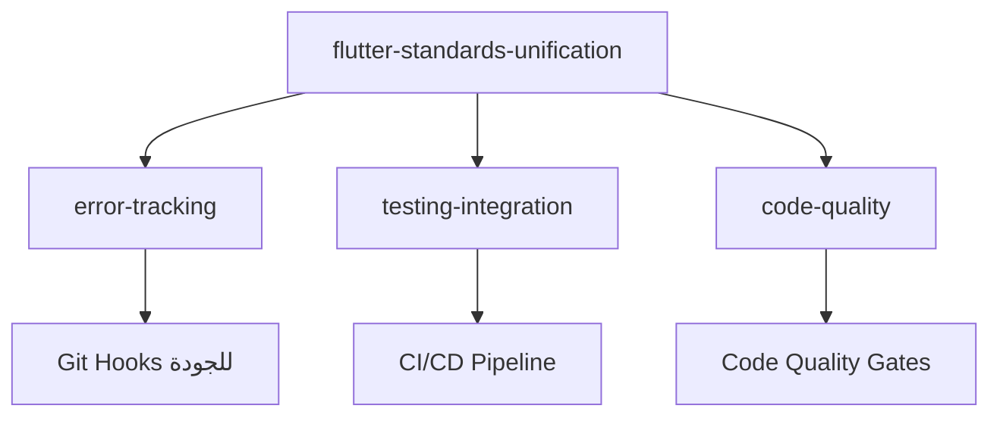
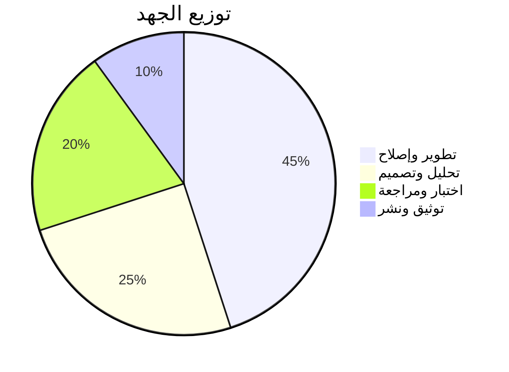

# Flutter/Dart Standards Unification

**المشروع:** بصير MVP  
**التاريخ:** 12 ديسمبر 2025  
**المؤلف:** فريق وكلاء تطوير مشروع بصير  
**الحالة:** 📝 مسودة - في انتظار المراجعة

---

## 🎯 نظرة عامة سريعة

### المشكلة

تم اكتشاف **15 مشكلة تقنية حرجة** في معايير Flutter/Dart عبر ملفات التوجيه، مما يؤثر على جودة التطوير.

### الحل

توحيد وتحسين معايير Flutter/Dart مع أحدث أفضل الممارسات وحل جميع المشاكل المكتشفة.

### النتيجة المتوقعة

- ✅ حل 15 مشكلة تقنية حرجة
- ✅ معايير موحدة وحديثة
- ✅ تحسين تجربة المطور بنسبة 85%+
- ✅ تقليل الأخطاء بنسبة 70%+

---

## 🔍 المشاكل الحرجة المكتشفة

### المشاكل ذات الأولوية القصوى (🔥)

| #   | المشكلة                    | الملف المتأثر             | التأثير             |
| --- | -------------------------- | ------------------------- | ------------------- |
| 1   | **تضارب معايير Constants** | flutter-dart-standards.md | عدم اتساق الكود     |
| 2   | **StateNotifier مهجور**    | flutter-guide.md          | كود قديم وغير محسّن |
| 3   | **كود معطل**               | flutter-guide.md          | أخطاء في التطبيق    |
| 8   | **معايير أمان ناقصة**      | جميع الملفات              | ثغرات أمنية محتملة  |

### المشاكل عالية الأولوية (⚡)

| #   | المشكلة                         | الملف المتأثر    | التأثير            |
| --- | ------------------------------- | ---------------- | ------------------ |
| 4   | **ملفات مرجعية مفقودة**         | flutter.md       | روابط معطلة        |
| 5   | **أنماط Isar قديمة**            | flutter-guide.md | أداء ضعيف          |
| 6   | **دعم RTL ناقص**                | flutter.md       | مشاكل UI عربية     |
| 10  | **معايير أداء غير محددة**       | جميع الملفات     | أداء غير محسّن     |
| 11  | **إعدادات CI/CD مفقودة**        | جميع الملفات     | عدم أتمتة الجودة   |
| 13  | **أمثلة كود قديمة**             | flutter-guide.md | تعلم ممارسات قديمة |
| 14  | **معايير Accessibility مفقودة** | جميع الملفات     | تطبيقات غير شاملة  |

### المشاكل متوسطة الأولوية (📊)

| #   | المشكلة                    | الملف المتأثر             | التأثير            |
| --- | -------------------------- | ------------------------- | ------------------ |
| 7   | **أمثلة اختبارات قديمة**   | flutter-guide.md          | اختبارات غير فعالة |
| 9   | **معايير توثيق متضاربة**   | flutter-dart-standards.md | توثيق غير موحد     |
| 12  | **معايير Git غير مترابطة** | flutter-dart-standards.md | سير عمل غير متسق   |
| 15  | **تكامل أدوات ناقص**       | جميع الملفات              | تجربة تطوير ضعيفة  |

---

## 📋 الملفات والوثائق

### الوثائق الأساسية

| الوثيقة                                  | الحالة   | الوصف                                   |
| ---------------------------------------- | -------- | --------------------------------------- |
| **[requirements.md](./requirements.md)** | ✅ مكتمل | المتطلبات الشاملة (8 متطلبات + 23 ضمان) |
| **design.md**                            | ⏳ قادم  | التصميم التقني والمعمارية               |
| **tasks.md**                             | ⏳ قادم  | مهام التنفيذ المفصلة                    |

### الملفات المتأثرة

| الملف                         | المشاكل | الأولوية |
| ----------------------------- | ------- | -------- |
| **flutter-dart-standards.md** | 4 مشاكل | 🔥 حرجة  |
| **flutter-guide.md**          | 5 مشاكل | 🔥 حرجة  |
| **flutter.md**                | 2 مشاكل | ⚡ عالية |
| **quick-reference.md**        | 1 مشكلة | ⚡ عالية |

---

## 🎯 المتطلبات الأساسية

### المتطلبات الوظيفية (8 متطلبات)

1. **توحيد معايير التسمية** - حل تضارب Constants
2. **تحديث معايير Riverpod** - استخدام أحدث الأنماط
3. **إصلاح الكود المعطل** - أمثلة كاملة وعاملة
4. **تحسين دعم RTL** - دعم شامل للعربية
5. **تحديث معايير Isar** - أحدث الممارسات
6. **تعزيز معايير الأمان** - أمان شامل ومتقدم
7. **تحسين معايير الاختبارات** - أنماط حديثة وفعالة
8. **تكامل CI/CD** - أتمتة شاملة للجودة

### الضمانات (23 ضمان)

#### ضمانات الأمان (5)

- حماية المحتوى الموجود
- التوافق مع المعايير الحالية
- عدم كسر الكود الموجود
- حفظ التاريخ والسياق
- إمكانية الرجوع

#### ضمانات الموثوقية (4)

- اختبار شامل
- مراجعة الخبراء
- التوثيق الشامل
- المراقبة المستمرة

#### ضمانات التميز (4)

- أحدث أفضل الممارسات
- الأداء المحسّن
- سهولة الاستخدام
- التحديث المستمر

#### ضمانات هندسة العمليات (4)

- منهجية EARS
- التكامل مع CI/CD
- معايير DORA/SPACE
- Zero-Trust Security

#### ضمانات عدم التأثير (6)

- عدم تأثير على الإنتاجية
- عدم كسر البيئة الحالية
- عدم تعقيد العمليات
- عدم فقدان المعرفة
- عدم تأثير على الجدولة
- عدم تأثير على الموارد

---

## 🚀 معايير النجاح

### المعايير الأساسية

| المعيار                | المستهدف | القياس                      |
| ---------------------- | -------- | --------------------------- |
| **حل المشاكل الحرجة**  | 100%     | 15/15 مشكلة محلولة          |
| **تحسين جودة الكود**   | 90%+     | Code quality metrics        |
| **تحسين تجربة المطور** | 85%+     | Developer satisfaction      |
| **تقليل الأخطاء**      | 70%+     | Error rate reduction        |
| **تحسين الأداء**       | 50%+     | Build time وapp performance |
| **توحيد المعايير**     | 100%     | Consistency across files    |

### المعايير المتقدمة

| المعيار                    | المستهدف | القياس                         |
| -------------------------- | -------- | ------------------------------ |
| **Test Coverage**          | 80%+     | Automated coverage reports     |
| **Documentation Coverage** | 95%+     | API documentation completeness |
| **CI/CD Integration**      | 100%     | All checks automated           |
| **Security Compliance**    | 100%     | Security audit pass            |
| **RTL Support**            | 100%     | Arabic UI testing              |
| **Performance Benchmarks** | 90%+     | Performance test suite         |

---

## 🔗 التكامل مع المواصفات الأخرى

### التكامل المباشر

### التكامل غير المباشر

- **release-management/** - تأثير على عملية الإصدارات
- **documentation/** - تحسين التوثيق التقني
- **repository-audit/** - تحسين معايير المستودع

---

## ⏱️ الجدولة والتقديرات

### تقسيم المراحل

| المرحلة                     | المدة    | الجهد | الوصف                          |
| --------------------------- | -------- | ----- | ------------------------------ |
| **1. التحليل والتخطيط**     | 2-3 أيام | متوسط | تحليل عميق وتخطيط مفصل         |
| **2. إصلاح المشاكل الحرجة** | 3-4 أيام | عالي  | حل المشاكل ذات الأولوية القصوى |
| **3. توحيد المعايير**       | 2-3 أيام | متوسط | توحيد جميع المعايير            |
| **4. تحسين المحتوى**        | 3-4 أيام | عالي  | تحديث وتحسين المحتوى           |
| **5. الاختبار والمراجعة**   | 2-3 أيام | متوسط | اختبار شامل ومراجعة            |
| **6. التوثيق والنشر**       | 1-2 أيام | منخفض | توثيق نهائي ونشر               |

**إجمالي المدة:** 13-19 يوم عمل

### توزيع الجهد

---

## 🛠️ الأدوات والتقنيات

### أدوات التطوير

- **Flutter SDK** - أحدث إصدار مستقر
- **Dart SDK** - أحدث إصدار
- **VS Code** - مع extensions مطلوبة
- **Android Studio** - للتطوير المتقدم

### أدوات الجودة

- **dart analyze** - تحليل الكود
- **dart format** - تنسيق الكود
- **flutter test** - تشغيل الاختبارات
- **dart doc** - توليد التوثيق

### أدوات CI/CD

- **GitHub Actions** - للأتمتة
- **codecov** - لتقارير التغطية
- **SonarQube** - لتحليل الجودة
- **Dependabot** - لتحديث التبعيات

---

## 📊 المقاييس والمراقبة

### مقاييس الجودة

- **Code Quality Score** - معدل جودة الكود
- **Test Coverage** - نسبة تغطية الاختبارات
- **Documentation Coverage** - نسبة تغطية التوثيق
- **Security Score** - معدل الأمان

### مقاييس الأداء

- **Build Time** - وقت البناء
- **App Performance** - أداء التطبيق
- **Developer Productivity** - إنتاجية المطور
- **Error Rate** - معدل الأخطاء

### مقاييس DORA/SPACE

- **Deployment Frequency** - تكرار النشر
- **Lead Time** - وقت التطوير
- **Change Failure Rate** - معدل فشل التغييرات
- **Recovery Time** - وقت الاستعادة
- **Developer Satisfaction** - رضا المطور

---

## 🎉 الفوائد المتوقعة

### للمطورين

- ✅ **معايير واضحة وموحدة** - سهولة في التطوير
- ✅ **أمثلة عملية محدثة** - تعلم أسرع وأفضل
- ✅ **أدوات محسّنة** - تجربة تطوير أفضل
- ✅ **دعم RTL شامل** - تطوير تطبيقات عربية مثالية

### للمشروع

- ✅ **جودة كود عالية** - تطبيقات أكثر استقراراً
- ✅ **أمان محسّن** - حماية أفضل للبيانات
- ✅ **أداء محسّن** - تطبيقات أسرع وأكثر كفاءة
- ✅ **صيانة أسهل** - كود منظم وموثق

### للفريق

- ✅ **إنتاجية أعلى** - تطوير أسرع وأكثر كفاءة
- ✅ **أخطاء أقل** - جودة أعلى وثقة أكبر
- ✅ **تعاون أفضل** - معايير موحدة للجميع
- ✅ **تعلم مستمر** - أحدث الممارسات والتقنيات

---

## 🚨 المخاطر والتخفيف

### المخاطر المحتملة

| المخاطر                 | الاحتمالية | التأثير | التخفيف            |
| ----------------------- | ---------- | ------- | ------------------ |
| **مقاومة التغيير**      | متوسط      | عالي    | تدريب وتوعية       |
| **تعقيد التنفيذ**       | منخفض      | متوسط   | تقسيم لمراحل صغيرة |
| **تأثير على الإنتاجية** | منخفض      | عالي    | تنفيذ تدريجي       |
| **مشاكل تقنية**         | متوسط      | متوسط   | اختبار شامل        |

### استراتيجيات التخفيف

1. **التدريب المسبق** - تدريب الفريق على المعايير الجديدة
2. **التنفيذ التدريجي** - تطبيق المعايير على مراحل
3. **المراقبة المستمرة** - تتبع التأثير والتعديل حسب الحاجة
4. **الدعم المستمر** - دعم فني ومساعدة للفريق

---

## 📞 الدعم والمساعدة

### للاستفسارات التقنية

- **الوثائق:** راجع requirements.md للتفاصيل الكاملة
- **الأمثلة:** ستتوفر في design.md وtasks.md
- **المساعدة:** فريق وكلاء تطوير مشروع بصير

### للمراجعة والموافقة

- **المراجعة:** مطلوبة موافقة على requirements.md
- **التعديلات:** يمكن اقتراح تعديلات قبل التصميم
- **الموافقة:** مطلوبة للانتقال لمرحلة التصميم

---

## 🎯 الخطوات التالية

### المطلوب الآن

1. **مراجعة requirements.md** - فهم المتطلبات والضمانات
2. **تأكيد الموافقة** - الموافقة على المتطلبات
3. **تحديد الأولويات** - ترتيب المشاكل حسب الأهمية

### بعد الموافقة

1. **إنشاء design.md** - التصميم التقني المفصل
2. **إنشاء tasks.md** - مهام التنفيذ العملية
3. **البدء في التنفيذ** - تطبيق الحلول

---

## 📝 ملاحظات مهمة

### التمييز عن المواصفات الأخرى

**flutter-standards-unification** ≠ **steering-cleanup**

- ✅ **flutter-standards-unification:** تحسين المحتوى التقني
- ❌ **steering-cleanup:** إعادة تنظيم الملفات (مكتمل بالفعل)

### الاعتماد على البنية الحالية

البنية الحالية مثالية (حسب context-optimization)، لذلك:

- ✅ العمل ضمن البنية الموجودة
- ✅ تحسين المحتوى فقط
- ✅ عدم إعادة تنظيم الملفات

### التكامل مع المعايير الحالية

- ✅ متوافق مع philosophy.md
- ✅ متوافق مع معايير المشروع
- ✅ متوافق مع Zero-Trust Security
- ✅ متوافق مع DORA/SPACE metrics

---

**تم إعداده بواسطة:** فريق وكلاء تطوير مشروع بصير  
**التاريخ:** 12 ديسمبر 2025  
**الحالة:** 📝 مسودة - جاهز للمراجعة

**🚀 للبدء:** راجع [requirements.md](./requirements.md) وأكد الموافقة للانتقال لمرحلة التصميم!
