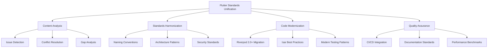

# Flutter/Dart Standards Unification - Technical Design

**المشروع:** بصير MVP  
**التاريخ:** 12 ديسمبر 2025  
**المؤلف:** فريق وكلاء تطوير مشروع بصير  
**الحالة:** 📐 تصميم تقني - جاهز للمراجعة

---

## 🎯 نظرة عامة على التصميم

### الهدف الأساسي

تصميم حل تقني شامل لتوحيد وتحسين معايير Flutter/Dart عبر جميع ملفات التوجيه، مع حل 15 مشكلة تقنية حرجة وضمان التوافق مع أحدث أفضل الممارسات.

### المبادئ التصميمية

1. **Backward Compatibility** - عدم كسر الكود الموجود
2. **Progressive Enhancement** - تحسين تدريجي للمعايير
3. **Documentation-First** - التوثيق أولاً
4. **Zero-Trust Security** - أمان بلا ثقة مسبقة
5. **KISS Principle** - البساطة أولاً

---

## 🏗️ المعمارية التقنية

### البنية العامة



### طبقات التصميم

#### 1. Content Analysis Layer

**المسؤولية:** تحليل المحتوى الحالي وتحديد المشاكل

```
Input: Existing steering files
Process:
  - Parse content structure
  - Identify conflicts and inconsistencies
  - Map dependencies between files
  - Generate issue reports
Output: Comprehensive analysis report
```

#### 2. Standards Harmonization Layer

**المسؤولية:** توحيد المعايير عبر جميع الملفات

```
Input: Analysis report + Best practices research
Process:
  - Resolve naming convention conflicts
  - Standardize code patterns
  - Align security requirements
  - Unify documentation formats
Output: Unified standards specification
```

#### 3. Code Modernization Layer

**المسؤولية:** تحديث الأمثلة والأنماط للإصدارات الحديثة

```
Input: Current code examples + Latest framework versions
Process:
  - Migrate StateNotifier to AsyncNotifier
  - Update Isar patterns to latest version
  - Modernize testing approaches
  - Enhance RTL support
Output: Modern, working code examples
```

#### 4. Quality Assurance Layer

**المسؤولية:** ضمان الجودة والتوافق

```
Input: Updated content + Quality standards
Process:
  - Validate all code examples
  - Test RTL functionality
  - Verify security compliance
  - Check performance benchmarks
Output: Quality-assured documentation
```

---

## 🔧 التصميم التفصيلي للحلول

### الحل 1: توحيد معايير التسمية

#### المشكلة الحالية

```yaml
# flutter-dart-standards.md
Constants: lowerCamelCase (maxRetries)

# quick-reference.md
Constants: lowerCamelCase (maxRetries)

# Conflict: Industry standard is SCREAMING_SNAKE_CASE for global constants
```

#### التصميم المقترح

```dart
// Global Constants (SCREAMING_SNAKE_CASE)
class AppConstants {
  static const int MAX_RETRY_ATTEMPTS = 3;
  static const Duration DEFAULT_TIMEOUT = Duration(seconds: 30);
  static const String API_BASE_URL = 'https://api.baseer.com';
}

// Local Constants (lowerCamelCase)
class CustomerScreen extends StatelessWidget {
  static const double cardPadding = 16.0;
  static const int itemsPerPage = 20;

  @override
  Widget build(BuildContext context) {
    return Container(padding: EdgeInsets.all(cardPadding));
  }
}

// Enum Values (camelCase)
enum CustomerStatus {
  active,
  inactive,
  pending,
  suspended,
}
```

#### معايير التطبيق

| النوع               | الصيغة               | مثال                 | الاستخدام             |
| ------------------- | -------------------- | -------------------- | --------------------- |
| Global Constants    | SCREAMING_SNAKE_CASE | `MAX_RETRY_ATTEMPTS` | App-wide constants    |
| Local Constants     | lowerCamelCase       | `cardPadding`        | Widget/class specific |
| Enum Values         | camelCase            | `customerStatus`     | Enum members          |
| Class Names         | PascalCase           | `CustomerRepository` | All classes           |
| Functions/Variables | camelCase            | `getAllCustomers`    | Methods and variables |

### الحل 2: تحديث معايير Riverpod

#### المشكلة الحالية

```dart
// Old StateNotifier pattern (deprecated in Riverpod 2.0+)
class CustomersNotifier extends StateNotifier<AsyncValue<List<Customer>>> {
  CustomersNotifier(this.repository) : super(const AsyncValue.loading());

  final CustomerRepository repository;

  Future<void> loadCustomers() async {
    state = const AsyncValue.loading();
    try {
      final customers = await repository.getAllCustomers();
      state = AsyncValue.data(customers);
    } catch (error, stackTrace) {
      state = AsyncValue.error(error, stackTrace);
    }
  }
}
```

#### التصميم المقترح

```dart
// Modern AsyncNotifier pattern (Riverpod 2.0+)
@riverpod
class CustomersNotifier extends _$CustomersNotifier {
  @override
  Future<List<Customer>> build() async {
    final repository = ref.watch(customerRepositoryProvider);
    return repository.getAllCustomers();
  }

  Future<void> addCustomer(Customer customer) async {
    state = const AsyncValue.loading();
    state = await AsyncValue.guard(() async {
      final repository = ref.read(customerRepositoryProvider);
      await repository.addCustomer(customer);
      return repository.getAllCustomers();
    });
  }

  Future<void> updateCustomer(Customer customer) async {
    state = const AsyncValue.loading();
    state = await AsyncValue.guard(() async {
      final repository = ref.read(customerRepositoryProvider);
      await repository.updateCustomer(customer);
      return repository.getAllCustomers();
    });
  }

  Future<void> deleteCustomer(String customerId) async {
    state = const AsyncValue.loading();
    state = await AsyncValue.guard(() async {
      final repository = ref.read(customerRepositoryProvider);
      await repository.deleteCustomer(customerId);
      return repository.getAllCustomers();
    });
  }
}

// Usage in widgets
class CustomersScreen extends ConsumerWidget {
  @override
  Widget build(BuildContext context, WidgetRef ref) {
    final customersAsync = ref.watch(customersNotifierProvider);

    return Scaffold(
      body: customersAsync.when(
        data: (customers) => ListView.builder(
          itemCount: customers.length,
          itemBuilder: (context, index) => CustomerCard(
            customer: customers[index],
            onEdit: (customer) => ref
                .read(customersNotifierProvider.notifier)
                .updateCustomer(customer),
            onDelete: (customerId) => ref
                .read(customersNotifierProvider.notifier)
                .deleteCustomer(customerId),
          ),
        ),
        loading: () => const Center(child: CircularProgressIndicator()),
        error: (error, stack) => ErrorWidget(
          error: error,
          onRetry: () => ref.invalidate(customersNotifierProvider),
        ),
      ),
    );
  }
}
```

### الحل 3: إصلاح الكود المعطل

#### المشكلة الحالية

الكود في نهاية flutter-guide.md غير مكتمل ومعطل:

```dart
String? validatePhone(String? value) {
  if (value == null || value.isEmpty) {
    return 'رقم الهاتف مطلوب';
  }
  if (!value.startsWith('05')) {
    return 'رقم الهاتف يجب أن يبدأ بـ 05';
  }
  if (value.length != 10) {
    return 'رقم الهاتف يجب أن يتكون من 10 أرقام';
  }
  if (!RegExp(r'^[0-9]+
// الكود مقطوع هنا!
```

#### التصميم المقترح

```dart
// Complete validation utilities
class ValidationUtils {
  // Phone validation for Saudi Arabia
  static String? validatePhone(String? value) {
    if (value == null || value.isEmpty) {
      return 'رقم الهاتف مطلوب';
    }

    // Remove any non-digit characters
    final cleanValue = value.replaceAll(RegExp(r'[^\d]'), '');

    // Check if starts with 05
    if (!cleanValue.startsWith('05')) {
      return 'رقم الهاتف يجب أن يبدأ بـ 05';
    }

    // Check length
    if (cleanValue.length != 10) {
      return 'رقم الهاتف يجب أن يتكون من 10 أرقام';
    }

    // Check if contains only digits
    if (!RegExp(r'^[0-9]+$').hasMatch(cleanValue)) {
      return 'رقم الهاتف يجب أن يحتوي على أرقام فقط';
    }

    return null;
  }

  // Email validation
  static String? validateEmail(String? value) {
    if (value == null || value.isEmpty) {
      return null; // Email is optional
    }

    final emailRegex = RegExp(
      r'^[a-zA-Z0-9._%+-]+@[a-zA-Z0-9.-]+\.[a-zA-Z]{2,}$'
    );

    if (!emailRegex.hasMatch(value)) {
      return 'البريد الإلكتروني غير صحيح';
    }

    return null;
  }

  // Name validation
  static String? validateName(String? value) {
    if (value == null || value.isEmpty) {
      return 'الاسم مطلوب';
    }

    if (value.trim().length < 2) {
      return 'الاسم يجب أن يتكون من حرفين على الأقل';
    }

    if (value.trim().length > 50) {
      return 'الاسم يجب أن يكون أقل من 50 حرف';
    }

    // Allow Arabic, English letters, and spaces
    if (!RegExp(r'^[\u0600-\u06FFa-zA-Z\s]+$').hasMatch(value)) {
      return 'الاسم يجب أن يحتوي على حروف فقط';
    }

    return null;
  }

  // Amount validation for invoices
  static String? validateAmount(String? value) {
    if (value == null || value.isEmpty) {
      return 'المبلغ مطلوب';
    }

    final amount = double.tryParse(value);
    if (amount == null) {
      return 'المبلغ يجب أن يكون رقم صحيح';
    }

    if (amount <= 0) {
      return 'المبلغ يجب أن يكون أكبر من صفر';
    }

    if (amount > 999999.99) {
      return 'المبلغ كبير جداً';
    }

    return null;
  }
}

// Usage example in forms
class CustomerForm extends StatefulWidget {
  @override
  _CustomerFormState createState() => _CustomerFormState();
}

class _CustomerFormState extends State<CustomerForm> {
  final _formKey = GlobalKey<FormState>();
  final _nameController = TextEditingController();
  final _phoneController = TextEditingController();
  final _emailController = TextEditingController();

  @override
  void dispose() {
    _nameController.dispose();
    _phoneController.dispose();
    _emailController.dispose();
    super.dispose();
  }

  @override
  Widget build(BuildContext context) {
    return Form(
      key: _formKey,
      child: Column(
        children: [
          TextFormField(
            controller: _nameController,
            decoration: const InputDecoration(
              labelText: 'اسم العميل',
              hintText: 'أدخل اسم العميل',
            ),
            validator: ValidationUtils.validateName,
            textDirection: TextDirection.rtl,
          ),
          const SizedBox(height: 16),
          TextFormField(
            controller: _phoneController,
            decoration: const InputDecoration(
              labelText: 'رقم الهاتف',
              hintText: '05xxxxxxxx',
            ),
            keyboardType: TextInputType.phone,
            validator: ValidationUtils.validatePhone,
            textDirection: TextDirection.ltr,
          ),
          const SizedBox(height: 16),
          TextFormField(
            controller: _emailController,
            decoration: const InputDecoration(
              labelText: 'البريد الإلكتروني (اختياري)',
              hintText: 'example@email.com',
            ),
            keyboardType: TextInputType.emailAddress,
            validator: ValidationUtils.validateEmail,
            textDirection: TextDirection.ltr,
          ),
          const SizedBox(height: 24),
          ElevatedButton(
            onPressed: () {
              if (_formKey.currentState!.validate()) {
                // Process form data
                final customer = Customer(
                  id: DateTime.now().millisecondsSinceEpoch.toString(),
                  name: _nameController.text.trim(),
                  phone: _phoneController.text.trim(),
                  email: _emailController.text.trim().isEmpty
                      ? null
                      : _emailController.text.trim(),
                  createdAt: DateTime.now(),
                );

                // Save customer
                Navigator.pop(context, customer);
              }
            },
            child: const Text('حفظ العميل'),
          ),
        ],
      ),
    );
  }
}
```

### الحل 4: تحسين دعم RTL

#### التصميم المقترح

```dart
// RTL-aware theme configuration
class AppTheme {
  static ThemeData get arabicTheme {
    return ThemeData(
      // Use Arabic font
      fontFamily: 'Cairo',

      // RTL-aware text theme
      textTheme: const TextTheme(
        displayLarge: TextStyle(
          fontFamily: 'Cairo',
          fontSize: 32,
          fontWeight: FontWeight.bold,
        ),
        bodyLarge: TextStyle(
          fontFamily: 'Cairo',
          fontSize: 16,
          height: 1.5, // Better line height for Arabic
        ),
      ),

      // RTL-aware input decoration
      inputDecorationTheme: const InputDecorationTheme(
        border: OutlineInputBorder(),
        contentPadding: EdgeInsets.symmetric(horizontal: 16, vertical: 12),
        // Align labels to the right for RTL
        floatingLabelAlignment: FloatingLabelAlignment.start,
      ),

      // RTL-aware app bar theme
      appBarTheme: const AppBarTheme(
        centerTitle: false, // Align title to start (right in RTL)
        titleTextStyle: TextStyle(
          fontFamily: 'Cairo',
          fontSize: 20,
          fontWeight: FontWeight.w600,
        ),
      ),
    );
  }
}

// RTL-aware widgets
class RTLAwareCard extends StatelessWidget {
  final Widget child;
  final EdgeInsetsGeometry? padding;

  const RTLAwareCard({
    Key? key,
    required this.child,
    this.padding,
  }) : super(key: key);

  @override
  Widget build(BuildContext context) {
    final isRTL = Directionality.of(context) == TextDirection.rtl;

    return Card(
      child: Padding(
        padding: padding ?? EdgeInsets.only(
          right: isRTL ? 16 : 8,
          left: isRTL ? 8 : 16,
          top: 12,
          bottom: 12,
        ),
        child: child,
      ),
    );
  }
}

// RTL-aware list tile
class RTLAwareListTile extends StatelessWidget {
  final Widget? leading;
  final Widget? title;
  final Widget? subtitle;
  final Widget? trailing;
  final VoidCallback? onTap;

  const RTLAwareListTile({
    Key? key,
    this.leading,
    this.title,
    this.subtitle,
    this.trailing,
    this.onTap,
  }) : super(key: key);

  @override
  Widget build(BuildContext context) {
    return ListTile(
      leading: leading,
      title: title,
      subtitle: subtitle,
      trailing: trailing,
      onTap: onTap,
      // Ensure proper text alignment
      titleAlignment: ListTileTitleAlignment.center,
    );
  }
}

// Arabic number formatting
extension ArabicNumbers on String {
  String toArabicDigits() {
    const english = ['0', '1', '2', '3', '4', '5', '6', '7', '8', '9'];
    const arabic = ['٠', '١', '٢', '٣', '٤', '٥', '٦', '٧', '٨', '٩'];

    String result = this;
    for (int i = 0; i < english.length; i++) {
      result = result.replaceAll(english[i], arabic[i]);
    }
    return result;
  }

  String toEnglishDigits() {
    const arabic = ['٠', '١', '٢', '٣', '٤', '٥', '٦', '٧', '٨', '٩'];
    const english = ['0', '1', '2', '3', '4', '5', '6', '7', '8', '9'];

    String result = this;
    for (int i = 0; i < arabic.length; i++) {
      result = result.replaceAll(arabic[i], english[i]);
    }
    return result;
  }
}

// Currency formatting for Saudi Riyal
class CurrencyFormatter {
  static String formatSAR(double amount) {
    final formatter = NumberFormat.currency(
      locale: 'ar_SA',
      symbol: 'ر.س',
      decimalDigits: 2,
    );
    return formatter.format(amount);
  }

  static String formatSARCompact(double amount) {
    if (amount >= 1000000) {
      return '${(amount / 1000000).toStringAsFixed(1)}م ر.س';
    } else if (amount >= 1000) {
      return '${(amount / 1000).toStringAsFixed(1)}ك ر.س';
    } else {
      return formatSAR(amount);
    }
  }
}
```

### الحل 5: تحديث معايير Isar

#### التصميم المقترح

```dart
// Modern Isar patterns with latest version
@collection
class CustomerModel {
  Id id = Isar.autoIncrement;

  @Index(type: IndexType.value)
  late String name;

  @Index(type: IndexType.hash)
  late String phone;

  String? email;
  String? address;

  @Index()
  late DateTime createdAt;

  DateTime? updatedAt;

  // Computed properties
  @ignore
  String get displayName => name.trim();

  @ignore
  bool get hasEmail => email != null && email!.isNotEmpty;
}

// Repository with modern Isar patterns
class CustomerRepositoryImpl implements CustomerRepository {
  final Isar isar;

  CustomerRepositoryImpl(this.isar);

  @override
  Future<List<Customer>> getAllCustomers() async {
    final models = await isar.customerModels
        .where()
        .sortByCreatedAtDesc()
        .findAll();

    return models.map((model) => _modelToEntity(model)).toList();
  }

  @override
  Future<Customer?> getCustomerById(String id) async {
    final numericId = int.tryParse(id);
    if (numericId == null) return null;

    final model = await isar.customerModels.get(numericId);
    return model != null ? _modelToEntity(model) : null;
  }

  @override
  Future<List<Customer>> searchCustomers(String query) async {
    final models = await isar.customerModels
        .filter()
        .nameContains(query, caseSensitive: false)
        .or()
        .phoneContains(query)
        .sortByName()
        .findAll();

    return models.map((model) => _modelToEntity(model)).toList();
  }

  @override
  Future<void> addCustomer(Customer customer) async {
    final model = _entityToModel(customer);
    model.createdAt = DateTime.now();

    await isar.writeTxn(() async {
      await isar.customerModels.put(model);
    });
  }

  @override
  Future<void> updateCustomer(Customer customer) async {
    final model = _entityToModel(customer);
    model.updatedAt = DateTime.now();

    await isar.writeTxn(() async {
      await isar.customerModels.put(model);
    });
  }

  @override
  Future<void> deleteCustomer(String id) async {
    final numericId = int.tryParse(id);
    if (numericId == null) return;

    await isar.writeTxn(() async {
      await isar.customerModels.delete(numericId);
    });
  }

  @override
  Future<void> deleteAllCustomers() async {
    await isar.writeTxn(() async {
      await isar.customerModels.clear();
    });
  }

  // Batch operations for better performance
  @override
  Future<void> addCustomers(List<Customer> customers) async {
    final models = customers.map((customer) {
      final model = _entityToModel(customer);
      model.createdAt = DateTime.now();
      return model;
    }).toList();

    await isar.writeTxn(() async {
      await isar.customerModels.putAll(models);
    });
  }

  // Streaming for real-time updates
  @override
  Stream<List<Customer>> watchAllCustomers() {
    return isar.customerModels
        .where()
        .sortByCreatedAtDesc()
        .watch(fireImmediately: true)
        .map((models) => models.map((model) => _modelToEntity(model)).toList());
  }

  // Helper methods
  Customer _modelToEntity(CustomerModel model) {
    return Customer(
      id: model.id.toString(),
      name: model.name,
      phone: model.phone,
      email: model.email,
      address: model.address,
      createdAt: model.createdAt,
      updatedAt: model.updatedAt,
    );
  }

  CustomerModel _entityToModel(Customer entity) {
    final model = CustomerModel()
      ..name = entity.name
      ..phone = entity.phone
      ..email = entity.email
      ..address = entity.address
      ..createdAt = entity.createdAt
      ..updatedAt = entity.updatedAt;

    if (entity.id.isNotEmpty) {
      final numericId = int.tryParse(entity.id);
      if (numericId != null) {
        model.id = numericId;
      }
    }

    return model;
  }
}

// Database initialization with proper error handling
class DatabaseService {
  static Isar? _instance;

  static Future<Isar> getInstance() async {
    if (_instance != null) return _instance!;

    final dir = await getApplicationDocumentsDirectory();

    _instance = await Isar.open(
      [CustomerModelSchema, InvoiceModelSchema],
      directory: dir.path,
      name: 'baseer_db',
      maxSizeMiB: 256, // Limit database size
    );

    return _instance!;
  }

  static Future<void> closeDatabase() async {
    await _instance?.close();
    _instance = null;
  }
}
```

---

## 🔒 تصميم الأمان

### Zero-Trust Security Implementation

```dart
// Secure storage service
class SecureStorageService {
  static const _storage = FlutterSecureStorage(
    aOptions: AndroidOptions(
      encryptedSharedPreferences: true,
    ),
    iOptions: IOSOptions(
      accessibility: IOSAccessibility.first_unlock_this_device,
    ),
  );

  // Store sensitive data
  static Future<void> storeSecurely(String key, String value) async {
    try {
      await _storage.write(key: key, value: value);
    } catch (e) {
      throw SecurityException('Failed to store data securely: $e');
    }
  }

  // Retrieve sensitive data
  static Future<String?> getSecurely(String key) async {
    try {
      return await _storage.read(key: key);
    } catch (e) {
      throw SecurityException('Failed to retrieve data securely: $e');
    }
  }

  // Delete sensitive data
  static Future<void> deleteSecurely(String key) async {
    try {
      await _storage.delete(key: key);
    } catch (e) {
      throw SecurityException('Failed to delete data securely: $e');
    }
  }

  // Clear all sensitive data
  static Future<void> clearAll() async {
    try {
      await _storage.deleteAll();
    } catch (e) {
      throw SecurityException('Failed to clear secure storage: $e');
    }
  }
}

// Input sanitization
class InputSanitizer {
  // Sanitize text input to prevent injection attacks
  static String sanitizeText(String input) {
    return input
        .replaceAll(RegExp(r'[<>"\']'), '') // Remove potentially dangerous characters
        .trim()
        .substring(0, math.min(input.length, 1000)); // Limit length
  }

  // Sanitize SQL-like input (even though we use Isar)
  static String sanitizeQuery(String query) {
    return query
        .replaceAll(RegExp(r'[;\'\"\\]'), '') // Remove SQL injection characters
        .trim()
        .substring(0, math.min(query.length, 100)); // Limit query length
  }

  // Validate file paths
  static bool isValidFilePath(String path) {
    // Prevent directory traversal attacks
    return !path.contains('..') &&
           !path.contains('~') &&
           !path.startsWith('/') &&
           path.length < 255;
  }
}

// Encryption utilities
class EncryptionUtils {
  // Hash passwords using SHA-256
  static String hashPassword(String password) {
    final bytes = utf8.encode(password);
    final digest = sha256.convert(bytes);
    return digest.toString();
  }

  // Generate secure random strings
  static String generateSecureToken(int length) {
    const chars = 'abcdefghijklmnopqrstuvwxyzABCDEFGHIJKLMNOPQRSTUVWXYZ0123456789';
    final random = Random.secure();
    return List.generate(length, (index) => chars[random.nextInt(chars.length)]).join();
  }

  // Validate password strength
  static bool isStrongPassword(String password) {
    return password.length >= 8 &&
           password.contains(RegExp(r'[A-Z]')) && // Uppercase
           password.contains(RegExp(r'[a-z]')) && // Lowercase
           password.contains(RegExp(r'[0-9]')) && // Number
           password.contains(RegExp(r'[!@#$%^&*(),.?":{}|<>]')); // Special char
  }
}
```

---

## 🧪 تصميم الاختبارات

### Modern Testing Architecture

```dart
// Test utilities
class TestUtils {
  // Create test Isar instance
  static Future<Isar> createTestIsar() async {
    return await Isar.open(
      [CustomerModelSchema, InvoiceModelSchema],
      directory: '',
      name: 'test_${DateTime.now().millisecondsSinceEpoch}',
    );
  }

  // Create mock customer
  static Customer createMockCustomer({
    String? id,
    String? name,
    String? phone,
  }) {
    return Customer(
      id: id ?? 'test-${DateTime.now().millisecondsSinceEpoch}',
      name: name ?? 'أحمد محمد',
      phone: phone ?? '0501234567',
      createdAt: DateTime.now(),
    );
  }

  // Pump and settle with timeout
  static Future<void> pumpAndSettleWithTimeout(
    WidgetTester tester, {
    Duration timeout = const Duration(seconds: 10),
  }) async {
    await tester.pumpAndSettle(timeout);
  }
}

// Widget test helpers
class WidgetTestHelpers {
  // Create test app wrapper
  static Widget createTestApp(Widget child) {
    return ProviderScope(
      child: MaterialApp(
        locale: const Locale('ar'),
        supportedLocales: const [Locale('ar'), Locale('en')],
        theme: AppTheme.arabicTheme,
        home: Directionality(
          textDirection: TextDirection.rtl,
          child: child,
        ),
      ),
    );
  }

  // Find by Arabic text
  static Finder findByArabicText(String text) {
    return find.text(text);
  }

  // Verify RTL layout
  static void verifyRTLLayout(WidgetTester tester, Finder finder) {
    final widget = tester.widget(finder);
    expect(widget, isA<Directionality>());
    final directionality = widget as Directionality;
    expect(directionality.textDirection, TextDirection.rtl);
  }
}

// Integration test helpers
class IntegrationTestHelpers {
  // Setup test environment
  static Future<void> setupTestEnvironment() async {
    // Initialize test database
    await DatabaseService.getInstance();

    // Clear any existing data
    final isar = await DatabaseService.getInstance();
    await isar.writeTxn(() async {
      await isar.customerModels.clear();
      await isar.invoiceModels.clear();
    });
  }

  // Cleanup test environment
  static Future<void> cleanupTestEnvironment() async {
    await DatabaseService.closeDatabase();
  }

  // Create test data
  static Future<void> createTestData() async {
    final isar = await DatabaseService.getInstance();

    final customers = List.generate(10, (index) => CustomerModel()
      ..name = 'عميل تجريبي ${index + 1}'
      ..phone = '050123456${index}'
      ..createdAt = DateTime.now().subtract(Duration(days: index)));

    await isar.writeTxn(() async {
      await isar.customerModels.putAll(customers);
    });
  }
}
```

---

## 🚀 تصميم CI/CD Integration

### GitHub Actions Workflow

```yaml
# .github/workflows/flutter_quality.yml
name: Flutter Quality Assurance

on:
  push:
    branches: [main, develop]
  pull_request:
    branches: [main]

jobs:
  quality_check:
    runs-on: ubuntu-latest

    steps:
      - uses: actions/checkout@v4

      - name: Setup Flutter
        uses: subosito/flutter-action@v2
        with:
          flutter-version: "3.16.0"
          channel: "stable"

      - name: Get dependencies
        run: flutter pub get

      - name: Verify formatting
        run: dart format --output=none --set-exit-if-changed .

      - name: Analyze project source
        run: flutter analyze --fatal-infos

      - name: Run tests
        run: flutter test --coverage

      - name: Upload coverage to Codecov
        uses: codecov/codecov-action@v3
        with:
          file: coverage/lcov.info

      - name: Check test coverage
        run: |
          COVERAGE=$(lcov --summary coverage/lcov.info | grep "lines" | awk '{print $2}' | sed 's/%//')
          if (( $(echo "$COVERAGE < 70" | bc -l) )); then
            echo "Test coverage is below 70%: $COVERAGE%"
            exit 1
          fi
          echo "Test coverage: $COVERAGE%"

  security_scan:
    runs-on: ubuntu-latest

    steps:
      - uses: actions/checkout@v4

      - name: Run security scan
        run: |
          # Check for hardcoded secrets
          if grep -r "password\|secret\|key" lib/ --include="*.dart" | grep -v "// TODO\|// FIXME"; then
            echo "Potential hardcoded secrets found!"
            exit 1
          fi

          # Check for TODO/FIXME in production code
          if grep -r "TODO\|FIXME" lib/ --include="*.dart" | grep -v test; then
            echo "TODO/FIXME found in production code!"
            exit 1
          fi

  build_test:
    runs-on: ubuntu-latest

    steps:
      - uses: actions/checkout@v4

      - name: Setup Flutter
        uses: subosito/flutter-action@v2
        with:
          flutter-version: "3.16.0"
          channel: "stable"

      - name: Build APK
        run: flutter build apk --debug

      - name: Build iOS (dry run)
        run: flutter build ios --no-codesign --debug
```

---

## 📊 تصميم المقاييس والمراقبة

### Performance Monitoring

```dart
// Performance monitoring service
class PerformanceMonitor {
  static final Map<String, Stopwatch> _timers = {};

  // Start timing an operation
  static void startTimer(String operation) {
    _timers[operation] = Stopwatch()..start();
  }

  // Stop timing and log result
  static Duration stopTimer(String operation) {
    final timer = _timers[operation];
    if (timer == null) return Duration.zero;

    timer.stop();
    final duration = timer.elapsed;

    // Log performance metrics
    debugPrint('Performance: $operation took ${duration.inMilliseconds}ms');

    // Send to analytics if needed
    _sendPerformanceMetric(operation, duration);

    _timers.remove(operation);
    return duration;
  }

  static void _sendPerformanceMetric(String operation, Duration duration) {
    // Implementation for sending metrics to analytics service
    // This could be Firebase Analytics, custom analytics, etc.
  }
}

// Usage in repositories
class CustomerRepositoryImpl implements CustomerRepository {
  @override
  Future<List<Customer>> getAllCustomers() async {
    PerformanceMonitor.startTimer('getAllCustomers');

    try {
      final models = await isar.customerModels
          .where()
          .sortByCreatedAtDesc()
          .findAll();

      final customers = models.map((model) => _modelToEntity(model)).toList();

      return customers;
    } finally {
      PerformanceMonitor.stopTimer('getAllCustomers');
    }
  }
}
```

---

## 🔄 Migration Strategy

### تدريجي Implementation Plan

#### Phase 1: Critical Fixes (Week 1)

- Fix broken code in flutter-guide.md
- Resolve constants naming conflicts
- Update StateNotifier to AsyncNotifier

#### Phase 2: Standards Unification (Week 2)

- Harmonize documentation standards
- Update Isar patterns
- Enhance security guidelines

#### Phase 3: Feature Enhancement (Week 3)

- Improve RTL support
- Add CI/CD integration
- Implement performance monitoring

#### Phase 4: Quality Assurance (Week 4)

- Comprehensive testing
- Documentation review
- Performance validation

---

## 📋 Implementation Checklist

### Pre-Implementation

- [ ] Backup all existing files
- [ ] Create feature branch
- [ ] Setup test environment
- [ ] Prepare migration scripts

### Implementation

- [ ] Fix critical issues (Priority 🔥)
- [ ] Update high priority items (Priority ⚡)
- [ ] Enhance medium priority features (Priority 📊)
- [ ] Add comprehensive tests
- [ ] Update documentation

### Post-Implementation

- [ ] Run full test suite
- [ ] Validate performance metrics
- [ ] Review security compliance
- [ ] Update team documentation
- [ ] Deploy to staging environment

---

**تم إعداده بواسطة:** فريق وكلاء تطوير مشروع بصير  
**التاريخ:** 12 ديسمبر 2025  
**الحالة:** 📐 تصميم تقني مكتمل - جاهز للمراجعة والموافقة
