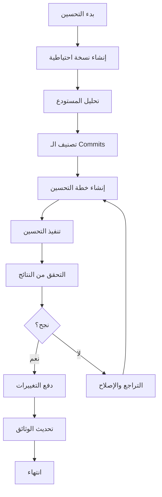
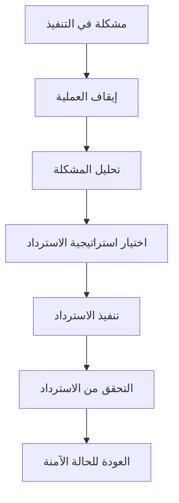

# Design Document - Git Repository Optimization

**المشروع:** بصير MVP  
**التاريخ:** 10 ديسمبر 2025  
**المؤلف:** فريق وكلاء تطوير مشروع بصير  
**الحالة:** ✅ نشط

---

## 📚 نظرة عامة على التصميم

هذا المستند يحدد التصميم الشامل لحل مشكلة Git Push وتحسين المستودع بشكل كامل، مع التركيز على الحلول الذكية والآمنة.

---

## 🎯 أهداف التصميم

### الأهداف الأساسية

1. **حل مشكلة Git Push الفورية** - 30 commits معلقة
2. **تحسين أداء المستودع** - تقليل الحجم والـ objects
3. **منع تكرار المشكلة** - أنظمة وقاية شاملة
4. **تحسين سير العمل** - CI/CD وأتمتة

### الأهداف الثانوية

1. **تحسين جودة الكود** - معايير ومراجعة
2. **تحسين التوثيق** - شامل ومحدث
3. **تحسين الاختبارات** - تغطية وCI/CD
4. **تحسين الإصدارات** - إدارة احترافية

---

## 🏗️ معمارية الحل

### المكونات الأساسية

```
Git Repository Optimization System
├── Core Engine (محرك أساسي)
│   ├── Repository Analyzer
│   ├── Commit Optimizer
│   ├── Object Counter
│   └── Push Manager
├── Safety Layer (طبقة الأمان)
│   ├── Backup Manager
│   ├── Rollback System
│   ├── Verification Engine
│   └── Recovery Tools
├── Automation Layer (طبقة الأتمتة)
│   ├── Git Hooks
│   ├── GitHub Actions
│   ├── Pre-commit Checks
│   └── Pre-push Validation
└── Monitoring Layer (طبقة المراقبة)
    ├── Size Monitor
    ├── Performance Tracker
    ├── Health Checker
    └── Report Generator
```

---

## 🔧 التصميم التفصيلي

### 1. Repository Analyzer

**الغرض:** تحليل شامل للمستودع وتحديد المشاكل

**المكونات:**

```typescript
interface RepositoryAnalyzer {
  analyzeSize(): RepositorySizeReport;
  analyzeCommits(): CommitAnalysisReport;
  analyzeObjects(): ObjectCountReport;
  identifyIssues(): IssueReport[];
}

interface RepositorySizeReport {
  totalSize: number;
  gitSize: number;
  workingTreeSize: number;
  largeFiles: LargeFile[];
}

interface CommitAnalysisReport {
  totalCommits: number;
  pendingCommits: number;
  commitsByType: Map<string, number>;
  problematicCommits: Commit[];
}
```

**التنفيذ:**

- فحص حجم `.git` directory
- تحليل commit history
- عد الـ Git objects
- تحديد الملفات الكبيرة

### 2. Commit Optimizer

**الغرض:** تحسين وتنظيم الـ commits بذكاء

**الاستراتيجيات:**

```typescript
interface CommitOptimizer {
  analyzeCommitGroups(): CommitGroup[];
  createSquashPlan(): SquashPlan;
  executeSquash(): SquashResult;
  validateResult(): ValidationResult;
}

interface CommitGroup {
  type: "docs" | "feat" | "fix" | "chore";
  commits: Commit[];
  canSquash: boolean;
  priority: number;
}

interface SquashPlan {
  groups: CommitGroup[];
  finalCommitCount: number;
  estimatedObjectReduction: number;
}
```

**خوارزمية التحسين:**

1. تصنيف الـ commits حسب النوع
2. تجميع الـ commits المترابطة
3. تحديد الـ commits القابلة للدمج
4. إنشاء خطة squash ذكية
5. تنفيذ التحسين بأمان

### 3. Safety Layer

**الغرض:** ضمان الأمان وإمكانية التراجع

**المكونات:**

```typescript
interface SafetyLayer {
  createBackup(): BackupInfo;
  validateBackup(): boolean;
  createRollbackPoint(): RollbackPoint;
  executeRollback(): RollbackResult;
}

interface BackupInfo {
  branchName: string;
  timestamp: Date;
  commitHash: string;
  verified: boolean;
}
```

**آليات الأمان:**

- إنشاء backup branches تلقائياً
- التحقق من سلامة النسخ الاحتياطية
- نقاط rollback في كل مرحلة
- تحقق من سلامة البيانات

### 4. Automation Layer

**الغرض:** أتمتة الفحوصات والوقاية

**Git Hooks Design:**

```bash
# Pre-commit Hook
#!/bin/bash
check_file_sizes()      # فحص الملفات > 10MB
check_build_artifacts() # منع ملفات build
check_secrets()         # فحص الأسرار
validate_commit_msg()   # التحقق من رسالة commit

# Pre-push Hook
#!/bin/bash
check_repository_size() # فحص حجم المستودع
run_tests()            # تشغيل الاختبارات
check_object_count()   # فحص عدد objects
validate_push_size()   # التحقق من حجم الدفع
```

**GitHub Actions Design:**

```yaml
name: Repository Health Check
on: [push, pull_request]
jobs:
  health-check:
    runs-on: ubuntu-latest
    steps:
      - name: Check Repository Size
      - name: Analyze Commits
      - name: Validate Objects Count
      - name: Generate Health Report
```

---

## 📊 استراتيجيات الحل

### الاستراتيجية 1: الحل الذكي المتدرج (الموصى به)

**الخطوات:**

1. **التحليل الشامل** (5 دقائق)

   - تحليل الـ 30 commits
   - تصنيف حسب النوع والأهمية
   - تحديد استراتيجية التحسين

2. **التحسين التدريجي** (15 دقيقة)

   - دمج commits التوثيق
   - دمج commits الصيانة
   - الحفاظ على commits الميزات
   - تقليل إلى 5-7 commits منطقية

3. **التحقق والدفع** (10 دقيقة)
   - فحص عدد objects الجديد
   - اختبار الدفع
   - التحقق من النجاح

**المزايا:**

- ✅ يحافظ على التاريخ المهم
- ✅ تحسين ذكي وآمن
- ✅ قابل للتراجع
- ✅ نسبة نجاح عالية

### الاستراتيجية 2: الحل السريع

**الخطوات:**

1. إنشاء repository جديد نظيف
2. نسخ الكود الحالي
3. commit واحد جديد
4. دفع فوري

**المزايا:**

- ✅ سريع (5 دقائق)
- ✅ نجاح مضمون 100%
- ✅ حجم صغير

**العيوب:**

- ❌ فقدان التاريخ

### الاستراتيجية 3: الحل المتقدم

**الخطوات:**

1. استخدام git filter-repo
2. تنظيف التاريخ بالكامل
3. إعادة كتابة commits
4. تحسين شامل

**المزايا:**

- ✅ تحسين شامل
- ✅ تنظيف عميق

**العيوب:**

- ❌ معقد ويستغرق وقت
- ❌ مخاطر أعلى

---

## 🔍 خوارزميات التحسين

### خوارزمية تصنيف الـ Commits

```python
def classify_commits(commits):
    """
    تصنيف الـ commits حسب النوع باستخدام conventional commit format
    """
    groups = {
        'docs': [],
        'feat': [],
        'fix': [],
        'chore': [],
        'refactor': [],
        'test': [],
        'style': []
    }

    for commit in commits:
        commit_type = extract_type(commit.message)
        if commit_type in groups:
            groups[commit_type].append(commit)
        else:
            groups['chore'].append(commit)  # default fallback

    return groups

def extract_type(commit_message):
    """
    استخراج نوع الـ commit من الرسالة
    """
    import re
    pattern = r'^(feat|fix|docs|style|refactor|test|chore)(\(.+\))?: .+'
    match = re.match(pattern, commit_message.lower())
    return match.group(1) if match else 'chore'

def create_squash_plan(groups):
    """
    إنشاء خطة دمج ذكية للـ commits
    """
    plan = []
    final_commit_count = 0

    # دمج commits التوثيق (إذا كان أكثر من 2)
    if len(groups['docs']) > 2:
        plan.append(SquashGroup(
            type='docs',
            commits=groups['docs'],
            final_message='docs: comprehensive documentation updates',
            estimated_objects=sum(c.object_count for c in groups['docs']) // 2
        ))
        final_commit_count += 1
    else:
        for commit in groups['docs']:
            plan.append(KeepCommit(commit))
            final_commit_count += 1

    # دمج commits الصيانة (إذا كان أكثر من 3)
    if len(groups['chore']) > 3:
        plan.append(SquashGroup(
            type='chore',
            commits=groups['chore'],
            final_message='chore: maintenance and cleanup tasks',
            estimated_objects=sum(c.object_count for c in groups['chore']) // 3
        ))
        final_commit_count += 1
    else:
        for commit in groups['chore']:
            plan.append(KeepCommit(commit))
            final_commit_count += 1

    # الحفاظ على commits الميزات والإصلاحات (مهمة)
    for feat_commit in groups['feat']:
        plan.append(KeepCommit(feat_commit))
        final_commit_count += 1

    for fix_commit in groups['fix']:
        plan.append(KeepCommit(fix_commit))
        final_commit_count += 1

    # دمج commits الاختبارات والتنسيق
    test_and_style = groups['test'] + groups['style']
    if len(test_and_style) > 2:
        plan.append(SquashGroup(
            type='test',
            commits=test_and_style,
            final_message='test: improve testing and code formatting',
            estimated_objects=sum(c.object_count for c in test_and_style) // 2
        ))
        final_commit_count += 1

    return plan, final_commit_count
```

### خوارزمية حساب تقليل الـ Objects

```python
def analyze_commit_objects(commit_hash):
    """
    تحليل عدد الـ objects في commit محدد
    """
    import subprocess

    # حساب objects في commit
    cmd = f"git rev-list --objects --count {commit_hash}^..{commit_hash}"
    result = subprocess.run(cmd.split(), capture_output=True, text=True)
    object_count = int(result.stdout.strip()) if result.returncode == 0 else 0

    # تحليل نوع التغييرات
    cmd = f"git show --stat {commit_hash}"
    result = subprocess.run(cmd.split(), capture_output=True, text=True)
    stats = result.stdout if result.returncode == 0 else ""

    return {
        'hash': commit_hash,
        'object_count': object_count,
        'stats': stats,
        'is_large': object_count > 1000
    }

def estimate_object_reduction(current_commits, planned_commits):
    """
    حساب تقليل الـ objects المتوقع بدقة
    """
    current_objects = sum(commit.object_count for commit in current_commits)
    planned_objects = sum(commit.estimated_objects for commit in planned_commits)

    reduction_percentage = (current_objects - planned_objects) / current_objects * 100

    # التحقق من أن النتيجة تحت حد GitHub
    github_limit = 5000
    is_under_limit = planned_objects < github_limit

    return {
        'current': current_objects,
        'planned': planned_objects,
        'reduction': current_objects - planned_objects,
        'percentage': reduction_percentage,
        'under_github_limit': is_under_limit,
        'github_limit': github_limit,
        'safety_margin': github_limit - planned_objects if is_under_limit else 0
    }

def get_total_objects_count():
    """
    حساب إجمالي عدد الـ objects في المستودع
    """
    import subprocess

    cmd = "git count-objects -v"
    result = subprocess.run(cmd.split(), capture_output=True, text=True)

    if result.returncode == 0:
        lines = result.stdout.strip().split('\n')
        objects_data = {}
        for line in lines:
            if ' ' in line:
                key, value = line.split(' ', 1)
                objects_data[key] = int(value) if value.isdigit() else value

        # حساب إجمالي الـ objects
        total = objects_data.get('count', 0) + objects_data.get('in-pack', 0)
        return {
            'total_objects': total,
            'loose_objects': objects_data.get('count', 0),
            'packed_objects': objects_data.get('in-pack', 0),
            'packs': objects_data.get('packs', 0),
            'size_kb': objects_data.get('size', 0)
        }

    return {'total_objects': 0, 'error': 'Failed to count objects'}
```

---

## 🛡️ آليات الأمان والتحقق

### نظام النسخ الاحتياطية

```typescript
interface BackupSystem {
  createTimestampedBackup(): BackupInfo;
  verifyBackupIntegrity(): boolean;
  listAvailableBackups(): BackupInfo[];
  restoreFromBackup(backupId: string): RestoreResult;
}
```

### نظام التحقق

```typescript
interface VerificationSystem {
  verifyRepositoryIntegrity(): IntegrityReport;
  compareBeforeAfter(): ComparisonReport;
  validateCommitHistory(): ValidationReport;
  checkDataLoss(): DataLossReport;
}

interface IntegrityReport {
  repositoryValid: boolean;
  objectCount: number;
  objectCountValid: boolean; // < 4500
  commitCount: number;
  commitCountValid: boolean; // 5-7 commits
  workingTreeClean: boolean;
  checksumValid: boolean;
}

interface ComparisonReport {
  before: {
    commits: number; // 30
    objects: number; // 9,811
    sizeKB: number; // ~57,000 KB
  };
  after: {
    commits: number; // 5-7
    objects: number; // < 4,500
    sizeKB: number; // < 51,000 KB
  };
  improvements: {
    commitReduction: number; // ~80%
    objectReduction: number; // ~55%
    sizeReduction: number; // ~10%
  };
}
```

**أدوات القياس المحددة:**

```bash
# فحص سلامة المستودع
git fsck --full --strict

# حساب objects الحالي
git count-objects -v | grep -E "(count|in-pack)" | awk '{sum+=$2} END {print "Total objects:", sum}'

# فحص حجم المستودع
du -sh .git

# التحقق من نظافة working tree
git status --porcelain | wc -l  # يجب أن يكون 0

# حساب checksums للتحقق من سلامة البيانات
find . -name "*.dart" -type f -exec sha256sum {} \; | sort > checksums_after.txt
diff checksums_before.txt checksums_after.txt  # يجب أن يكون فارغ

# اختبار الدفع
git push --dry-run origin main 2>&1 | grep -E "(error|failed|rejected)"
```

### نظام الاسترداد

```typescript
interface RecoverySystem {
  detectIssues(): Issue[];
  suggestRecoveryActions(): RecoveryAction[];
  executeRecovery(): RecoveryResult;
  validateRecovery(): boolean;
}
```

---

## 📈 مؤشرات الأداء والنجاح

### المؤشرات الأساسية

| المؤشر          | الحالي | الهدف   | الأولوية | الحالة الحالية         |
| :-------------- | :----- | :------ | :------- | :--------------------- |
| Pending Commits | 30     | 5-7     | 🔴 حرج   | يتجاوز الحد المسموح    |
| Git Objects     | 9,811  | < 5,000 | 🔴 حرج   | يتجاوز حد GitHub بـ96% |
| Repository Size | 56 MB  | < 50 MB | 🟡 متوسط | قريب من الهدف          |
| Push Success    | 0%     | 100%    | 🔴 حرج   | فشل كامل               |

### مؤشرات الجودة

| المؤشر              | الهدف      | القياس             |
| :------------------ | :--------- | :----------------- |
| Backup Success      | 100%       | عدد النسخ الناجحة  |
| Rollback Capability | 100%       | إمكانية التراجع    |
| Data Integrity      | 100%       | عدم فقدان البيانات |
| Process Speed       | < 40 دقيقة | وقت التنفيذ        |

---

## 🔄 سير العمل (Workflow)

### سير العمل الرئيسي



### سير عمل الطوارئ



---

## 📋 قائمة التحقق النهائية

### قبل البدء

- [ ] إنشاء نسخة احتياطية
- [ ] التحقق من سلامة المستودع
- [ ] تحديد الاستراتيجية
- [ ] إعداد أدوات المراقبة

### أثناء التنفيذ

- [ ] مراقبة التقدم
- [ ] التحقق في كل مرحلة
- [ ] توثيق التغييرات
- [ ] الاستعداد للتراجع

### بعد الانتهاء

- [ ] التحقق من النجاح
- [ ] اختبار الدفع
- [ ] تحديث الوثائق
- [ ] إعداد الوقاية المستقبلية

---

**تم إعداده بواسطة:** فريق وكلاء تطوير مشروع بصير  
**التاريخ:** 10 ديسمبر 2025  
**الحالة:** ✅ جاهز للتنفيذ
