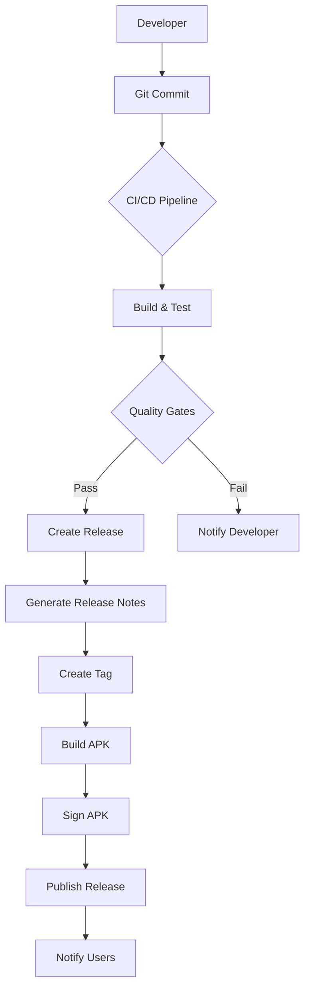
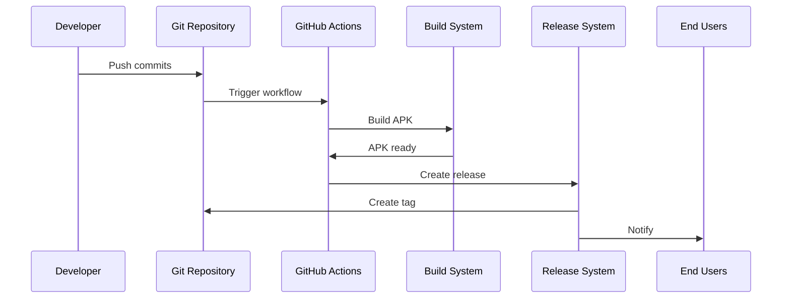

# تصميم نظام إدارة الإصدارات (Release Management)

**المشروع:** بصير MVP  
**التاريخ:** 4 ديسمبر 2025  
**المصمم:** فريق وكلاء تطوير مشروع بصير  
**الحالة:** 📋 مخطط  
**الأولوية:** 🔥 عالية جداً

---

## 1. نظرة عامة على التصميم

### 1.1 الهدف المعماري

تصميم نظام متكامل وآلي لإدارة الإصدارات يضمن:

- سهولة إنشاء الإصدارات
- جودة عالية للإصدارات
- أتمتة كاملة للعملية
- توثيق شامل

### 1.2 المبادئ المعمارية

#### مبدأ 1: الأتمتة أولاً (Automation First)

```
كل ما يمكن أتمتته يجب أتمتته
- توليد release notes تلقائياً
- بناء APK تلقائياً
- إنشاء tags تلقائياً
- نشر releases تلقائياً
```

#### مبدأ 2: الجودة قبل السرعة (Quality over Speed)

```
لا نشر بدون:
- ✅ اختبارات ناجحة 100%
- ✅ تحليل كود نظيف
- ✅ توثيق كامل
- ✅ مراجعة معتمدة
```

#### مبدأ 3: الشفافية الكاملة (Full Transparency)

```
كل شيء موثق ومرئي:
- جميع التغييرات في CHANGELOG
- جميع الإصدارات في Releases
- جميع المشاكل في Issues
- جميع القرارات في Discussions
```

---

## 2. البنية المعمارية

### 2.1 المكونات الرئيسية



### 2.2 تدفق البيانات



---

## 3. التصميم التفصيلي

### 3.1 نظام الإصدارات (Release System)

#### 3.1.1 بنية Release

```yaml
Release:
  version: "1.0.0-beta"
  tag: "v1.0.0-beta"
  name: "بصير MVP - الإصدار التجريبي الأول"
  description: |
    أول إصدار تجريبي لتطبيق بصير MVP

  release_notes:
    features:
      - إدارة العملاء
      - إدارة الفواتير
      - تصدير PDF
      - دعم RTL

    fixes:
      - إصلاح مشكلة Overflow
      - تحسين الأداء

    breaking_changes: []

  assets:
    - name: "basser-v1.0.0-beta.apk"
      size: "45 MB"
      downloads: 0

    - name: "CHANGELOG.md"
      size: "10 KB"

  metadata:
    created_at: "2025-12-04T13:00:00Z"
    author: "Basser Development Team"
    commit: "b70a807"
    build_number: 1
```

#### 3.1.2 Release Workflow

```yaml
name: Create Release

on:
  push:
    tags:
      - "v*"

jobs:
  create-release:
    runs-on: ubuntu-latest

    steps:
      - name: Checkout code
        uses: actions/checkout@v3
        with:
          fetch-depth: 0

      - name: Setup Flutter
        uses: subosito/flutter-action@v2
        with:
          flutter-version: "3.24.0"

      - name: Run tests
        run: flutter test

      - name: Build APK
        run: flutter build apk --release

      - name: Sign APK
        run: |
          # Sign APK with keystore
          jarsigner -verbose \
            -sigalg SHA256withRSA \
            -digestalg SHA-256 \
            -keystore ${{ secrets.KEYSTORE_FILE }} \
            -storepass ${{ secrets.KEYSTORE_PASSWORD }} \
            build/app/outputs/flutter-apk/app-release.apk \
            ${{ secrets.KEY_ALIAS }}

      - name: Generate Release Notes
        id: release_notes
        run: |
          # Generate from commits
          ./scripts/generate_release_notes.sh

      - name: Create Release
        uses: actions/create-release@v1
        env:
          GITHUB_TOKEN: ${{ secrets.GITHUB_TOKEN }}
        with:
          tag_name: ${{ github.ref }}
          release_name: Release ${{ github.ref }}
          body_path: RELEASE_NOTES.md
          draft: false
          prerelease: true

      - name: Upload APK
        uses: actions/upload-release-asset@v1
        env:
          GITHUB_TOKEN: ${{ secrets.GITHUB_TOKEN }}
        with:
          upload_url: ${{ steps.create_release.outputs.upload_url }}
          asset_path: ./build/app/outputs/flutter-apk/app-release.apk
          asset_name: basser-${{ github.ref }}.apk
          asset_content_type: application/vnd.android.package-archive
```

### 3.2 نظام العلامات (Tag System)

#### 3.2.1 بنية Tag

```bash
# Tag format
v<MAJOR>.<MINOR>.<PATCH>[-<PRERELEASE>][+<BUILD>]

# Examples
v1.0.0-beta.1
v1.0.0-rc.1
v1.0.0
v1.1.0
v2.0.0
```

#### 3.2.2 Tag Creation Script

```bash
#!/bin/bash
# scripts/create_tag.sh

set -e

# Get version from pubspec.yaml
VERSION=$(grep "version:" pubspec.yaml | sed 's/version: //' | tr -d ' ')

# Create tag
TAG="v${VERSION}"

echo "Creating tag: ${TAG}"

# Create annotated tag
git tag -a "${TAG}" -m "Release version ${VERSION}

Features:
$(git log --pretty=format:"- %s" --grep="^feat:" $(git describe --tags --abbrev=0)..HEAD)

Fixes:
$(git log --pretty=format:"- %s" --grep="^fix:" $(git describe --tags --abbrev=0)..HEAD)

Full Changelog: https://github.com/mohammed-murad-alqabal/Basser_MVP/compare/$(git describe --tags --abbrev=0)...${TAG}
"

# Push tag
git push origin "${TAG}"

echo "Tag ${TAG} created and pushed successfully!"
```

#### 3.2.3 Tag Protection Rules

```yaml
# .github/settings.yml
branches:
  - name: main
    protection:
      required_pull_request_reviews:
        required_approving_review_count: 1

tags:
  - name: "v*"
    protection:
      required_signatures: true
      allow_deletions: false
      allow_force_pushes: false
```

### 3.3 نظام توليد Release Notes

#### 3.3.1 Release Notes Generator

```bash
#!/bin/bash
# scripts/generate_release_notes.sh

set -e

# Get current tag
CURRENT_TAG=$(git describe --tags --abbrev=0)

# Get previous tag
PREVIOUS_TAG=$(git describe --tags --abbrev=0 ${CURRENT_TAG}^)

# Generate release notes
cat > RELEASE_NOTES.md << EOF
# Release ${CURRENT_TAG}

**التاريخ:** $(date +"%Y-%m-%d")
**المؤلف:** فريق وكلاء تطوير مشروع بصير

---

## 🎉 الميزات الجديدة

$(git log --pretty=format:"- %s (%h)" --grep="^feat:" ${PREVIOUS_TAG}..${CURRENT_TAG})

## 🐛 الإصلاحات

$(git log --pretty=format:"- %s (%h)" --grep="^fix:" ${PREVIOUS_TAG}..${CURRENT_TAG})

## 📚 التوثيق

$(git log --pretty=format:"- %s (%h)" --grep="^docs:" ${PREVIOUS_TAG}..${CURRENT_TAG})

## 🔧 التحسينات

$(git log --pretty=format:"- %s (%h)" --grep="^refactor:\|^perf:" ${PREVIOUS_TAG}..${CURRENT_TAG})

## ⚠️ Breaking Changes

$(git log --pretty=format:"- %s (%h)" --grep="BREAKING CHANGE" ${PREVIOUS_TAG}..${CURRENT_TAG})

## 📊 الإحصائيات

- **عدد الـ Commits:** $(git rev-list --count ${PREVIOUS_TAG}..${CURRENT_TAG})
- **عدد الملفات المعدلة:** $(git diff --name-only ${PREVIOUS_TAG}..${CURRENT_TAG} | wc -l)
- **الإضافات:** $(git diff --shortstat ${PREVIOUS_TAG}..${CURRENT_TAG} | grep -oP '\d+(?= insertion)')
- **الحذف:** $(git diff --shortstat ${PREVIOUS_TAG}..${CURRENT_TAG} | grep -oP '\d+(?= deletion)')

## 🔗 الروابط

- [Full Changelog](https://github.com/mohammed-murad-alqabal/Basser_MVP/compare/${PREVIOUS_TAG}...${CURRENT_TAG})
- [Download APK](https://github.com/mohammed-murad-alqabal/Basser_MVP/releases/download/${CURRENT_TAG}/basser-${CURRENT_TAG}.apk)

---

**تم إنشاؤه تلقائياً بواسطة:** Release Notes Generator
**الإصدار:** 1.0
EOF

echo "Release notes generated successfully!"
```

### 3.4 نظام البناء والتوقيع

#### 3.4.1 Build Configuration

```gradle
// android/app/build.gradle

android {
    ...

    signingConfigs {
        release {
            if (System.getenv("CI")) {
                // CI environment
                storeFile file(System.getenv("KEYSTORE_FILE"))
                storePassword System.getenv("KEYSTORE_PASSWORD")
                keyAlias System.getenv("KEY_ALIAS")
                keyPassword System.getenv("KEY_PASSWORD")
            } else {
                // Local environment
                def keystorePropertiesFile = rootProject.file("key.properties")
                if (keystorePropertiesFile.exists()) {
                    def keystoreProperties = new Properties()
                    keystoreProperties.load(new FileInputStream(keystorePropertiesFile))

                    storeFile file(keystoreProperties['storeFile'])
                    storePassword keystoreProperties['storePassword']
                    keyAlias keystoreProperties['keyAlias']
                    keyPassword keystoreProperties['keyPassword']
                }
            }
        }
    }

    buildTypes {
        release {
            signingConfig signingConfigs.release
            minifyEnabled true
            shrinkResources true
            proguardFiles getDefaultProguardFile('proguard-android-optimize.txt'), 'proguard-rules.pro'
        }
    }
}
```

#### 3.4.2 Keystore Management

```bash
# scripts/setup_keystore.sh

#!/bin/bash

set -e

echo "Setting up keystore for signing..."

# Check if keystore exists
if [ ! -f "android/app/keystore.jks" ]; then
    echo "Creating new keystore..."

    keytool -genkey \
        -v \
        -keystore android/app/keystore.jks \
        -keyalg RSA \
        -keysize 2048 \
        -validity 10000 \
        -alias basser \
        -dname "CN=Basser, OU=Development, O=Basser Team, L=Riyadh, ST=Riyadh, C=SA" \
        -storepass "${KEYSTORE_PASSWORD}" \
        -keypass "${KEY_PASSWORD}"

    echo "Keystore created successfully!"
else
    echo "Keystore already exists."
fi

# Create key.properties for local development
cat > android/key.properties << EOF
storeFile=keystore.jks
storePassword=${KEYSTORE_PASSWORD}
keyAlias=basser
keyPassword=${KEY_PASSWORD}
EOF

echo "key.properties created successfully!"
```

---

## 4. واجهات النظام

### 4.1 GitHub UI Interface

#### 4.1.1 Release Page Layout

```
┌─────────────────────────────────────────────────────┐
│ Releases                                            │
├─────────────────────────────────────────────────────┤
│                                                     │
│ v1.0.0-beta                          Latest Release│
│ بصير MVP - الإصدار التجريبي الأول                  │
│                                                     │
│ 📅 Released on Dec 4, 2025                         │
│ 👤 By Basser Development Team                      │
│                                                     │
│ 🎉 الميزات الجديدة                                 │
│ • إدارة العملاء الكاملة                            │
│ • إدارة الفواتير مع PDF                            │
│ • دعم RTL كامل                                     │
│                                                     │
│ 🐛 الإصلاحات                                       │
│ • إصلاح مشكلة Overflow في Dashboard               │
│ • تحسين الأداء العام                               │
│                                                     │
│ 📦 Assets                                           │
│ ├─ basser-v1.0.0-beta.apk (45 MB) ⬇️ 0 downloads  │
│ ├─ CHANGELOG.md (10 KB)                            │
│ └─ Source code (zip)                               │
│                                                     │
│ 📊 Statistics                                       │
│ • 67 commits                                        │
│ • 150 files changed                                 │
│ • 97.7% test success                                │
│                                                     │
└─────────────────────────────────────────────────────┘
```

### 4.2 CLI Interface

#### 4.2.1 Release CLI Tool

```bash
# scripts/release.sh

#!/bin/bash

# Basser Release Management CLI
# Usage: ./scripts/release.sh [command] [options]

set -e

SCRIPT_DIR="$(cd "$(dirname "${BASH_SOURCE[0]}")" && pwd)"
PROJECT_ROOT="$(cd "${SCRIPT_DIR}/.." && pwd)"

# Colors
RED='\033[0;31m'
GREEN='\033[0;32m'
YELLOW='\033[1;33m'
NC='\033[0m' # No Color

# Functions
print_success() {
    echo -e "${GREEN}✅ $1${NC}"
}

print_error() {
    echo -e "${RED}❌ $1${NC}"
}

print_warning() {
    echo -e "${YELLOW}⚠️  $1${NC}"
}

print_info() {
    echo -e "ℹ️  $1"
}

# Commands
cmd_create() {
    local version=$1

    if [ -z "$version" ]; then
        print_error "Version is required!"
        echo "Usage: ./scripts/release.sh create <version>"
        exit 1
    fi

    print_info "Creating release ${version}..."

    # Update version in pubspec.yaml
    sed -i "s/^version: .*/version: ${version}/" pubspec.yaml
    print_success "Updated pubspec.yaml"

    # Run tests
    print_info "Running tests..."
    flutter test
    print_success "Tests passed"

    # Build APK
    print_info "Building APK..."
    flutter build apk --release
    print_success "APK built"

    # Create tag
    print_info "Creating tag..."
    git tag -a "v${version}" -m "Release version ${version}"
    print_success "Tag created"

    # Push tag
    print_info "Pushing tag..."
    git push origin "v${version}"
    print_success "Tag pushed"

    print_success "Release ${version} created successfully!"
}

cmd_list() {
    print_info "Listing all releases..."
    git tag -l "v*" --sort=-version:refname
}

cmd_delete() {
    local version=$1

    if [ -z "$version" ]; then
        print_error "Version is required!"
        echo "Usage: ./scripts/release.sh delete <version>"
        exit 1
    fi

    print_warning "Deleting release ${version}..."

    # Delete local tag
    git tag -d "v${version}"

    # Delete remote tag
    git push origin --delete "v${version}"

    print_success "Release ${version} deleted"
}

cmd_help() {
    cat << EOF
Basser Release Management CLI

Usage:
  ./scripts/release.sh [command] [options]

Commands:
  create <version>  Create a new release
  list              List all releases
  delete <version>  Delete a release
  help              Show this help message

Examples:
  ./scripts/release.sh create 1.0.0-beta
  ./scripts/release.sh list
  ./scripts/release.sh delete 1.0.0-beta

EOF
}

# Main
case "${1:-help}" in
    create)
        cmd_create "$2"
        ;;
    list)
        cmd_list
        ;;
    delete)
        cmd_delete "$2"
        ;;
    help|--help|-h)
        cmd_help
        ;;
    *)
        print_error "Unknown command: $1"
        cmd_help
        exit 1
        ;;
esac
```

---

## 5. الأمان والحماية

### 5.1 حماية المفاتيح

#### 5.1.1 GitHub Secrets

```yaml
# Required secrets in GitHub repository settings:

KEYSTORE_FILE: <base64 encoded keystore>
KEYSTORE_PASSWORD: <keystore password>
KEY_ALIAS: basser
KEY_PASSWORD: <key password>
```

#### 5.1.2 Local Development

```bash
# android/key.properties (gitignored)
storeFile=keystore.jks
storePassword=<password>
keyAlias=basser
keyPassword=<password>
```

### 5.2 حماية Tags

```yaml
# .github/workflows/protect-tags.yml

name: Protect Tags

on:
  push:
    tags:
      - "v*"

jobs:
  protect:
    runs-on: ubuntu-latest
    steps:
      - name: Prevent tag deletion
        run: |
          echo "Tag protection enabled"
          # Add protection rules
```

---

## 6. المراقبة والتتبع

### 6.1 Release Metrics

```yaml
Metrics:
  - release_count: عدد الإصدارات
  - release_frequency: معدل الإصدارات
  - download_count: عدد التحميلات
  - build_time: وقت البناء
  - test_coverage: تغطية الاختبارات
  - success_rate: نسبة النجاح
```

### 6.2 Monitoring Dashboard

```markdown
# Release Dashboard

## الإحصائيات الحالية

- إجمالي الإصدارات: 1
- آخر إصدار: v1.0.0-beta
- إجمالي التحميلات: 0
- معدل النجاح: 100%

## الإصدارات الأخيرة

1. v1.0.0-beta (2025-12-04) - 0 downloads
```

---

## 7. الاختبار والتحقق

### 7.1 Release Testing Checklist

```markdown
# Release Testing Checklist

## قبل الإصدار

- [ ] جميع الاختبارات تنجح
- [ ] flutter analyze نظيف
- [ ] التوثيق محدث
- [ ] CHANGELOG محدث
- [ ] Screenshots جاهزة

## أثناء الإصدار

- [ ] APK يبنى بنجاح
- [ ] APK موقع بشكل صحيح
- [ ] Release notes مولدة
- [ ] Tag منشئ
- [ ] Assets مرفوعة

## بعد الإصدار

- [ ] APK يعمل على الموبايل
- [ ] Release مرئي على GitHub
- [ ] Downloads تعمل
- [ ] Links صحيحة
- [ ] Notifications مرسلة
```

---

## 8. التوثيق

### 8.1 Release Documentation Template

```markdown
# Release v1.0.0-beta

## معلومات الإصدار

- **الإصدار:** v1.0.0-beta
- **التاريخ:** 2025-12-04
- **المؤلف:** فريق وكلاء تطوير مشروع بصير
- **Commit:** b70a807

## ما الجديد

### الميزات الجديدة 🎉

- إدارة العملاء الكاملة
- إدارة الفواتير مع PDF
- دعم RTL كامل

### الإصلاحات 🐛

- إصلاح مشكلة Overflow
- تحسين الأداء

### التحسينات 🔧

- تحسين UI/UX
- تحسين الكود

## التثبيت

### متطلبات النظام

- Android 5.0 (API 21) أو أحدث
- 100 MB مساحة فارغة
- اتصال بالإنترنت (اختياري)

### خطوات التثبيت

1. تحميل APK من [هنا](link)
2. تفعيل "مصادر غير معروفة"
3. تثبيت APK
4. فتح التطبيق

## المشاكل المعروفة

- لا يوجد

## الخطوات التالية

- إضافة ميزات جديدة
- تحسينات إضافية
- إصدار v1.0.0

---

**للدعم:** [Issues](https://github.com/mohammed-murad-alqabal/Basser_MVP/issues)  
**للمساهمة:** [Contributing](CONTRIBUTING.md)
```

---

**تم إعداده بواسطة:** فريق وكلاء تطوير مشروع بصير  
**التاريخ:** 4 ديسمبر 2025  
**الإصدار:** 1.0  
**الحالة:** 📋 مخطط - جاهز للتنفيذ
