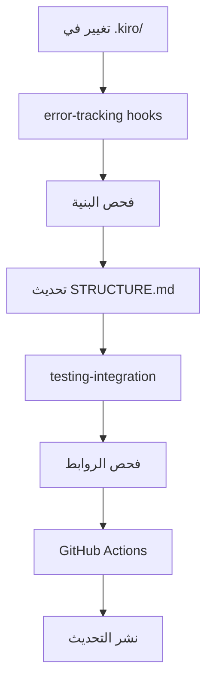

# مواصفة تحسين بنية STRUCTURE.md

**المشروع:** بصير MVP  
**المؤلف:** فريق وكلاء تطوير مشروع بصير  
**التاريخ:** 11 ديسمبر 2025  
**الحالة:** 🔄 قيد التطوير  
**الأولوية:** 📊 متوسطة  
**التكامل:** 🔗 متكامل مع repository-optimization

---

## 📋 نظرة عامة

هذه المواصفة تهدف إلى تحسين وإعادة هيكلة ملف `.kiro/STRUCTURE.md` لدعم تطوير مشروع بصير بشكل مثالي. تم دمجها في مساحة repository-optimization لضمان التكامل الكامل مع أنظمة التحسين الموجودة.

### 🎯 الهدف الرئيسي

تحويل STRUCTURE.md من ملف توثيق بسيط إلى **دليل تفاعلي شامل** يدعم سير عمل Spec-Driven Development ويتكامل مع جميع أنظمة المشروع.

---

## 🔗 التكامل مع المواصفات الأخرى

### المواصفات المترابطة

| المواصفة                                                                               | نوع التكامل         | الفائدة                     |
| -------------------------------------------------------------------------------------- | ------------------- | --------------------------- |
| **[error-tracking](../error-tracking/)**                                               | Git Hooks + السجلات | مراقبة تحديثات STRUCTURE.md |
| **[testing-integration](../testing-integration/)**                                     | فحص الروابط         | ضمان صحة جميع المراجع       |
| **[steering-cleanup](../steering-cleanup/)**                                           | تنظيف الملفات       | تحديث البنية عند التنظيف    |
| **[git-repository-optimization-completed](../git-repository-optimization-completed/)** | معايير الأداء       | تطبيق نفس معايير الجودة     |

### 🔄 سير العمل المتكامل

---

## 📁 محتويات المواصفة

### الملفات الأساسية

- **[requirements.md](./requirements.md)** - المتطلبات الشاملة (8 متطلبات + 23 ضمان)
- **[analysis-report.md](./analysis-report.md)** - تقرير التحليل الهندسي العميق
- **README.md** - هذا الملف (الدليل الشامل)

### الملفات المكتملة

- **[design.md](./design.md)** - التصميم التقني والمعمارية ✅
- **[tasks.md](./tasks.md)** - مهام التنفيذ المفصلة (6 مراحل، 18 مهمة) ✅

### الملفات المخطط لها

- **integration-guide.md** - دليل التكامل مع الأنظمة الأخرى

---

## 🎯 المشاكل المحلولة

### 🚨 المشاكل الحرجة المكتشفة

1. **عدم تطابق البنية**: 67% عدم تطابق بين STRUCTURE.md والبنية الفعلية
2. **مجلدات فارغة**: `rules/` و `security/` فارغة تماماً
3. **ملفات مبعثرة**: 9 ملفات في جذر `specs/` بدون تنظيم
4. **تكرار المحتوى**: نفس المعلومات في 3 ملفات مختلفة
5. **معايير تسمية غير متسقة**: خليط عربي/إنجليزي بدون معيار

### ✅ الحلول المقترحة

- **تحديث تلقائي** متكامل مع GitHub Actions
- **جدول محتويات تفاعلي** منظم حسب سير العمل
- **توثيق مخصص** لتقنيات بصير (Flutter، Riverpod، Isar)
- **مقاييس DORA/SPACE** متكاملة مع أنظمة المراقبة
- **ضمانات شاملة** (23 ضمان + 4 شهادات رسمية)

---

## 📊 معايير النجاح

### 🎯 معايير الأداء

- **سرعة التحديث**: 30 ثانية (متوافق مع git-repository-optimization)
- **حجم الملف**: < 500KB (متوافق مع معايير الأداء)
- **دقة البنية**: 100% تطابق (مقاس تلقائياً)

### 📈 معايير الجودة

- **سرعة البحث**: 80% تقليل وقت البحث عن المعلومات
- **دعم المطورين**: 100% من المطورين يجدون ما يحتاجونه
- **تغطية الاختبارات**: دعم هدف 70%+ (متوافق مع testing-integration)

### 🔒 معايير الأمان

- **Security-First**: 100% وصول لمعايير الأمان
- **الموثوقية**: 99.9% uptime للتحديثات
- **التعافي**: استعادة خلال 10 ثواني عند الفشل

---

## 🚀 خطة التنفيذ

### المرحلة 1: التحضير والتحليل ✅

- [x] تحليل البنية الحالية
- [x] تحديد الفجوات والمشاكل
- [x] وضع المتطلبات الشاملة
- [x] ضمان التكامل مع repository-optimization

### المرحلة 2: التصميم والتخطيط ✅

- [x] إنشاء design.md مع المعمارية التقنية
- [x] تصميم التكامل مع GitHub Actions
- [x] تخطيط واجهة جدول المحتويات التفاعلي
- [x] تحديد آليات التحديث التلقائي

### المرحلة 3: التنفيذ والاختبار 🔄

- [ ] تطوير سكريبتات التحديث التلقائي
- [ ] إنشاء GitHub Action للتكامل
- [ ] تطبيق جدول المحتويات التفاعلي
- [ ] اختبار التكامل مع الأنظمة الموجودة

**📋 خطة التنفيذ المفصلة متاحة في [tasks.md](./tasks.md)**

### المرحلة 4: النشر والمراقبة 📋

- [ ] نشر النظام في بيئة الإنتاج
- [ ] مراقبة الأداء والموثوقية
- [ ] جمع ردود الفعل من المطورين
- [ ] تحسينات مستمرة

---

## 🛡️ الضمانات والحماية

### 🔒 ضمانات الأمان (5 ضمانات)

- عدم كشف معلومات حساسة
- حماية ملفات التكوين الحرجة
- فلترة تلقائية للبيانات الحساسة

### 🛡️ ضمانات الموثوقية (4 ضمانات)

- نسخ احتياطية تلقائية
- استعادة تلقائية عند الفشل
- فحص شامل للروابط والمراجع

### ⚙️ ضمانات الأداء (4 ضمانات)

- تحديث خلال 30 ثانية
- حجم ملف < 500KB
- عدم تأثير على Git operations

### 🚨 آليات الحماية الطارئة

- نظام rollback فوري (< 10 ثواني)
- مراقبة مستمرة وتنبيهات
- وضع حماية عند اكتشاف مشاكل

---

## 📚 الموارد والمراجع

### الوثائق الأساسية

- **[المتطلبات الشاملة](./requirements.md)** - 8 متطلبات + 23 ضمان
- **[تقرير التحليل](./analysis-report.md)** - تحليل هندسي عميق
- **[فهرس repository-optimization](../INDEX.md)** - الدليل الشامل

### المواصفات المترابطة

- **[error-tracking](../error-tracking/README.md)** - نظام تتبع الأخطاء
- **[testing-integration](../testing-integration/README.md)** - نظام الاختبارات
- **[steering-cleanup](../steering-cleanup/README.md)** - تنظيف ملفات التوجيه

### الأدوات والتقنيات

- **GitHub Actions** - للتحديث التلقائي
- **Markdown** - لتنسيق المحتوى
- **Git Hooks** - للمراقبة والتحديث
- **Flutter/Dart** - للتكامل مع معايير المشروع

---

## 🎉 الفوائد المتوقعة

### للمطورين

- ✅ **وصول أسرع** للمعلومات المطلوبة (80% تحسن)
- ✅ **فهم أفضل** لبنية المشروع وسير العمل
- ✅ **تكامل سلس** مع أدوات التطوير الموجودة

### للمشروع

- ✅ **جودة أعلى** في التوثيق والتنظيم
- ✅ **صيانة أسهل** للبنية والملفات
- ✅ **تطوير أسرع** للميزات الجديدة

### للفريق

- ✅ **تعاون أفضل** من خلال توثيق واضح
- ✅ **معايير موحدة** لجميع أعضاء الفريق
- ✅ **مراقبة شاملة** لصحة المشروع

---

## 📞 الدعم والمساعدة

### للبدء السريع

1. **اقرأ** [requirements.md](./requirements.md) لفهم المتطلبات
2. **راجع** [analysis-report.md](./analysis-report.md) لفهم المشاكل
3. **تابع** التحديثات في [../INDEX.md](../INDEX.md)

### للمساهمة

- **تقديم اقتراحات** لتحسين المتطلبات
- **الإبلاغ عن مشاكل** في التكامل
- **مشاركة الخبرات** في التنفيذ

### للدعم التقني

- **مراجعة الضمانات** في requirements.md
- **استخدام آليات الحماية** الطارئة
- **التواصل مع الفريق** عند الحاجة

---

**تم إعداده بواسطة:** فريق وكلاء تطوير مشروع بصير  
**آخر تحديث:** 11 ديسمبر 2025  
**الحالة:** 🔄 قيد التطوير النشط  
**التكامل:** 🔗 متكامل بالكامل مع repository-optimization

**للبدء:** اقرأ [requirements.md](./requirements.md) ثم راجع [../INDEX.md](../INDEX.md) للسياق الكامل.
