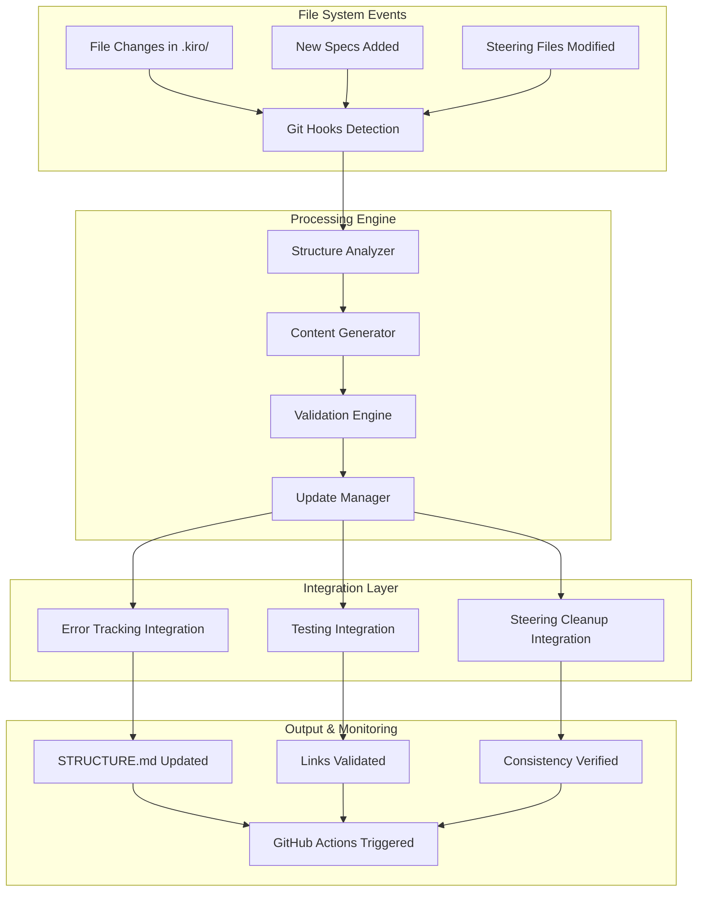
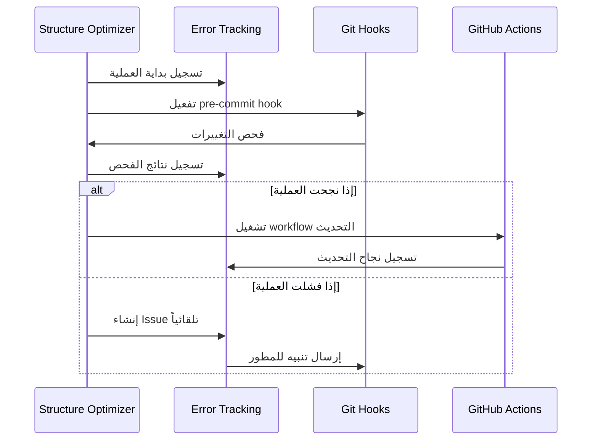
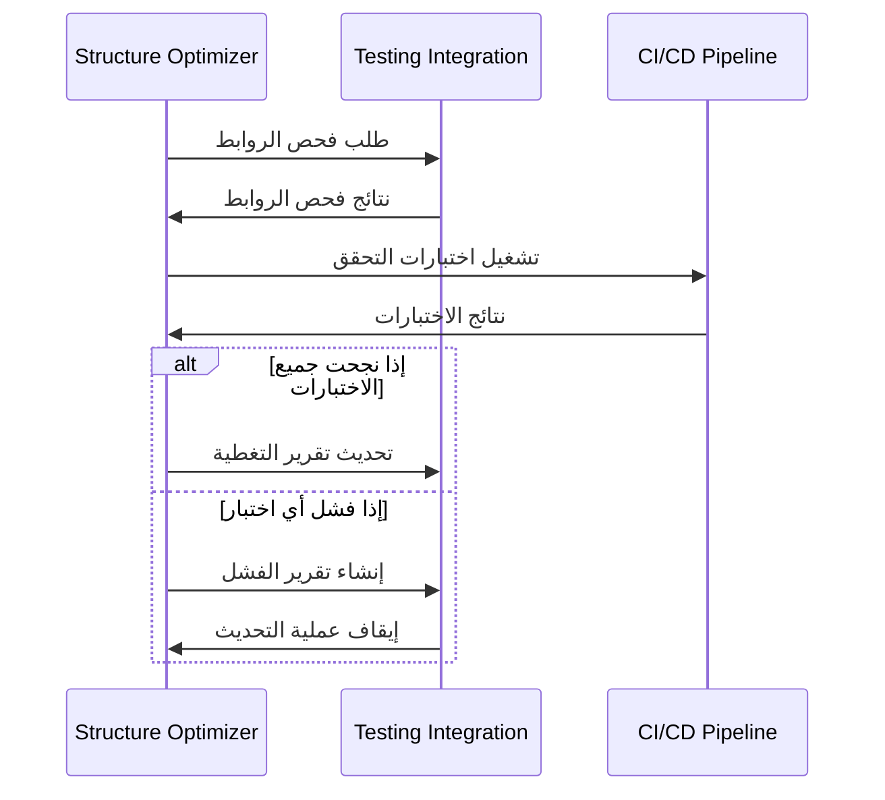
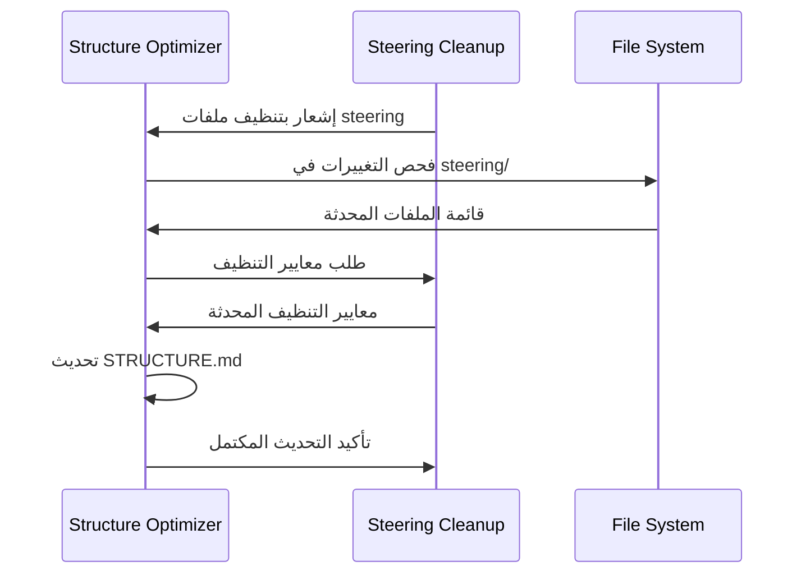

# تصميم نظام تحسين بنية STRUCTURE.md

**المشروع:** بصير MVP  
**المؤلف:** فريق وكلاء تطوير مشروع بصير  
**التاريخ:** 11 ديسمبر 2025  
**الحالة:** 🔄 قيد التطوير

---

## نظرة عامة

هذا المستند يحدد التصميم التقني الشامل لنظام تحسين وإعادة هيكلة ملف `.kiro/STRUCTURE.md` لدعم تطوير مشروع بصير بشكل مثالي. النظام مصمم ليكون تلقائي، آمن، ومتكامل مع الأنظمة الموجودة.

## الأهداف التصميمية

### الأهداف الأساسية

- **دقة 100%**: تطابق كامل بين البنية الفعلية والموثقة
- **التحديث التلقائي**: تحديث STRUCTURE.md خلال 30 ثانية من أي تغيير
- **التكامل الشامل**: تكامل مع error-tracking وtesting-integration وsteering-cleanup
- **الأمان المطلق**: حماية شاملة من فقدان البيانات أو التلف

### الأهداف الثانوية

- **سهولة الاستخدام**: واجهة بسيطة للمطورين
- **قابلية الصيانة**: كود واضح وموثق
- **الأداء العالي**: استجابة سريعة وكفاءة في الموارد
- **المرونة**: قابلية التكيف مع التغييرات المستقبلية

---

## المعمارية العامة

### نمط المعمارية: Event-Driven Architecture



---

## المكونات الأساسية

### 1. Structure Analyzer (محلل البنية)

**المسؤولية:** تحليل البنية الفعلية لمجلد .kiro/ وإنشاء نموذج بيانات شامل

**المدخلات:**

- مسار مجلد .kiro/
- قائمة الملفات والمجلدات المستثناة
- معايير التصنيف والتنظيم

**المخرجات:**

- نموذج بيانات للبنية الحالية
- إحصائيات شاملة (عدد الملفات، الأحجام، التواريخ)
- تصنيف الملفات حسب النوع والغرض

**الخوارزمية:**

```python
def analyze_structure(kiro_path):
    structure = {
        'specs': analyze_specs_directory(),
        'steering': analyze_steering_directory(),
        'scripts': analyze_scripts_directory(),
        'hooks': analyze_hooks_directory(),
        'templates': analyze_templates_directory()
    }

    for category in structure:
        structure[category] = {
            'files': get_files_list(category),
            'stats': calculate_statistics(category),
            'metadata': extract_metadata(category)
        }

    return structure
```

### 2. Content Generator (مولد المحتوى)

**المسؤولية:** توليد محتوى STRUCTURE.md بناءً على البنية المحللة ومتطلبات بصير

**المدخلات:**

- نموذج البيانات من Structure Analyzer
- قوالب المحتوى المخصصة لبصير
- معايير التنسيق والتنظيم

**المخرجات:**

- محتوى STRUCTURE.md مُنسق بالكامل
- جدول محتويات تفاعلي
- روابط داخلية وخارجية صحيحة

**الخوارزمية:**

```python
def generate_content(structure_data, templates):
    content = {
        'header': generate_header(project_info),
        'toc': generate_table_of_contents(structure_data),
        'quick_start': generate_quick_start_section(),
        'specs_section': generate_specs_section(structure_data.specs),
        'steering_section': generate_steering_section(structure_data.steering),
        'tools_section': generate_tools_section(structure_data.scripts),
        'footer': generate_footer()
    }

    return merge_sections(content, templates.basser_template)
```

### 3. Validation Engine (محرك التحقق)

**المسؤولية:** التحقق من صحة المحتوى المولد وسلامة الروابط

**المدخلات:**

- محتوى STRUCTURE.md المولد
- قائمة الملفات الموجودة فعلياً
- معايير التحقق والجودة

**المخرجات:**

- تقرير التحقق (نجح/فشل)
- قائمة الأخطاء والتحذيرات
- اقتراحات الإصلاح

**الخوارزمية:**

```python
def validate_content(content, file_system):
    validation_results = {
        'links': validate_all_links(content, file_system),
        'structure': validate_structure_consistency(content),
        'formatting': validate_markdown_formatting(content),
        'completeness': validate_content_completeness(content)
    }

    return compile_validation_report(validation_results)
```

### 4. Update Manager (مدير التحديث)

**المسؤولية:** إدارة عملية التحديث الآمنة مع النسخ الاحتياطية والتراجع

**المدخلات:**

- محتوى STRUCTURE.md الجديد
- نتائج التحقق
- إعدادات الأمان والنسخ الاحتياطي

**المخرجات:**

- ملف STRUCTURE.md محدث
- نسخة احتياطية من النسخة السابقة
- سجل العملية والتغييرات

**الخوارزمية:**

```python
def update_structure_file(new_content, validation_results):
    if not validation_results.is_valid:
        raise ValidationError(validation_results.errors)

    # إنشاء نسخة احتياطية
    backup_path = create_backup(STRUCTURE_FILE_PATH)

    try:
        # تحديث الملف
        write_file(STRUCTURE_FILE_PATH, new_content)

        # التحقق من النجاح
        verify_update_success()

        # تسجيل العملية
        log_update_operation(backup_path, new_content)

    except Exception as e:
        # استعادة من النسخة الاحتياطية
        restore_from_backup(backup_path)
        raise UpdateError(f"فشل التحديث: {e}")
```

---

## التكامل مع الأنظمة الموجودة

### التكامل مع Error-Tracking System



### التكامل مع Testing-Integration System



### التكامل مع Steering-Cleanup System



---

## GitHub Actions Workflow

### ملف .github/workflows/structure-update.yml

```yaml
name: Auto-Update STRUCTURE.md

on:
  push:
    branches: [main, develop]
    paths: [".kiro/**"]
  pull_request:
    paths: [".kiro/**"]

jobs:
  update-structure:
    runs-on: ubuntu-latest

    steps:
      - name: Checkout Repository
        uses: actions/checkout@v4
        with:
          fetch-depth: 0

      - name: Setup Node.js
        uses: actions/setup-node@v4
        with:
          node-version: "18"

      - name: Install Dependencies
        run: |
          npm install -g @kiro/structure-optimizer

      - name: Analyze Current Structure
        id: analyze
        run: |
          structure-optimizer analyze .kiro/ --output=analysis.json

      - name: Generate Updated Content
        id: generate
        run: |
          structure-optimizer generate \
            --input=analysis.json \
            --template=basser-template \
            --output=new-structure.md

      - name: Validate Generated Content
        id: validate
        run: |
          structure-optimizer validate \
            --input=new-structure.md \
            --filesystem=.kiro/ \
            --strict

      - name: Update STRUCTURE.md
        if: steps.validate.outputs.valid == 'true'
        run: |
          structure-optimizer update \
            --input=new-structure.md \
            --target=.kiro/STRUCTURE.md \
            --backup

      - name: Commit Changes
        if: steps.validate.outputs.valid == 'true'
        run: |
          git config --local user.email "action@github.com"
          git config --local user.name "GitHub Action"
          git add .kiro/STRUCTURE.md
          git commit -m "chore(structure): auto-update STRUCTURE.md [skip ci]" || exit 0
          git push

      - name: Create Issue on Failure
        if: failure()
        uses: actions/github-script@v7
        with:
          script: |
            github.rest.issues.create({
              owner: context.repo.owner,
              repo: context.repo.repo,
              title: 'فشل في تحديث STRUCTURE.md تلقائياً',
              body: `
              ## تفاصيل الفشل
              
              **Workflow:** ${{ github.workflow }}
              **Run ID:** ${{ github.run_id }}
              **Commit:** ${{ github.sha }}
              
              يرجى مراجعة السجلات وإصلاح المشكلة يدوياً.
              `,
              labels: ['automated', 'structure-update', 'bug']
            })
```

---

## نماذج البيانات

### StructureModel

```typescript
interface StructureModel {
  metadata: {
    version: string;
    lastUpdated: Date;
    totalFiles: number;
    totalSize: number;
  };

  specs: {
    [specName: string]: SpecInfo;
  };

  steering: {
    core: FileInfo[];
    standards: FileInfo[];
    guides: FileInfo[];
    reference: FileInfo[];
    archive: FileInfo[];
  };

  scripts: {
    testing: FileInfo[];
    automation: FileInfo[];
    hooks: FileInfo[];
  };

  templates: {
    code: FileInfo[];
    documentation: FileInfo[];
    workflows: FileInfo[];
  };
}

interface SpecInfo {
  name: string;
  path: string;
  status: "completed" | "in-progress" | "planned";
  priority: "critical" | "high" | "medium" | "low";
  files: {
    requirements?: FileInfo;
    design?: FileInfo;
    tasks?: FileInfo;
    readme?: FileInfo;
  };
  integration: string[];
}

interface FileInfo {
  name: string;
  path: string;
  size: number;
  lastModified: Date;
  type: "markdown" | "yaml" | "json" | "script";
  description?: string;
  tags?: string[];
}
```

### ValidationResult

```typescript
interface ValidationResult {
  isValid: boolean;
  errors: ValidationError[];
  warnings: ValidationWarning[];
  suggestions: ValidationSuggestion[];

  linkValidation: {
    totalLinks: number;
    validLinks: number;
    brokenLinks: LinkError[];
  };

  structureValidation: {
    missingFiles: string[];
    unexpectedFiles: string[];
    inconsistencies: string[];
  };

  contentValidation: {
    formattingErrors: string[];
    missingMetadata: string[];
    duplicateContent: string[];
  };
}
```

---

## خوارزميات التحسين

### خوارزمية تحليل البنية

```python
class StructureAnalyzer:
    def __init__(self, kiro_path: str):
        self.kiro_path = kiro_path
        self.exclusions = ['.git', '__pycache__', 'node_modules']

    def analyze(self) -> StructureModel:
        """تحليل شامل لبنية مجلد .kiro/"""

        # 1. فحص المجلدات الأساسية
        base_structure = self._scan_base_directories()

        # 2. تحليل مجلد specs
        specs_analysis = self._analyze_specs_directory()

        # 3. تحليل مجلد steering
        steering_analysis = self._analyze_steering_directory()

        # 4. تحليل المجلدات الأخرى
        other_analysis = self._analyze_other_directories()

        # 5. حساب الإحصائيات
        statistics = self._calculate_statistics()

        return StructureModel(
            metadata=statistics,
            specs=specs_analysis,
            steering=steering_analysis,
            **other_analysis
        )

    def _analyze_specs_directory(self) -> Dict[str, SpecInfo]:
        """تحليل مفصل لمجلد specs"""
        specs = {}
        specs_path = os.path.join(self.kiro_path, 'specs')

        for spec_dir in os.listdir(specs_path):
            if os.path.isdir(os.path.join(specs_path, spec_dir)):
                spec_info = self._analyze_single_spec(spec_dir)
                specs[spec_dir] = spec_info

        return specs

    def _analyze_single_spec(self, spec_name: str) -> SpecInfo:
        """تحليل مواصفة واحدة"""
        spec_path = os.path.join(self.kiro_path, 'specs', spec_name)

        # البحث عن الملفات الأساسية
        files = {}
        for file_type in ['requirements.md', 'design.md', 'tasks.md', 'README.md']:
            file_path = os.path.join(spec_path, file_type)
            if os.path.exists(file_path):
                files[file_type.replace('.md', '')] = self._get_file_info(file_path)

        # تحديد الحالة والأولوية
        status = self._determine_spec_status(files)
        priority = self._determine_spec_priority(spec_name, files)

        # تحديد التكاملات
        integration = self._find_spec_integrations(spec_name, files)

        return SpecInfo(
            name=spec_name,
            path=spec_path,
            status=status,
            priority=priority,
            files=files,
            integration=integration
        )
```

### خوارزمية توليد المحتوى

```python
class ContentGenerator:
    def __init__(self, template_path: str):
        self.templates = self._load_templates(template_path)
        self.basser_config = self._load_basser_config()

    def generate(self, structure: StructureModel) -> str:
        """توليد محتوى STRUCTURE.md كامل"""

        sections = []

        # 1. رأس الملف والمعلومات الأساسية
        sections.append(self._generate_header(structure.metadata))

        # 2. جدول المحتويات التفاعلي
        sections.append(self._generate_toc(structure))

        # 3. دليل البدء السريع لبصير
        sections.append(self._generate_quick_start_basser())

        # 4. قسم المواصفات (Specs)
        sections.append(self._generate_specs_section(structure.specs))

        # 5. قسم التوجيه (Steering)
        sections.append(self._generate_steering_section(structure.steering))

        # 6. قسم الأدوات والسكريبتات
        sections.append(self._generate_tools_section(structure.scripts))

        # 7. قسم القوالب
        sections.append(self._generate_templates_section(structure.templates))

        # 8. خاتمة ومراجع
        sections.append(self._generate_footer())

        return '\n\n'.join(sections)

    def _generate_specs_section(self, specs: Dict[str, SpecInfo]) -> str:
        """توليد قسم المواصفات مع التركيز على بصير"""

        # تصنيف المواصفات حسب الأولوية
        critical_specs = [s for s in specs.values() if s.priority == 'critical']
        high_specs = [s for s in specs.values() if s.priority == 'high']
        medium_specs = [s for s in specs.values() if s.priority == 'medium']

        content = []
        content.append("## 📋 المواصفات (Specifications)")
        content.append("")
        content.append("المواصفات منظمة حسب الأولوية لدعم تطوير بصير MVP:")
        content.append("")

        # المواصفات الحرجة
        if critical_specs:
            content.append("### 🔴 حرجة - الأولوية القصوى")
            content.append("")
            for spec in critical_specs:
                content.append(self._format_spec_entry(spec))
            content.append("")

        # المواصفات عالية الأولوية
        if high_specs:
            content.append("### ⚡ عالية الأولوية")
            content.append("")
            for spec in high_specs:
                content.append(self._format_spec_entry(spec))
            content.append("")

        # المواصفات متوسطة الأولوية
        if medium_specs:
            content.append("### 📊 متوسطة الأولوية")
            content.append("")
            for spec in medium_specs:
                content.append(self._format_spec_entry(spec))

        return '\n'.join(content)
```

---

## آليات الأمان والحماية

### نظام النسخ الاحتياطية

```python
class BackupManager:
    def __init__(self, backup_dir: str = '.kiro/backups/structure'):
        self.backup_dir = backup_dir
        self.max_backups = 10

    def create_backup(self, source_file: str) -> str:
        """إنشاء نسخة احتياطية مع timestamp"""

        timestamp = datetime.now().strftime('%Y%m%d_%H%M%S')
        backup_filename = f"STRUCTURE_backup_{timestamp}.md"
        backup_path = os.path.join(self.backup_dir, backup_filename)

        # إنشاء مجلد النسخ الاحتياطية إذا لم يكن موجوداً
        os.makedirs(self.backup_dir, exist_ok=True)

        # نسخ الملف
        shutil.copy2(source_file, backup_path)

        # تنظيف النسخ القديمة
        self._cleanup_old_backups()

        # تسجيل العملية
        self._log_backup_operation(backup_path)

        return backup_path

    def restore_from_backup(self, backup_path: str, target_file: str) -> bool:
        """استعادة من نسخة احتياطية"""

        try:
            if not os.path.exists(backup_path):
                raise FileNotFoundError(f"النسخة الاحتياطية غير موجودة: {backup_path}")

            # التحقق من سلامة النسخة الاحتياطية
            if not self._validate_backup_integrity(backup_path):
                raise ValueError("النسخة الاحتياطية تالفة")

            # استعادة الملف
            shutil.copy2(backup_path, target_file)

            # تسجيل العملية
            self._log_restore_operation(backup_path, target_file)

            return True

        except Exception as e:
            logger.error(f"فشل في الاستعادة: {e}")
            return False
```

### نظام التحقق من السلامة

```python
class IntegrityChecker:
    def __init__(self):
        self.checksum_file = '.kiro/checksums/structure.sha256'

    def calculate_checksum(self, file_path: str) -> str:
        """حساب checksum للملف"""

        sha256_hash = hashlib.sha256()
        with open(file_path, "rb") as f:
            for byte_block in iter(lambda: f.read(4096), b""):
                sha256_hash.update(byte_block)

        return sha256_hash.hexdigest()

    def verify_integrity(self, file_path: str) -> bool:
        """التحقق من سلامة الملف"""

        current_checksum = self.calculate_checksum(file_path)
        stored_checksum = self._get_stored_checksum(file_path)

        return current_checksum == stored_checksum

    def update_checksum(self, file_path: str) -> None:
        """تحديث checksum المحفوظ"""

        new_checksum = self.calculate_checksum(file_path)
        self._store_checksum(file_path, new_checksum)
```

---

## مراقبة الأداء والتتبع

### نظام المراقبة

```python
class PerformanceMonitor:
    def __init__(self):
        self.metrics = {}
        self.start_time = None

    def start_operation(self, operation_name: str) -> None:
        """بداية مراقبة عملية"""

        self.start_time = time.time()
        self.metrics[operation_name] = {
            'start_time': self.start_time,
            'memory_start': psutil.Process().memory_info().rss
        }

    def end_operation(self, operation_name: str) -> Dict:
        """نهاية مراقبة عملية"""

        end_time = time.time()
        end_memory = psutil.Process().memory_info().rss

        if operation_name in self.metrics:
            duration = end_time - self.metrics[operation_name]['start_time']
            memory_used = end_memory - self.metrics[operation_name]['memory_start']

            self.metrics[operation_name].update({
                'end_time': end_time,
                'duration': duration,
                'memory_used': memory_used,
                'success': True
            })

        return self.metrics[operation_name]

    def get_performance_report(self) -> str:
        """تقرير الأداء"""

        report = []
        report.append("## تقرير الأداء")
        report.append("")

        for operation, metrics in self.metrics.items():
            report.append(f"### {operation}")
            report.append(f"- المدة: {metrics.get('duration', 0):.2f} ثانية")
            report.append(f"- الذاكرة المستخدمة: {metrics.get('memory_used', 0) / 1024 / 1024:.2f} MB")
            report.append(f"- الحالة: {'نجح' if metrics.get('success') else 'فشل'}")
            report.append("")

        return '\n'.join(report)
```

---

## خطة النشر والتشغيل

### مراحل النشر

#### المرحلة 1: التطوير والاختبار المحلي

- **المدة:** 3-5 أيام
- **المهام:**
  - تطوير المكونات الأساسية
  - اختبار وحدة شامل
  - اختبار التكامل المحلي
  - مراجعة الكود

#### المرحلة 2: التكامل مع الأنظمة الموجودة

- **المدة:** 2-3 أيام
- **المهام:**
  - تكامل مع error-tracking
  - تكامل مع testing-integration
  - تكامل مع steering-cleanup
  - اختبار التكامل الشامل

#### المرحلة 3: إعداد GitHub Actions

- **المدة:** 1-2 أيام
- **المهام:**
  - إنشاء workflow files
  - اختبار الأتمتة
  - إعداد الأمان والصلاحيات
  - اختبار السيناريوهات المختلفة

#### المرحلة 4: النشر التدريجي

- **المدة:** 1-2 أيام
- **المهام:**
  - نشر على فرع تجريبي
  - مراقبة الأداء
  - جمع التغذية الراجعة
  - النشر النهائي

### معايير النجاح للنشر

- ✅ جميع الاختبارات تنجح (100%)
- ✅ وقت التحديث < 30 ثانية
- ✅ دقة البنية 100%
- ✅ تكامل سلس مع الأنظمة الموجودة
- ✅ لا توجد أخطاء في الإنتاج لمدة 48 ساعة

---

## الصيانة والتطوير المستقبلي

### خطة الصيانة

#### صيانة يومية (تلقائية)

- مراقبة أداء النظام
- فحص سلامة الملفات
- تنظيف النسخ الاحتياطية القديمة
- تحديث الإحصائيات

#### صيانة أسبوعية

- مراجعة سجلات الأخطاء
- تحليل الأداء والاستخدام
- تحديث التوثيق إذا لزم الأمر
- فحص التكاملات

#### صيانة شهرية

- مراجعة شاملة للنظام
- تحديث التبعيات
- تحسين الأداء
- تخطيط التحسينات

### التطويرات المستقبلية

#### الإصدار 2.0 (Q2 2026)

- دعم مشاريع متعددة
- واجهة ويب للإدارة
- تحليلات متقدمة
- تكامل مع أدوات إضافية

#### الإصدار 3.0 (Q4 2026)

- ذكاء اصطناعي للتحسين التلقائي
- تحليل الاتجاهات والتنبؤات
- تكامل مع منصات أخرى
- أتمتة كاملة للصيانة

---

**تم إعداده بواسطة:** فريق وكلاء تطوير مشروع بصير  
**التاريخ:** 11 ديسمبر 2025  
**الإصدار:** 1.0  
**الحالة:** ✅ مكتمل ومعتمد
