# Design Document - Flutter Development Environment Enhancement

**المشروع:** بصير MVP - تحسين بيئة تطوير Flutter  
**التاريخ:** 13 ديسمبر 2025  
**المؤلف:** فريق وكلاء تطوير مشروع بصير  
**الحالة:** 🎯 **تصميم تفصيلي لتحسين بيئة Flutter المحلية**

---

## Overview

هذا التصميم يحدد الحلول التقنية المفصلة لتحسين بيئة تطوير Flutter المحلية لمشروع بصير، مع التركيز على جودة الكود، الاختبارات، الأداء، والأمان المحلي.

**التركيز الأساسي:** تطبيق بصير هو تطبيق Flutter محلي يستخدم Isar كقاعدة بيانات محلية وRiverpod لإدارة الحالة، مع Clean Architecture.

## Architecture

### High-Level Architecture

```mermaid
graph TB
    A[Flutter Development Enhancement] --> B[Code Quality Layer]
    A --> C[Testing Framework Layer]
    A --> D[Performance Optimization Layer]
    A --> E[Security Enhancement Layer]
    A --> F[Development Workflow Layer]

    B --> B1[Dart Analysis Enhancement]
    B --> B2[Code Formatting Automation]
    B --> B3[Flutter Best Practices]

    C --> C1[Unit Testing Framework]
    C --> C2[Widget Testing Setup]
    C --> C3[Isar Test Configuration]
    C --> C4[Golden File Testing]

    D --> D1[Performance Monitoring]
    D --> D2[Widget Optimization]
    D --> D3[Database Query Optimization]

    E --> E1[Local Data Encryption]
    E --> E2[Input Validation]
    E --> E3[Secure Storage Implementation]

    F --> F1[Flutter Hooks Automation]
    F --> F2[Development Templates]
    F --> F3[Build Process Enhancement]
```



## Components and Interfaces

### 1. MCP Integration Enhancement

#### 1.1 MCP Servers Configuration

```json
{
  "mcpServers": {
    "aws-tools": {
      "command": "uvx",
      "args": ["awslabs.aws-mcp-server@latest"],
      "env": { "AWS_REGION": "us-east-1" },
      "disabled": false,
      "category": "cloud",
      "autoApprove": ["list", "describe"]
    },
    "docker-tools": {
      "command": "uvx",
      "args": ["docker-mcp-server@latest"],
      "disabled": false,
      "category": "containers",
      "autoApprove": ["ps", "images"]
    },
    "github-tools": {
      "command": "uvx",
      "args": ["github-mcp-server@latest"],
      "env": { "GITHUB_TOKEN": "${GITHUB_TOKEN}" },
      "disabled": false,
      "category": "vcs",
      "autoApprove": ["status", "list"]
    }
  }
}
```

#### 1.2 MCP Validation Hooks

```json
{
  "enabled": true,
  "name": "MCP Configuration Validation",
  "when": {
    "type": "fileEdited",
    "patterns": [".kiro/settings/mcp.json"]
  },
  "action": {
    "type": "runCommand",
    "command": "validate-mcp-config"
  }
}
```

### 2. Multi-Provider AI Support

#### 2.1 Model-Specific Prompts Structure

```
.kiro/prompts/models/
├── openai/
│   ├── gpt-4o.prompt.md
│   ├── gpt-4-turbo.prompt.md
│   └── gpt-3.5-turbo.prompt.md
├── anthropic/
│   ├── claude-3.5-sonnet.prompt.md
│   ├── claude-3-opus.prompt.md
│   └── claude-3-haiku.prompt.md
├── aws-bedrock/
│   ├── titan-text.prompt.md
│   └── jurassic-2.prompt.md
├── ollama/
│   ├── llama3.prompt.md
│   ├── codellama.prompt.md
│   └── mistral.prompt.md
└── README.md
```

#### 2.2 Provider Adapter Interface

```typescript
interface ProviderAdapter {
  name: string;
  formatPrompt(prompt: string, context: Context): string;
  injectContext(context: Context): string;
  parseResponse(response: string): ParsedResponse;
}
```

### 3. Technology Coverage Expansion

#### 3.1 AWS Steering Document Structure

```markdown
---
title: AWS Best Practices
inclusion: always
technology: aws
category: cloud
---

# AWS Development Best Practices

## Core Principles

- Use IAM roles instead of access keys
- Enable CloudTrail for all regions
- Implement least privilege access
- Use AWS Config for compliance

## Service-Specific Guidelines

### Lambda Functions

- Set appropriate timeout values
- Use environment variables for configuration
- Implement proper error handling

### S3 Buckets

- Enable versioning for critical data
- Use bucket policies for access control
- Enable server-side encryption
```

#### 3.2 Docker Steering Document Structure

```markdown
---
title: Docker Security Best Practices
inclusion: always
technology: docker
category: containers
---

# Docker Development Best Practices

## Security Guidelines

- Use official base images
- Run containers as non-root user
- Scan images for vulnerabilities
- Use multi-stage builds

## Performance Optimization

- Minimize layer count
- Use .dockerignore effectively
- Optimize image size
```

### 4. EARS Methodology Implementation

#### 4.1 EARS Template Structure

```markdown
# Requirements Template (EARS Compliant)

## Ubiquitous Requirements

**Pattern:** THE <system> SHALL <response>
**Example:** THE authentication system SHALL encrypt all user passwords using bcrypt

## Event-Driven Requirements

**Pattern:** WHEN <trigger>, THE <system> SHALL <response>
**Example:** WHEN a user fails login 3 times, THE system SHALL lock the account for 15 minutes

## State-Driven Requirements

**Pattern:** WHILE <condition>, THE <system> SHALL <response>
**Example:** WHILE processing payments, THE system SHALL maintain PCI DSS compliance

## Unwanted Event Requirements

**Pattern:** IF <condition>, THEN THE <system> SHALL <response>
**Example:** IF database connection fails, THEN THE system SHALL retry with exponential backoff

## Optional Feature Requirements

**Pattern:** WHERE <option>, THE <system> SHALL <response>
**Example:** WHERE premium subscription exists, THE system SHALL provide priority support

## Complex Requirements

**Pattern:** [WHERE] [WHILE] [WHEN/IF] THE <system> SHALL <response>
**Example:** WHERE premium subscription exists, WHILE user is authenticated, WHEN requesting data export, THE system SHALL provide CSV format within 24 hours
```

### 5. Enhanced Hooks Classification System

#### 5.1 Automatic Hooks (File Save Triggers)

```json
{
  "category": "automatic",
  "enabled": true,
  "name": "Security Dependency Scan",
  "description": "Automatically scans dependencies for security vulnerabilities",
  "when": {
    "type": "fileEdited",
    "patterns": ["package.json", "pubspec.yaml", "requirements.txt"]
  },
  "action": {
    "type": "runCommand",
    "command": "audit-dependencies --security-only"
  },
  "priority": "high"
}
```

#### 5.2 Manual Hooks (Button Triggers)

```json
{
  "category": "manual",
  "enabled": true,
  "name": "Comprehensive Code Review",
  "description": "Performs detailed code review with security and performance analysis",
  "action": {
    "type": "runCommand",
    "command": "comprehensive-review --include-security --include-performance"
  },
  "estimatedTime": "2-5 minutes"
}
```

#### 5.3 Optional Hooks (Performance Sensitive)

```json
{
  "category": "optional",
  "enabled": false,
  "name": "Real-time Documentation Update",
  "description": "Updates documentation automatically on code changes (performance intensive)",
  "when": {
    "type": "fileEdited",
    "patterns": ["**/*.dart", "**/*.ts"]
  },
  "action": {
    "type": "runCommand",
    "command": "update-docs --incremental"
  },
  "performanceImpact": "medium"
}
```

## Data Models

### MCP Server Configuration Model

```typescript
interface MCPServerConfig {
  name: string;
  command: string;
  args: string[];
  env?: Record<string, string>;
  disabled: boolean;
  category: "cloud" | "containers" | "vcs" | "database" | "monitoring";
  autoApprove: string[];
  timeout?: number;
  retries?: number;
}
```

### AI Provider Model

```typescript
interface AIProvider {
  id: string;
  name: string;
  type: "openai" | "anthropic" | "bedrock" | "ollama" | "custom";
  models: AIModel[];
  defaultModel: string;
  apiEndpoint?: string;
  authMethod: "api-key" | "oauth" | "iam";
}

interface AIModel {
  id: string;
  name: string;
  contextLength: number;
  promptTemplate: string;
  specialInstructions?: string;
}
```

### Hook Classification Model

```typescript
interface Hook {
  id: string;
  name: string;
  category: "automatic" | "manual" | "optional";
  enabled: boolean;
  description: string;
  when?: HookTrigger;
  action: HookAction;
  priority?: "low" | "medium" | "high";
  performanceImpact?: "low" | "medium" | "high";
  estimatedTime?: string;
}
```

## Error Handling

### MCP Integration Error Handling

- **Connection Failures**: Retry with exponential backoff, fallback to local tools
- **Configuration Errors**: Validate on load, provide detailed error messages
- **Authentication Issues**: Clear error messages, guidance for token setup

### Multi-Provider AI Error Handling

- **Model Unavailable**: Fallback to alternative models in same provider
- **Rate Limiting**: Implement queuing and retry mechanisms
- **Context Length Exceeded**: Automatic context truncation with preservation of key information

### Hooks System Error Handling

- **Hook Execution Failures**: Log errors, continue with other hooks
- **Performance Issues**: Automatic disabling of slow hooks with user notification
- **Dependency Missing**: Clear error messages with installation instructions

## Testing Strategy

### Unit Testing

- MCP configuration validation functions
- AI provider adapter implementations
- Hook classification and execution logic
- EARS template validation

### Integration Testing

- End-to-end MCP server communication
- Multi-provider AI prompt formatting
- Hook trigger and execution workflows
- Steering document loading and application

### Performance Testing

- Hook execution time measurement
- MCP server response time monitoring
- AI provider response time comparison
- Memory usage optimization validation

## Integration with Phase 2

هذا التصميم يحضر الأساس للمرحلة الثانية من خلال:

### Technical Foundation

- **Enhanced MCP Integration**: يدعم الأنظمة الذكية المتقدمة
- **Multi-Provider AI**: يمكن الوكلاء الذكية من استخدام أفضل النماذج
- **Improved Hooks System**: يدعم الأتمتة المتقدمة والتعلم الآلي

### Quality Standards

- **EARS Methodology**: يضمن متطلبات واضحة للأنظمة المعقدة
- **Approval Gates**: يحافظ على الجودة أثناء التطوير الآلي
- **Security Framework**: يوفر أساس أمني قوي للأنظمة الآلية

### Documentation & Guidance

- **Comprehensive Steering**: يدعم التطوير الآلي بأفضل الممارسات
- **Technology Coverage**: يغطي جميع التقنيات المطلوبة للمرحلة الثانية

---

**تم إعداده بواسطة:** فريق وكلاء تطوير مشروع بصير  
**التاريخ:** 11 ديسمبر 2025  
**الحالة:** ✅ تصميم مفصل جاهز للتنفيذ
