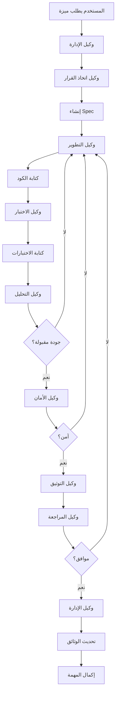

# إطار عمل الوكلاء المطورين

**المشروع:** بصير MVP  
**التاريخ:** 29 نوفمبر 2025  
**المؤلف:** فريق وكلاء تطوير مشروع بصير  
**الحالة:** ✅ نشط ومعتمد

---

## المبدأ الأساسي

**التعاون المنظم** - فريق من الوكلاء المتخصصين يعملون معاً بشكل منسق لتحقيق أهداف المشروع.

---

## 1. هيكل الفريق

### 1.1 الوكلاء الأساسيون

#### أ. وكيل اتخاذ القرار (Decision Agent)

**الدور:** اتخاذ القرارات الاستراتيجية والتقنية

**المسؤوليات:**

- تحليل المتطلبات وتحديد الأولويات
- اختيار التقنيات والأدوات المناسبة
- حل النزاعات التقنية
- الموافقة على التغييرات الكبيرة

**الأدوات:**

- تحليل SWOT
- مصفوفة القرار
- تقييم المخاطر

**مثال على القرارات:**

```yaml
قرار: اختيار Isar كقاعدة بيانات محلية
السبب:
  - أداء عالي
  - دعم Flutter ممتاز
  - سهولة الاستخدام
البدائل المرفوضة:
  - Hive: أداء أقل
  - SQLite: تعقيد أكبر
```

#### ب. وكيل التطوير (Development Agent)

**الدور:** كتابة وتنفيذ الكود

**المسؤوليات:**

- تنفيذ المهام من tasks.md
- كتابة كود نظيف ومختبر
- اتباع معايير الجودة
- إصلاح الأخطاء

**الأدوات:**

- Flutter SDK
- Dart
- Git
- IDE Tools

**معايير العمل:**

- اتباع naming-conventions.md
- اتباع code-quality-standards.md
- اتباع flutter-best-practices.md
- كتابة اختبارات لكل ميزة

#### ج. وكيل التحليل (Analysis Agent)

**الدور:** تحليل الكود والأداء والجودة

**المسؤوليات:**

- تشغيل flutter analyze
- تحليل تغطية الاختبارات
- مراقبة الأداء
- اكتشاف المشاكل المحتملة

**الأدوات:**

- flutter analyze
- flutter test --coverage
- DevTools
- Performance profiling

**التقارير:**

```dart
// مثال على تقرير التحليل
class AnalysisReport {
  final int totalIssues;
  final int errors;
  final int warnings;
  final double testCoverage;
  final List<String> recommendations;
}
```

#### د. وكيل الإدارة (Management Agent)

**الدور:** إدارة المشروع والتنسيق بين الوكلاء

**المسؤوليات:**

- تتبع تقدم المهام
- تحديث الوثائق
- إدارة الجدول الزمني
- التواصل مع المستخدم

**الأدوات:**

- tasks.md
- CHANGELOG.md
- GitHub Projects
- تقارير الحالة

**مقاييس الأداء:**

- عدد المهام المكتملة
- الوقت المستغرق
- جودة التسليم
- رضا المستخدم

#### هـ. وكيل الاختبار (Testing Agent)

**الدور:** ضمان جودة الكود من خلال الاختبارات

**المسؤوليات:**

- كتابة Unit Tests
- كتابة Widget Tests
- كتابة Integration Tests
- تشغيل الاختبارات والتحقق من النتائج

**الأدوات:**

- flutter test
- mockito
- flutter_test package

**معايير الاختبار:**

- تغطية 70%+ للكود
- جميع الاختبارات تنجح
- اختبار الحالات الطبيعية والاستثنائية

#### و. وكيل الأمان (Security Agent)

**الدور:** ضمان أمان التطبيق والبيانات

**المسؤوليات:**

- مراجعة الكود للثغرات الأمنية
- التحقق من تشفير البيانات الحساسة
- فحص التبعيات للثغرات
- تطبيق best practices الأمنية

**الأدوات:**

- flutter_secure_storage
- crypto package
- OWASP guidelines
- Security scanning tools

**قائمة التحقق:**

- [ ] لا توجد بيانات حساسة في الكود
- [ ] استخدام secure storage
- [ ] تشفير كلمات المرور
- [ ] التحقق من جميع المدخلات

#### ز. وكيل التوثيق (Documentation Agent)

**الدور:** توثيق الكود والمشروع

**المسؤوليات:**

- كتابة DartDoc للكود
- تحديث README.md
- تحديث CHANGELOG.md
- إنشاء أدلة المستخدم

**الأدوات:**

- DartDoc
- Markdown
- Documentation tools

**معايير التوثيق:**

- 95%+ تغطية توثيق
- أمثلة عملية
- شرح واضح بالعربية

#### ح. وكيل المراجعة (Review Agent)

**الدور:** مراجعة الكود قبل الدمج

**المسؤوليات:**

- مراجعة Pull Requests
- التحقق من اتباع المعايير
- اقتراح تحسينات
- الموافقة على التغييرات

**معايير المراجعة:**

- اتباع جميع المعايير
- جودة الكود عالية
- الاختبارات موجودة وتعمل
- التوثيق محدث

---

## 2. سير العمل (Workflow)

### 2.1 دورة التطوير الكاملة



### 2.2 مثال عملي: إضافة ميزة جديدة

#### المرحلة 1: التخطيط

**وكيل الإدارة:**

- يستقبل الطلب من المستخدم
- ينشئ مهمة في tasks.md
- يحدد الأولوية

**وكيل اتخاذ القرار:**

- يحلل المتطلبات
- يختار النهج التقني
- يحدد التبعيات

#### المرحلة 2: التطوير

**وكيل التطوير:**

- يقرأ المهمة من tasks.md
- يكتب الكود وفقاً للمعايير
- يلتزم بـ naming-conventions.md

**وكيل الاختبار:**

- يكتب Unit Tests
- يكتب Widget Tests
- يتحقق من التغطية

#### المرحلة 3: الجودة

**وكيل التحليل:**

- يشغل flutter analyze
- يفحص التغطية
- يقيس الأداء

**وكيل الأمان:**

- يراجع الكود للثغرات
- يتحقق من الأمان
- يطبق best practices

#### المرحلة 4: التوثيق

**وكيل التوثيق:**

- يكتب DartDoc
- يحدث README
- يحدث CHANGELOG

#### المرحلة 5: المراجعة

**وكيل المراجعة:**

- يراجع جميع التغييرات
- يتحقق من المعايير
- يوافق أو يطلب تعديلات

#### المرحلة 6: الإكمال

**وكيل الإدارة:**

- يحدث حالة المهمة
- ينشئ تقرير
- يبلغ المستخدم

---

## 3. التنسيق بين الوكلاء

### 3.1 قنوات الاتصال

#### أ. الملفات المشتركة

```
.kiro/specs/          # المواصفات
.kiro/steering/       # المعايير والتوجيهات
tasks.md              # قائمة المهام
CHANGELOG.md          # سجل التغييرات
```

#### ب. التقارير

```
analysis_report.md    # تقرير التحليل
test_report.md        # تقرير الاختبارات
security_report.md    # تقرير الأمان
review_report.md      # تقرير المراجعة
```

### 3.2 بروتوكولات التواصل

#### قاعدة 1: الشفافية

- جميع القرارات موثقة
- جميع التغييرات مسجلة
- جميع المشاكل مبلغ عنها

#### قاعدة 2: المسؤولية

- كل وكيل مسؤول عن مجاله
- لا تداخل في المسؤوليات
- التعاون عند الحاجة

#### قاعدة 3: الجودة

- لا تنازل عن الجودة
- اتباع جميع المعايير
- التحسين المستمر

---

## 4. الأدوات المشتركة

### 4.1 أدوات التطوير

```yaml
Flutter SDK: 3.35.5+
Dart: 3.9.2+
Git: 2.x+
VS Code: latest
Android Studio: latest
```

### 4.2 أدوات الجودة

```yaml
flutter analyze: تحليل الكود
flutter test: الاختبارات
flutter format: التنسيق
dart fix: الإصلاحات التلقائية
```

### 4.3 أدوات الأمان

```yaml
flutter_secure_storage: تخزين آمن
crypto: التشفير
OWASP: معايير الأمان
```

### 4.4 أدوات التوثيق

```yaml
DartDoc: توثيق الكود
Markdown: الوثائق
Mermaid: الرسوم البيانية
```

---

## 5. مقاييس الأداء

### 5.1 مقاييس الفريق

| المقياس              | الهدف         | الحالة         |
| :------------------- | :------------ | :------------- |
| **سرعة التطوير**     | 10 مهام/أسبوع | 🔄 قيد القياس  |
| **جودة الكود**       | A+            | ✅ ممتاز       |
| **تغطية الاختبارات** | 70%+          | 🔄 قيد التحسين |
| **تغطية التوثيق**    | 95%+          | ✅ ممتاز       |
| **الأمان**           | A+            | ✅ ممتاز       |

### 5.2 مقاييس كل وكيل

#### وكيل التطوير

- عدد المهام المكتملة
- جودة الكود
- الالتزام بالمعايير

#### وكيل الاختبار

- تغطية الاختبارات
- نسبة نجاح الاختبارات
- عدد الأخطاء المكتشفة

#### وكيل التحليل

- عدد المشاكل المكتشفة
- وقت التحليل
- دقة التقارير

#### وكيل الأمان

- عدد الثغرات المكتشفة
- عدد الثغرات المصلحة
- درجة الأمان

#### وكيل التوثيق

- تغطية التوثيق
- جودة التوثيق
- وضوح الشرح

---

## 6. حالات الاستخدام

### 6.1 حالة: إصلاح خطأ حرج

**الخطوات:**

1. **وكيل الإدارة:** يستقبل البلاغ ويحدد الأولوية
2. **وكيل التحليل:** يحلل الخطأ ويحدد السبب
3. **وكيل اتخاذ القرار:** يقرر الحل الأمثل
4. **وكيل التطوير:** يصلح الخطأ
5. **وكيل الاختبار:** يكتب اختبار للخطأ
6. **وكيل المراجعة:** يراجع الإصلاح
7. **وكيل الإدارة:** يحدث الوثائق

### 6.2 حالة: إضافة ميزة جديدة

**الخطوات:**

1. **وكيل الإدارة:** ينشئ spec جديد
2. **وكيل اتخاذ القرار:** يراجع المتطلبات
3. **وكيل التطوير:** ينفذ الميزة
4. **وكيل الاختبار:** يختبر الميزة
5. **وكيل الأمان:** يراجع الأمان
6. **وكيل التوثيق:** يوثق الميزة
7. **وكيل المراجعة:** يراجع كل شيء
8. **وكيل الإدارة:** يكمل المهمة

### 6.3 حالة: تحسين الأداء

**الخطوات:**

1. **وكيل التحليل:** يقيس الأداء الحالي
2. **وكيل اتخاذ القرار:** يحدد نقاط التحسين
3. **وكيل التطوير:** ينفذ التحسينات
4. **وكيل التحليل:** يقيس الأداء الجديد
5. **وكيل الاختبار:** يتحقق من عدم كسر شيء
6. **وكيل المراجعة:** يوافق على التحسينات

---

## 7. التحسين المستمر

### 7.1 المراجعة الدورية

**أسبوعياً:**

- مراجعة الأداء
- تحديد المشاكل
- اقتراح تحسينات

**شهرياً:**

- تحليل شامل
- تحديث المعايير
- تدريب الوكلاء

**ربع سنوياً:**

- مراجعة استراتيجية
- تحديث الأدوات
- تقييم النتائج

### 7.2 التعلم من الأخطاء

**عند كل خطأ:**

1. توثيق الخطأ
2. تحليل السبب
3. إيجاد الحل
4. تحديث المعايير
5. منع التكرار

---

## 8. قائمة التحقق اليومية

### للوكلاء جميعاً

- [ ] قراءة المهام الجديدة
- [ ] التحقق من التحديثات
- [ ] مراجعة المعايير
- [ ] التواصل مع الفريق
- [ ] توثيق العمل
- [ ] تحديث الحالة

### لوكيل الإدارة

- [ ] تحديث tasks.md
- [ ] مراجعة التقدم
- [ ] التواصل مع المستخدم
- [ ] حل المشاكل
- [ ] تحديث التقارير

---

## 9. الخلاصة

### الفريق الحالي

✅ **8 وكلاء متخصصين** يعملون معاً  
✅ **سير عمل منظم** ومحدد  
✅ **معايير واضحة** للجميع  
✅ **أدوات متكاملة** للعمل  
✅ **مقاييس أداء** محددة

### الحالة

**جميع الوكلاء نشطون وفعالون!** 🎉

- وكيل اتخاذ القرار: ✅ نشط
- وكيل التطوير: ✅ نشط
- وكيل التحليل: ✅ نشط
- وكيل الإدارة: ✅ نشط
- وكيل الاختبار: ✅ نشط
- وكيل الأمان: ✅ نشط
- وكيل التوثيق: ✅ نشط
- وكيل المراجعة: ✅ نشط

---

**تم إعداده بواسطة:** فريق وكلاء تطوير مشروع بصير  
**التاريخ:** 29 نوفمبر 2025  
**الإصدار:** 1.0  
**الحالة:** ✅ نشط ومعتمد ومفعّل
