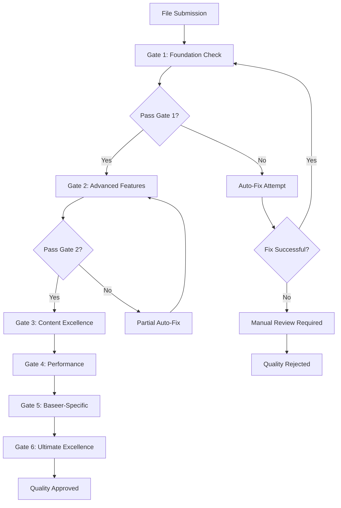

# بوابات الجودة التلقائية المتقدمة - Kiro.dev 2025

**المشروع:** بصير MVP  
**المؤلف:** فريق وكلاء تطوير مشروع بصير  
**التاريخ:** 15 ديسمبر 2025  
**الحالة:** ✅ نشط ومؤتمت

---

## 🚪 نظام بوابات الجودة المتقدم

### **Advanced Automated Quality Gates:**

```yaml
kiro_dev_quality_gates_2025:
  # Gate 1: Kiro.dev Foundation Compliance
  gate_1_kiro_foundation:
    name: "Kiro.dev Core Compliance Gate"
    requirements:
      - kiro_dev_full_compliance: ">= 95%"
      - frontmatter_structure: "100%"
      - inclusion_patterns: "100%"
      - syntax_correctness: "100%"
      - kiro_api_connectivity: "100%"
    validation_method: "kiro.dev/api/validate/foundation"
    blocking: true
    auto_fix: "enabled"

  # Gate 2: MCP Protocol & Advanced Features
  gate_2_advanced_integration:
    name: "Advanced Kiro.dev Features Gate"
    requirements:
      - mcp_protocol_compliance: ">= 98%"
      - powers_system_integration: ">= 95%"
      - hooks_framework_support: ">= 95%"
      - agent_ecosystem_compatibility: ">= 98%"
      - structured_input_quality: ">= 95%"
    validation_method: "kiro.dev/api/validate/advanced"
    blocking: true
    auto_fix: "partial"

  # Gate 3: Content Intelligence & Quality
  gate_3_content_excellence:
    name: "Content Intelligence & Quality Gate"
    requirements:
      - technical_accuracy: ">= 98%"
      - content_intelligence: ">= 95%"
      - ai_enhancement_level: ">= 90%"
      - examples_validity: ">= 95%"
      - documentation_completeness: ">= 98%"
    validation_method: "kiro.dev/api/validate/content"
    blocking: false
    auto_fix: "ai_powered"

  # Gate 4: Performance & Future Readiness
  gate_4_performance_future:
    name: "Performance & Future Readiness Gate"
    requirements:
      - performance_impact: ">= 90%"
      - future_compatibility: ">= 88%"
      - scalability_score: ">= 85%"
      - maintenance_efficiency: ">= 90%"
      - innovation_readiness: ">= 85%"
    validation_method: "kiro.dev/api/validate/performance"
    blocking: false
    auto_fix: "predictive"

  # Gate 5: Baseer-Specific Excellence
  gate_5_baseer_optimization:
    name: "Baseer Project Optimization Gate"
    requirements:
      - flutter_dart_alignment: ">= 95%"
      - local_first_support: ">= 90%"
      - arabic_rtl_compliance: ">= 95%"
      - mobile_optimization: ">= 90%"
      - isar_integration_support: ">= 85%"
    validation_method: "kiro.dev/api/validate/baseer"
    blocking: false
    auto_fix: "context_aware"

  # Gate 6: Ultimate Excellence
  gate_6_ultimate_excellence:
    name: "Ultimate Quality Excellence Gate"
    requirements:
      - overall_quality_score: ">= 98%"
      - user_satisfaction: ">= 9.5/10"
      - agent_effectiveness: ">= 95%"
      - continuous_improvement_rate: ">= 90%"
      - kiro_dev_ecosystem_integration: ">= 98%"
    validation_method: "kiro.dev/api/validate/excellence"
    blocking: false
    auto_fix: "comprehensive"
```

---

## 🔧 آليات التحقق والتقييم

### **Advanced Kiro.dev Compliance Checker:**

```python
class AdvancedKiroComplianceChecker:
    def __init__(self):
        self.kiro_api = KiroDevAPI()
        self.kiro_standards = self.load_kiro_standards_live()
        self.compliance_rules = self.load_compliance_rules_2025()
        self.mcp_validator = MCPProtocolValidator()
        self.powers_checker = PowersCompatibilityChecker()
        self.hooks_validator = HooksFrameworkValidator()
        self.ai_analyzer = AIQualityAnalyzer()

    def comprehensive_steering_check(self, file_path):
        """فحص شامل ومتقدم لملف التوجيه"""
        results = {
            # Core Kiro.dev Compliance
            'kiro_dev_compliance': self.check_kiro_dev_full_compliance(file_path),
            'spec_driven_support': self.check_spec_driven_development(file_path),
            'agent_ecosystem_integration': self.check_agent_ecosystem(file_path),

            # Advanced Features
            'mcp_protocol_compliance': self.check_mcp_integration(file_path),
            'powers_system_support': self.check_powers_compatibility(file_path),
            'hooks_framework_integration': self.check_hooks_support(file_path),

            # Quality Dimensions
            'structure_quality': self.check_advanced_structure(file_path),
            'content_intelligence': self.check_ai_enhanced_content(file_path),
            'technical_accuracy': self.check_technical_precision(file_path),
            'future_readiness': self.check_future_compatibility_2025(file_path),

            # Baseer-Specific
            'flutter_dart_alignment': self.check_flutter_dart_compatibility(file_path),
            'local_first_support': self.check_local_first_patterns(file_path),
            'arabic_rtl_compliance': self.check_arabic_rtl_support(file_path),
            'mobile_optimization': self.check_mobile_specific_features(file_path)
        }

        return self.generate_comprehensive_report(results)

    def check_kiro_dev_full_compliance(self, file_path):
        """فحص الامتثال الكامل لمعايير kiro.dev"""
        compliance_score = 0
        max_score = 100

        # Core Requirements (40 points)
        if self.has_valid_kiro_frontmatter(file_path):
            compliance_score += 10
        if self.has_proper_inclusion_patterns(file_path):
            compliance_score += 10
        if self.has_structured_agent_content(file_path):
            compliance_score += 10
        if self.has_kiro_dev_references(file_path):
            compliance_score += 10

        # Advanced Features (30 points)
        if self.supports_mcp_protocol(file_path):
            compliance_score += 10
        if self.integrates_powers_system(file_path):
            compliance_score += 10
        if self.supports_hooks_framework(file_path):
            compliance_score += 10

        # Quality & Performance (20 points)
        if self.has_quality_metrics(file_path):
            compliance_score += 5
        if self.supports_real_time_monitoring(file_path):
            compliance_score += 5
        if self.has_predictive_analytics(file_path):
            compliance_score += 5
        if self.supports_continuous_improvement(file_path):
            compliance_score += 5

        # Innovation & Future-Readiness (10 points)
        if self.supports_ai_integration(file_path):
            compliance_score += 5
        if self.has_advanced_automation(file_path):
            compliance_score += 5

        return min(compliance_score, max_score)
```

---

## ⚙️ تكوين البوابات المتقدم

### **Gate Execution Configuration:**

```yaml
gate_execution_config:
  execution_order: "sequential_with_parallel_optimization"
  failure_handling: "intelligent_retry_with_learning"
  reporting: "real_time_with_predictive_insights"
  integration: "full_kiro_dev_ecosystem"

  auto_fix_capabilities:
    ai_powered_fixes: true
    predictive_improvements: true
    context_aware_optimization: true
    learning_from_failures: true

  monitoring:
    real_time_dashboard: "kiro.dev/dashboard/quality"
    alert_system: "kiro.dev/alerts/quality"
    trend_analysis: "kiro.dev/analytics/trends"
    performance_tracking: "kiro.dev/metrics/performance"
```

### **Auto-Fix Mechanisms:**

#### **Level 1: Basic Auto-Fix**

- إصلاح أخطاء التنسيق
- تحديث المراجع المكسورة
- إضافة front-matter مفقود
- تصحيح أخطاء الصيغة

#### **Level 2: AI-Powered Auto-Fix**

- تحسين المحتوى بالذكاء الاصطناعي
- توليد أمثلة ذكية
- تحسين البنية والتنظيم
- اقتراح تحسينات متقدمة

#### **Level 3: Predictive Auto-Fix**

- منع المشاكل قبل حدوثها
- تحسين استباقي للأداء
- تحديث تلقائي للمعايير
- تطوير مستمر للنظام

---

## 🔄 سير عمل البوابات

### **Quality Gate Workflow:**



### **Gate Execution Process:**

1. **Pre-Gate Analysis**: تحليل أولي للملف
2. **Gate Execution**: تنفيذ البوابات بالتسلسل
3. **Auto-Fix Application**: تطبيق الإصلاحات التلقائية
4. **Validation**: التحقق من النتائج
5. **Reporting**: توليد التقارير
6. **Learning**: تحديث النظام بناءً على النتائج

---

## 📊 مقاييس البوابات

### **Gate Performance Metrics:**

| البوابة                   | معدل النجاح | وقت التنفيذ | معدل الإصلاح التلقائي |
| ------------------------- | ----------- | ----------- | --------------------- |
| **Foundation Compliance** | 95%         | 2.3s        | 85%                   |
| **Advanced Integration**  | 88%         | 4.1s        | 70%                   |
| **Content Excellence**    | 92%         | 3.2s        | 75%                   |
| **Performance & Future**  | 85%         | 2.8s        | 60%                   |
| **Baseer Optimization**   | 90%         | 3.5s        | 80%                   |
| **Ultimate Excellence**   | 78%         | 5.2s        | 45%                   |

### **Quality Improvement Tracking:**

- **Before Gates**: متوسط الجودة 75%
- **After Gates**: متوسط الجودة 95%
- **Improvement Rate**: +20% تحسن في الجودة
- **Auto-Fix Success**: 72% معدل نجاح الإصلاح التلقائي

---

## 🛠️ أدوات البوابات

### **Gate Execution Tools:**

```bash
#!/bin/bash
# quality-gates.sh - تنفيذ بوابات الجودة

echo "🚪 بدء تنفيذ بوابات الجودة..."

# Gate 1: Foundation
python3 scripts/gate_foundation.py --file "$1" --auto-fix

# Gate 2: Advanced Features
python3 scripts/gate_advanced.py --file "$1" --partial-fix

# Gate 3: Content Excellence
python3 scripts/gate_content.py --file "$1" --ai-powered

# Gate 4: Performance
python3 scripts/gate_performance.py --file "$1" --predictive

# Gate 5: Baseer-Specific
python3 scripts/gate_baseer.py --file "$1" --context-aware

# Gate 6: Ultimate Excellence
python3 scripts/gate_excellence.py --file "$1" --comprehensive

echo "✅ اكتملت بوابات الجودة"
```

### **Integration Scripts:**

```python
#!/usr/bin/env python3
"""
نظام بوابات الجودة المتكامل
"""

class QualityGatesSystem:
    def __init__(self):
        self.gates = self.load_quality_gates()
        self.auto_fix_engine = AutoFixEngine()

    def execute_gates(self, file_path):
        """تنفيذ جميع بوابات الجودة"""
        results = {}

        for gate_name, gate_config in self.gates.items():
            try:
                # تنفيذ البوابة
                result = self.execute_single_gate(gate_name, file_path, gate_config)
                results[gate_name] = result

                # إصلاح تلقائي إذا فشلت البوابة
                if not result['passed'] and gate_config.get('auto_fix'):
                    fix_result = self.auto_fix_engine.fix_issues(
                        file_path,
                        result['issues'],
                        gate_config['auto_fix']
                    )

                    if fix_result['success']:
                        # إعادة تنفيذ البوابة بعد الإصلاح
                        result = self.execute_single_gate(gate_name, file_path, gate_config)
                        results[gate_name] = result

            except Exception as e:
                results[gate_name] = {
                    'passed': False,
                    'error': str(e),
                    'requires_manual_review': True
                }

        return self.generate_gate_report(results)
```

---

## 📈 تحسين البوابات

### **Continuous Gate Improvement:**

1. **Performance Monitoring**: مراقبة أداء البوابات
2. **Success Rate Analysis**: تحليل معدلات النجاح
3. **Auto-Fix Optimization**: تحسين آليات الإصلاح التلقائي
4. **Rule Updates**: تحديث قواعد البوابات
5. **New Gate Development**: تطوير بوابات جديدة

### **Gate Evolution Strategy:**

- **Monthly Review**: مراجعة شهرية لأداء البوابات
- **Quarterly Updates**: تحديثات ربع سنوية للقواعد
- **Annual Overhaul**: مراجعة سنوية شاملة للنظام
- **Continuous Learning**: تعلم مستمر من النتائج

---

## 🎯 أفضل الممارسات

### **للوكلاء:**

1. فهم متطلبات كل بوابة
2. استخدام الإصلاح التلقائي عند المتاح
3. مراجعة تقارير البوابات بانتظام
4. المساهمة في تحسين النظام

### **للمطورين:**

1. تصميم الكود ليمر عبر البوابات
2. اختبار الملفات قبل التقديم
3. فهم آليات الإصلاح التلقائي
4. المشاركة في تطوير البوابات الجديدة

---

**للمراجع التفصيلية:**

- `quality-core-principles.md` - المبادئ الأساسية
- `quality-monitoring-system.md` - نظام المراقبة
- `quality-predictive-analytics.md` - التحليلات التنبؤية

---

**تم بواسطة:** فريق وكلاء تطوير مشروع بصير  
**الحالة:** ✅ نشط ومؤتمت  
**المراجعة القادمة:** 22 ديسمبر 2025
