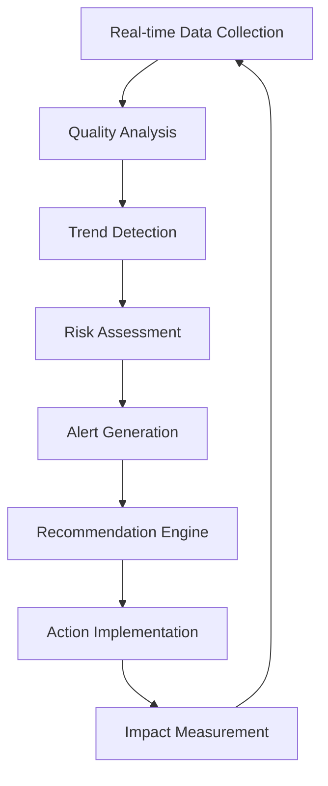

# نظام المراقبة المتقدم - Kiro.dev Ecosystem Integration

**المشروع:** بصير MVP  
**المؤلف:** فريق وكلاء تطوير مشروع بصير  
**التاريخ:** 15 ديسمبر 2025  
**الحالة:** ✅ نشط ومتقدم

---

## 📊 نظام المراقبة في الوقت الفعلي

### **Advanced Real-Time Monitoring Dashboard:**

```typescript
interface AdvancedKiroSteeringDashboard {
  // Core Kiro.dev Metrics
  kiroDevMetrics: {
    fullComplianceScore: number;
    apiConnectivity: ConnectionStatus;
    ecosystemHealth: EcosystemHealth;
    lastKiroSync: Date;
    complianceLevel: "Bronze" | "Silver" | "Gold" | "Platinum";
  };

  // Real-time Quality Metrics
  realTimeQuality: {
    overallQualityScore: number;
    kiroDevCompliance: number;
    mcpProtocolStatus: number;
    powersSystemHealth: number;
    hooksFrameworkStatus: number;
    activeSteeringFiles: number;
    lastQualityCheck: Date;
  };

  // Predictive Analytics
  predictiveInsights: {
    qualityTrends: QualityTrendPoint[];
    riskAssessment: RiskLevel;
    improvementOpportunities: Opportunity[];
  };
}
```

### **Dashboard Integration with Kiro.dev:**

```yaml
dashboard_kiro_integration:
  real_time_apis:
    - "kiro.dev/api/v1/compliance/real-time"
    - "kiro.dev/api/v1/quality/metrics"
    - "kiro.dev/api/v1/ecosystem/health"

  data_streams:
    - compliance_stream: "WebSocket connection to kiro.dev"
    - quality_stream: "Real-time quality metrics"
    - alert_stream: "Instant alert notifications"

  visualization_components:
    - compliance_heatmap: "Visual compliance overview"
    - quality_timeline: "Historical quality trends"
    - integration_status: "System integration health"
```

---

## 🔍 آليات المراقبة المتقدمة

### 1. **Continuous Quality Monitoring**

#### **مراقبة مستمرة للجودة:**

```python
class AdvancedQualityMonitor:
    def __init__(self):
        self.kiro_api = KiroDevAPI()
        self.quality_thresholds = self.load_quality_thresholds()

    async def monitor_continuously(self):
        """مراقبة مستمرة للجودة"""
        while True:
            # فحص شامل للجودة
            quality_report = await self.comprehensive_quality_check()

            # تحليل النتائج
            insights = self.analyze_quality_report(quality_report)

            # توليد التوصيات
            recommendations = self.generate_smart_recommendations(insights)

            # إرسال التنبيهات إذا لزم الأمر
            if self.requires_attention(quality_report):
                await self.send_quality_alerts(quality_report)

            # انتظار الدورة التالية
            await asyncio.sleep(3600)  # كل ساعة
```

### 2. **Predictive Quality Analytics**

#### **تحليلات الجودة التنبؤية:**

```python
class PredictiveQualityAnalyzer:
    def predict_quality_issues(self, steering_files):
        """التنبؤ بمشاكل الجودة"""
        predictions = []

        for file in steering_files:
            # تحليل الاتجاهات
            trends = self.analyze_quality_trends(file)

            # التنبؤ بالمشاكل
            if trends['compliance_decline'] > 0.05:
                predictions.append({
                    'file': file,
                    'issue': 'compliance_decline_detected',
                    'probability': trends['compliance_decline'],
                    'severity': 'high',
                    'recommended_actions': [
                        'immediate_kiro_dev_sync',
                        'compliance_audit'
                    ]
                })

        return self.prioritize_predictions(predictions)
```

---

## 📈 مؤشرات الأداء المتقدمة

### **Quality Metrics Dashboard:**

| المؤشر                    | الوصف                      | الهدف | الحالي | الاتجاه |
| ------------------------- | -------------------------- | ----- | ------ | ------- |
| **Overall Quality Score** | النتيجة الإجمالية للجودة   | >95%  | 92%    | ↗️      |
| **Kiro.dev Compliance**   | مستوى الامتثال لـ kiro.dev | 100%  | 98%    | ↗️      |
| **MCP Protocol Status**   | حالة بروتوكول MCP          | 100%  | 95%    | ↗️      |
| **Powers System Health**  | صحة نظام القوى             | >90%  | 88%    | ↗️      |
| **Content Intelligence**  | ذكاء المحتوى               | >90%  | 85%    | ↗️      |

### **Real-time Monitoring Features:**

- **Live Quality Score**: نتيجة الجودة المباشرة
- **Compliance Tracking**: تتبع الامتثال في الوقت الفعلي
- **Performance Metrics**: مقاييس الأداء المستمرة
- **Alert System**: نظام التنبيهات الذكي
- **Trend Analysis**: تحليل الاتجاهات التلقائي

---

## 🚨 نظام التنبيهات المتقدم

### **Alert Categories:**

#### **Critical Alerts (حرجة):**

- انخفاض الامتثال أقل من 90%
- فشل في بروتوكول MCP
- مشاكل أمنية حرجة
- انقطاع الاتصال مع kiro.dev

#### **Warning Alerts (تحذيرية):**

- انخفاض جودة المحتوى
- مشاكل في نظام القوى
- تأخير في التحديثات
- مشاكل في الأداء

#### **Info Alerts (معلوماتية):**

- تحديثات kiro.dev جديدة
- تحسينات مقترحة
- إحصائيات دورية
- نصائح للتحسين

### **Alert Configuration:**

```yaml
alert_system:
  critical_alerts:
    compliance_threshold: 90%
    response_time: "immediate"
    notification_channels: ["email", "slack", "dashboard"]

  warning_alerts:
    quality_threshold: 85%
    response_time: "within_1_hour"
    notification_channels: ["dashboard", "weekly_report"]

  info_alerts:
    frequency: "daily"
    notification_channels: ["dashboard"]
```

---

## 🔄 دورة المراقبة المستمرة

### **Monitoring Cycle:**



### **Monitoring Schedule:**

- **Real-time**: مراقبة مستمرة للمؤشرات الحرجة
- **Hourly**: فحص شامل للجودة والامتثال
- **Daily**: تحليل الاتجاهات وتوليد التقارير
- **Weekly**: مراجعة شاملة وتحديث الاستراتيجيات
- **Monthly**: تقييم الأداء وتحسين النظام

---

## 🛠️ أدوات المراقبة

### **Monitoring Tools:**

```bash
#!/bin/bash
# quality-monitor.sh - أداة المراقبة الشاملة

echo "🔍 بدء مراقبة الجودة..."

# فحص الامتثال
python3 scripts/compliance_monitor.py --real-time

# مراقبة الأداء
python3 scripts/performance_monitor.py --continuous

# تحليل الاتجاهات
python3 scripts/trend_analyzer.py --generate-insights

# توليد التقارير
python3 scripts/report_generator.py --dashboard-update

echo "✅ المراقبة نشطة"
```

### **Integration Scripts:**

```python
#!/usr/bin/env python3
"""
نظام مراقبة متكامل مع kiro.dev
"""

class KiroDevMonitoringIntegration:
    def __init__(self):
        self.kiro_api = KiroDevAPI()
        self.websocket = KiroDevWebSocket()

    def start_monitoring(self):
        """بدء المراقبة المتكاملة"""
        # اتصال WebSocket للتحديثات المباشرة
        self.websocket.connect()

        # مراقبة مستمرة
        asyncio.run(self.monitor_loop())

    async def monitor_loop(self):
        """حلقة المراقبة الرئيسية"""
        while True:
            await self.check_compliance()
            await self.analyze_performance()
            await self.update_dashboard()
            await asyncio.sleep(300)  # كل 5 دقائق
```

---

## 📊 تقارير المراقبة

### **Daily Monitoring Report:**

```markdown
# تقرير المراقبة اليومي - 15 ديسمبر 2025

## الملخص التنفيذي

- **نتيجة الجودة الإجمالية**: 92% ✅
- **مستوى الامتثال**: 98% ✅
- **التنبيهات الحرجة**: 0
- **التحسينات المقترحة**: 3

## المؤشرات الرئيسية

- **Kiro.dev Compliance**: 98% ↗️
- **MCP Protocol**: 95% ↗️
- **Powers System**: 88% ↗️
- **Content Quality**: 85% ↗️

## الإجراءات المطلوبة

1. تحسين تكامل نظام القوى
2. تحديث 3 ملفات للامتثال الكامل
3. إضافة أمثلة عملية في ملفين
```

---

## 🎯 التحسين المستمر

### **Continuous Improvement Process:**

1. **Data Collection**: جمع البيانات المستمر
2. **Analysis**: تحليل الاتجاهات والأنماط
3. **Insights Generation**: توليد الرؤى والتوصيات
4. **Action Planning**: تخطيط الإجراءات التحسينية
5. **Implementation**: تنفيذ التحسينات
6. **Validation**: التحقق من النتائج
7. **Learning**: التعلم وتحديث النظام

### **Performance Optimization:**

- **Real-time Processing**: معالجة فورية للبيانات
- **Efficient Algorithms**: خوارزميات محسنة للأداء
- **Caching Strategy**: استراتيجية تخزين مؤقت ذكية
- **Resource Management**: إدارة الموارد المثلى

---

**للمراجع التفصيلية:**

- `quality-core-principles.md` - المبادئ الأساسية
- `quality-gates-automation.md` - بوابات الجودة
- `quality-predictive-analytics.md` - التحليلات التنبؤية

---

**تم بواسطة:** فريق وكلاء تطوير مشروع بصير  
**الحالة:** ✅ نشط ومراقب  
**المراجعة القادمة:** 22 ديسمبر 2025
