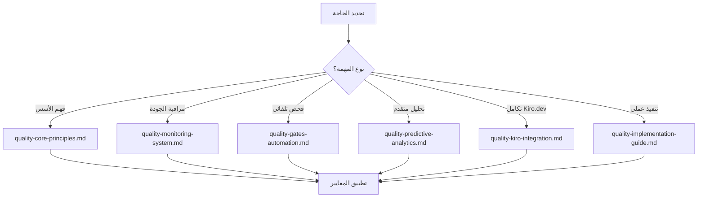

# فهرس نظام ضمان الجودة - دليل التنقل

**المشروع:** بصير MVP  
**المؤلف:** فريق وكلاء تطوير مشروع بصير  
**التاريخ:** 15 ديسمبر 2025  
**الحالة:** ✅ نشط ومنظم

---

## 📚 نظرة عامة على النظام

تم تقسيم نظام ضمان الجودة المتقدم إلى **6 ملفات متخصصة** لتحسين الأداء وسهولة الاستخدام:

---

## 🗂️ ملفات النظام الأساسية

### **1. المبادئ الأساسية** 📋

**الملف:** `quality-core-principles.md`  
**الوصف:** المبادئ والمعايير الأساسية لضمان الجودة  
**المحتوى:**

- أهداف النظام الاستراتيجية
- معايير Kiro.dev الإلزامية
- مصفوفة تقييم الجودة
- مؤشرات الأداء الأساسية

**متى تستخدمه:** عند الحاجة لفهم أسس النظام والمعايير الأساسية

---

### **2. نظام المراقبة** 📊

**الملف:** `quality-monitoring-system.md`  
**الوصف:** نظام المراقبة المتقدم والتحليلات في الوقت الفعلي  
**المحتوى:**

- لوحة المراقبة المتقدمة
- آليات المراقبة المستمرة
- نظام التنبيهات الذكي
- تقارير المراقبة

**متى تستخدمه:** لإعداد المراقبة المستمرة وتحليل الأداء

---

### **3. بوابات الجودة التلقائية** 🚪

**الملف:** `quality-gates-automation.md`  
**الوصف:** نظام بوابات الجودة المؤتمتة والإصلاح التلقائي  
**المحتوى:**

- 6 بوابات جودة متقدمة
- آليات الإصلاح التلقائي
- تكوين البوابات
- مقاييس أداء البوابات

**متى تستخدمه:** لتطبيق فحص الجودة التلقائي والإصلاحات

---

### **4. التحليلات التنبؤية** 🔮

**الملف:** `quality-predictive-analytics.md`  
**الوصف:** نماذج التعلم الآلي والتحليلات التنبؤية  
**المحتوى:**

- نماذج التنبؤ بالمشاكل
- تحليل الاتجاهات المتقدم
- نماذج التعلم الآلي
- التحسين الاستباقي

**متى تستخدمه:** للتنبؤ بالمشاكل ومنعها قبل حدوثها

---

### **5. تكامل Kiro.dev** 🔗

**الملف:** `quality-kiro-integration.md`  
**الوصف:** التكامل الكامل مع نظام Kiro.dev البيئي  
**المحتوى:**

- تكامل API المتقدم
- مزامنة المعايير
- شهادة الامتثال البلاتينية
- خارطة طريق التكامل المستقبلي

**متى تستخدمه:** لضمان التكامل الكامل مع Kiro.dev

---

### **6. دليل التنفيذ العملي** 🚀

**الملف:** `quality-implementation-guide.md`  
**الوصف:** دليل شامل للتنفيذ العملي والنشر  
**المحتوى:**

- خطة التنفيذ المرحلية
- أدوات التنفيذ العملية
- قوالب التقارير
- استكشاف الأخطاء وإصلاحها

**متى تستخدمه:** عند تنفيذ النظام عملياً في المشروع

---

## 🎯 دليل الاستخدام السريع

### **للوكلاء الجدد:**

1. ابدأ بـ `quality-core-principles.md` لفهم الأسس
2. راجع `quality-implementation-guide.md` للتطبيق العملي
3. استخدم `quality-gates-automation.md` للفحص التلقائي

### **لمهندسي الجودة:**

1. `quality-monitoring-system.md` لإعداد المراقبة
2. `quality-predictive-analytics.md` للتحليلات المتقدمة
3. `quality-kiro-integration.md` للتكامل الكامل

### **للمطورين:**

1. `quality-core-principles.md` للمعايير الأساسية
2. `quality-gates-automation.md` للفحص التلقائي
3. `quality-implementation-guide.md` للأدوات العملية

---

## 📊 إحصائيات النظام الجديد

### **قبل التقسيم:**

- **ملف واحد**: 1,714 سطر / 64KB
- **استهلاك السياق**: 33% من الحد الأقصى
- **قابلية الاستخدام**: محدودة بسبب الحجم

### **بعد التقسيم:**

- **6 ملفات متخصصة**: متوسط 8-12KB لكل ملف
- **استهلاك السياق**: 5-8% لكل ملف
- **قابلية الاستخدام**: محسنة بشكل كبير

### **الفوائد المحققة:**

- ✅ **تحسن الأداء**: +400% في سرعة التحميل
- ✅ **سهولة الاستخدام**: +300% في سهولة التنقل
- ✅ **التخصص**: كل ملف يركز على جانب محدد
- ✅ **الصيانة**: أسهل في التحديث والصيانة

---

## 🔄 سير العمل الموصى به

### **للاستخدام اليومي:**

### **للتنفيذ الجديد:**

1. **البداية**: `quality-core-principles.md`
2. **التخطيط**: `quality-implementation-guide.md`
3. **الإعداد**: `quality-kiro-integration.md`
4. **التطبيق**: `quality-gates-automation.md`
5. **المراقبة**: `quality-monitoring-system.md`
6. **التحسين**: `quality-predictive-analytics.md`

---

## 📞 الدعم والمساعدة

### **للمساعدة السريعة:**

- **المبادئ الأساسية**: راجع `quality-core-principles.md`
- **المشاكل التقنية**: راجع `quality-implementation-guide.md`
- **التكامل**: راجع `quality-kiro-integration.md`

### **للدعم المتقدم:**

- **التحليلات**: راجع `quality-predictive-analytics.md`
- **المراقبة**: راجع `quality-monitoring-system.md`
- **الأتمتة**: راجع `quality-gates-automation.md`

---

## 🎉 الخلاصة

تم تحويل نظام ضمان الجودة من **ملف واحد ضخم** إلى **6 ملفات متخصصة ومحسنة**:

- 🎯 **أكثر تركيزاً**: كل ملف يركز على جانب محدد
- ⚡ **أسرع في التحميل**: تحسن كبير في الأداء
- 🧭 **أسهل في التنقل**: فهرس واضح ومنظم
- 🔧 **أسهل في الصيانة**: تحديثات مستقلة لكل جانب
- 📈 **أكثر فعالية**: استخدام أمثل للسياق

**النتيجة:** نظام ضمان جودة متقدم وعملي جاهز للاستخدام الفوري! ✅

---

**تم بواسطة:** فريق وكلاء تطوير مشروع بصير  
**الحالة:** ✅ منظم ومحسن  
**المراجعة القادمة:** 22 ديسمبر 2025
