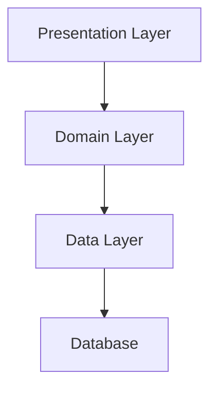
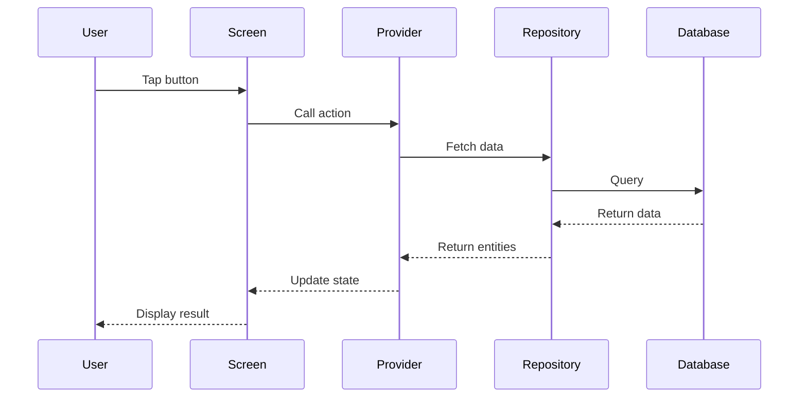
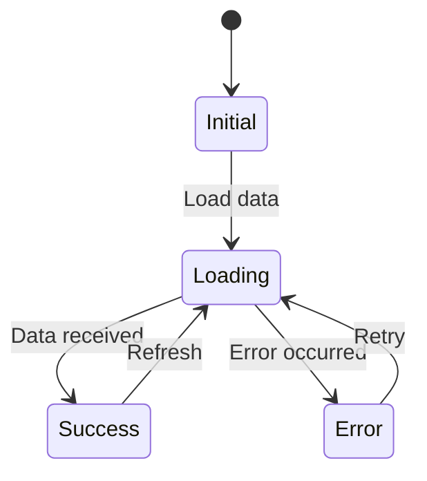

# [Feature Name] Design Document

**Project:** Basser MVP  
**Date:** [Date]  
**Author:** Basser Project Development Agents Team  
**Status:** 🔄 Draft

---

## Design Overview

High-level description of the design approach.

---

## Architecture Diagram (MANDATORY)



---

## Component Design

### 1. Presentation Layer

**Screens:**

- `[Screen]Screen` - Main screen

**Widgets:**

- `[Widget]Card` - Display component
- `[Widget]Form` - Input component

**Providers:**

- `[Entity]sNotifier` - State management

### 2. Domain Layer

**Entities:**

```dart
class [Entity] {
  final String id;
  final String name;
}
```

**Use Cases:**

- `Get[Entity]UseCase`
- `Add[Entity]UseCase`

### 3. Data Layer

**Models:**

```dart
@collection
class [Entity]Model {
  Id id = Isar.autoIncrement;
  late String name;
}
```

**Repositories:**

- `[Entity]Repository` - Data access

---

## Data Flow Diagram



---

## UI/UX Design

### Wireframes

[Add wireframes or mockups]

### Color Scheme

- Primary: `#[color]`
- Secondary: `#[color]`
- Background: `#[color]`

### Typography

- Heading: Cairo Bold, 24px
- Body: Cairo Regular, 16px

---

## State Management

### States

- `Initial` - No data loaded
- `Loading` - Fetching data
- `Success` - Data loaded
- `Error` - Error occurred

### State Transitions



---

## Error Handling

### Error Types

1. **ValidationError** - Invalid input
2. **NetworkError** - Connection failed
3. **DatabaseError** - Storage failed

### Error Messages

- Validation: "Please enter valid data"
- Network: "Connection failed. Please try again"
- Database: "Failed to save. Please try again"

---

## Security Considerations

- [ ] Input validation
- [ ] Secure storage
- [ ] Data encryption
- [ ] Access control

---

## Performance Considerations

- [ ] Lazy loading
- [ ] Caching strategy
- [ ] Pagination
- [ ] Const constructors

---

## Accessibility

- [ ] RTL support
- [ ] Screen reader support
- [ ] Keyboard navigation
- [ ] Color contrast

---

## Notes

Additional design notes or decisions.

---

**Prepared by:** Basser Project Development Agents Team
