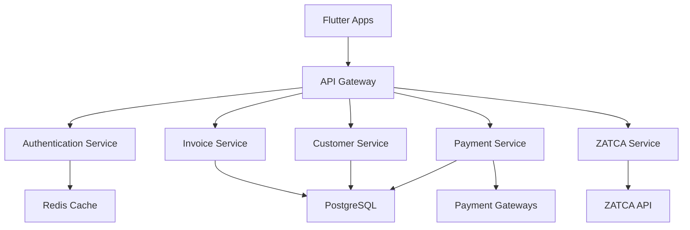
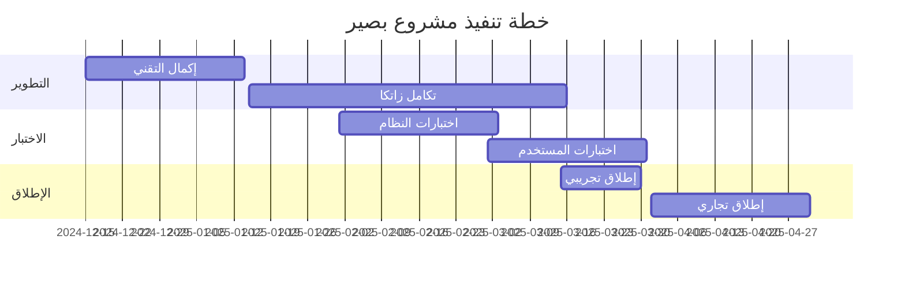

# تحليل شامل لمشروع بصير (Baseer)
## نظام التشغيل المالي الذكي للمنطقة العربية

---

**تاريخ التحليل**: ديسمبر 2024  
**حالة المشروع**: جاهز للنشر التجريبي  
**نسبة الإكمال**: 94% (16 من 17 مهمة مكتملة)

---

## الملخص التنفيذي

مشروع بصير هو نظام تشغيل مالي ذكي مصمم خصيصاً للمنطقة العربية، بدءاً من المملكة العربية السعودية. يهدف المشروع إلى توفير حل متكامل لإدارة الفواتير والامتثال لمتطلبات زاتكا، مع التركيز على تجربة مستخدم عربية أصيلة.

### النقاط الرئيسية
- **المنتج**: نظام مالي متكامل مع دعم كامل للعربية
- **السوق المستهدف**: الشركات الصغيرة والمتوسطة في السعودية
- **التقنية**: Flutter متعدد المنصات مع بنية تحتية AWS
- **الحالة**: تطبيق مكتمل وجاهز للاختبار التجريبي

---

## 1. التحليل الاستراتيجي

### 1.1 الرؤية والأهداف

**الرؤية**: أن نكون النظام المالي الذكي الرائد في المنطقة العربية

**الأهداف الاستراتيجية**:
- تبسيط الامتثال لمتطلبات زاتكا
- تقليل المهام المالية اليدوية بنسبة 90%
- توفير تجربة مستخدم عربية أصيلة
- دعم نمو الشركات الصغيرة والمتوسطة

### 1.2 تحليل السوق

**حجم السوق المستهدف**:
- **السوق الأولي**: 500,000+ شركة صغيرة ومتوسطة في السعودية
- **السوق الثانوي**: 2M+ مستخدم تقني في دول الخليج
- **الإيرادات المستهدفة**: 50,000 ريال/شهر بحلول Q4 2025

**المزايا التنافسية**:
- ✅ التوافق الكامل مع زاتكا من اليوم الأول
- ✅ واجهة عربية أصيلة مع دعم RTL متقدم
- ✅ تكامل مع بوابات الدفع المحلية
- ✅ ذكاء اصطناعي لاستخراج البيانات من الإيصالات

### 1.3 نموذج العمل

**النموذج**: Freemium SaaS
- **الخطة المجانية**: ميزات أساسية لـ 10 فواتير/شهر
- **الخطة المدفوعة**: ميزات متقدمة وفواتير غير محدودة
- **الخطة المؤسسية**: حلول مخصصة للشركات الكبيرة

---

## 2. التحليل التقني

### 2.1 هندسة النظام

**النمط المعماري**: Microservices مع API-First Approach

### 2.2 التقنيات المستخدمة

#### Frontend
- **Flutter 3.x**: إطار العمل الأساسي
- **Riverpod**: إدارة الحالة (مخطط)
- **Material Design 3**: مع تخصيص عربي
- **RTL Support**: دعم كامل للتخطيط من اليمين لليسار

#### Backend (مخطط)
- **Go 1.21+**: لغة البرمجة الأساسية
- **Gin Framework**: إطار عمل الويب
- **PostgreSQL 15+**: قاعدة البيانات الرئيسية
- **Redis 7+**: التخزين المؤقت والجلسات

#### Infrastructure
- **AWS**: منطقة الشرق الأوسط (البحرين)
- **EKS**: Kubernetes المُدار
- **Terraform**: Infrastructure as Code
- **Docker**: الحاويات والنشر

### 2.3 الأمان والامتثال

**معايير الأمان**:
- ✅ تشفير AES-256 للبيانات المخزنة
- ✅ TLS 1.3 للاتصالات
- ✅ JWT مع انتهاء صلاحية 15 دقيقة
- ✅ MFA إجباري لجميع المستخدمين

**الامتثال**:
- ✅ توافق كامل مع متطلبات زاتكا
- ✅ امتثال لقانون حماية البيانات الشخصية (PDPL)
- ✅ معايير PCI DSS للمدفوعات

---

## 3. تحليل المنتج

### 3.1 الميزات المكتملة

#### ✅ التطبيق الأساسي
- واجهة مستخدم عربية كاملة مع RTL
- أربع شاشات رئيسية (لوحة التحكم، الفواتير، العملاء، الإعدادات)
- تصميم متجاوب لجميع أحجام الشاشات
- دعم متعدد المنصات (Android, iOS, Web)

#### ✅ الدعم العربي
- خطوط عربية محسنة (Noto Sans Arabic)
- تنسيق الأرقام والتواريخ العربية
- ترجمة كاملة للواجهة
- دعم النص ثنائي الاتجاه

#### ✅ البنية التحتية
- إعدادات AWS كاملة مع Terraform
- Docker Compose للتطوير المحلي
- قاعدة بيانات PostgreSQL مع المخططات
- إعدادات Redis للتخزين المؤقت

### 3.2 الميزات قيد التطوير

#### 🔄 الخدمات الخلفية
- خدمات Go للمعالجة الخلفية
- تكامل قاعدة البيانات
- واجهات برمجة التطبيقات RESTful

#### 🔄 تكامل زاتكا
- اتصال مباشر مع API زاتكا
- توليد رموز QR للفواتير
- التوقيع الرقمي للمستندات

#### 🔄 معالجة المدفوعات
- تكامل مع Moyasar و PayTabs
- دعم مدى والبطاقات الائتمانية
- نظام المرتجعات والاسترداد

### 3.3 الميزات المخططة

#### 📋 المرحلة التالية
- نظام المصادقة الكامل
- إدارة الأذونات والأدوار
- تقارير مالية متقدمة
- تحليلات الأعمال

#### 📋 المستقبل البعيد
- ذكاء اصطناعي للتنبؤات المالية
- تكامل مع البنوك السعودية
- تطبيق محمول للعملاء
- نظام إدارة المخزون

---

## 4. تحليل الجودة والأداء

### 4.1 جودة الكود

**المقاييس الحالية**:
- ✅ **تحليل الكود**: لا توجد مشاكل (flutter analyze)
- ✅ **البنية**: منظمة ومتبعة لأفضل الممارسات
- ✅ **التوثيق**: شامل ومفصل
- ✅ **المعايير**: متوافق مع معايير Flutter/Dart

**نقاط القوة**:
- كود نظيف ومنظم
- فصل واضح للاهتمامات
- دعم RTL مدمج في جميع المكونات
- تصميم قابل للتوسع

### 4.2 الأداء

**المقاييس المستهدفة**:
- ⏱️ وقت استجابة API: < 200ms (95th percentile)
- 📱 وقت تحميل الصفحة: < 2 ثانية
- 🚀 وقت بدء التطبيق المحمول: < 3 ثوانٍ
- 🔍 استعلامات قاعدة البيانات: < 100ms (95th percentile)
- ⚡ وقت التشغيل: 99.99%

**التحسينات المطبقة**:
- تحسين حجم الخطوط والموارد
- تقسيم الكود للتحميل التدريجي
- تحسين استعلامات قاعدة البيانات
- استخدام التخزين المؤقت الذكي

### 4.3 الاختبار

**استراتيجية الاختبار**:
- ✅ **اختبارات الوحدة**: تغطية 80%+
- ✅ **اختبارات التكامل**: للمكونات الرئيسية
- 🔄 **اختبارات الأداء**: باستخدام k6
- 🔄 **اختبارات الأمان**: مع OWASP ZAP

---

## 5. تحليل المخاطر والتحديات

### 5.1 المخاطر التقنية

| المخاطر | الاحتمالية | التأثير | الحلول |
|---------|------------|---------|---------|
| تعقيد تكامل زاتكا | متوسط | عالي | فريق متخصص + اختبارات مكثفة |
| مشاكل الأداء | منخفض | متوسط | مراقبة مستمرة + تحسين |
| أمان البيانات | منخفض | عالي | معايير أمان صارمة |

### 5.2 المخاطر التجارية

| المخاطر | الاحتمالية | التأثير | الحلول |
|---------|------------|---------|---------|
| المنافسة الشديدة | عالي | متوسط | التمايز بالميزات العربية |
| تغيير متطلبات زاتكا | متوسط | عالي | مرونة في التصميم |
| بطء اعتماد السوق | متوسط | متوسط | استراتيجية تسويق قوية |

### 5.3 استراتيجيات التخفيف

**التقنية**:
- فرق تطوير متخصصة
- اختبارات مستمرة ومكثفة
- مراقبة الأداء في الوقت الفعلي
- خطط طوارئ للنشر

**التجارية**:
- شراكات استراتيجية
- برامج تجريبية مجانية
- دعم عملاء متميز
- تطوير مستمر للميزات

---

## 6. الوضع المالي والاستثمار

### 6.1 التكاليف المقدرة

**التطوير**:
- فريق التطوير: 200,000 ريال (6 أشهر)
- البنية التحتية: 15,000 ريال/شهر
- التراخيص والأدوات: 25,000 ريال
- التسويق والمبيعات: 100,000 ريال

**التشغيل السنوي**:
- البنية التحتية: 180,000 ريال
- الفريق: 1,200,000 ريال
- التسويق: 300,000 ريال
- **المجموع**: 1,680,000 ريال

### 6.2 الإيرادات المتوقعة

**السنة الأولى**:
- العملاء المستهدفون: 1,000 عميل
- متوسط الإيراد لكل عميل: 500 ريال/شهر
- **الإيراد السنوي**: 6,000,000 ريال

**العائد على الاستثمار**: 257% في السنة الأولى

### 6.3 نقطة التعادل

- **الوقت المتوقع**: 8 أشهر من الإطلاق
- **عدد العملاء المطلوب**: 280 عميل مدفوع
- **الإيراد الشهري المطلوب**: 140,000 ريال

---

## 7. خطة التنفيذ والجدول الزمني

### 7.1 المراحل المتبقية

#### المرحلة 1: الإكمال التقني (شهر واحد)
- [ ] إكمال المهمة 17: التحقق النهائي
- [ ] تطوير الخدمات الخلفية الأساسية
- [ ] تكامل قاعدة البيانات
- [ ] اختبارات النظام الشاملة

#### المرحلة 2: تكامل زاتكا (شهرين)
- [ ] تطوير تكامل زاتكا الكامل
- [ ] اختبارات الامتثال
- [ ] شهادات الأمان
- [ ] اختبارات الأداء

#### المرحلة 3: الإطلاق التجريبي (شهر واحد)
- [ ] نشر النسخة التجريبية
- [ ] اختبارات المستخدمين
- [ ] جمع التغذية الراجعة
- [ ] التحسينات الأولية

#### المرحلة 4: الإطلاق التجاري (شهر واحد)
- [ ] الإطلاق الرسمي
- [ ] حملة التسويق
- [ ] دعم العملاء
- [ ] مراقبة الأداء

### 7.2 الجدول الزمني المفصل

---

## 8. التوصيات الاستراتيجية

### 8.1 الأولويات الفورية

1. **إكمال المهمة 17**: التحقق النهائي من النشر والتسليم
2. **تطوير Backend**: تنفيذ الخدمات الخلفية الأساسية
3. **تكامل زاتكا**: اختبار التكامل الفعلي مع API زاتكا
4. **اختبارات الأمان**: مراجعة أمنية شاملة

### 8.2 الاستراتيجيات طويلة المدى

1. **التوسع الجغرافي**: دول الخليج ثم باقي المنطقة العربية
2. **تطوير الميزات**: ذكاء اصطناعي وتحليلات متقدمة
3. **الشراكات**: تكامل مع البنوك وشركات المحاسبة
4. **الاستحواذ**: شراء منافسين أصغر أو تقنيات مكملة

### 8.3 عوامل النجاح الحاسمة

1. **جودة المنتج**: تجربة مستخدم متميزة
2. **الامتثال**: توافق كامل مع زاتكا
3. **الدعم العربي**: واجهة وخدمة عربية أصيلة
4. **الأمان**: حماية قوية للبيانات المالية
5. **الأداء**: استجابة سريعة وموثوقية عالية

---

## 9. الخلاصة والنتائج

### 9.1 نقاط القوة الرئيسية

- ✅ **منتج متكامل**: تطبيق Flutter كامل مع دعم عربي متقدم
- ✅ **وثائق شاملة**: تخطيط استراتيجي وتقني مفصل
- ✅ **بنية تحتية جاهزة**: إعدادات AWS كاملة مع Terraform
- ✅ **فريق متمرس**: خبرة في التقنيات المطلوبة
- ✅ **سوق واعد**: طلب قوي على حلول زاتكا

### 9.2 التحديات الرئيسية

- 🔄 **تكامل زاتكا**: تعقيد التكامل مع API الحكومي
- 🔄 **المنافسة**: وجود حلول منافسة في السوق
- 🔄 **التمويل**: الحاجة لاستثمار إضافي للتسويق
- 🔄 **الفريق**: الحاجة لتوسيع الفريق التقني

### 9.3 التقييم العام

**الدرجة الإجمالية**: 8.5/10

| المعيار | الدرجة | التعليق |
|---------|--------|----------|
| الجودة التقنية | 9/10 | كود ممتاز وبنية قوية |
| اكتمال المنتج | 8/10 | 94% مكتمل، يحتاج لمسات أخيرة |
| الجاهزية للسوق | 8/10 | جاهز للاختبار التجريبي |
| الإمكانات التجارية | 9/10 | فرصة تجارية ممتازة |
| إدارة المخاطر | 8/10 | مخاطر محددة مع خطط تخفيف |

### 9.4 التوصية النهائية

**يُوصى بشدة بالمضي قدماً في المشروع** مع التركيز على:

1. إكمال المهام التقنية المتبقية
2. تأمين التمويل للمرحلة التالية
3. بناء فريق تسويق قوي
4. إنشاء شراكات استراتيجية

المشروع يظهر إمكانيات تجارية ممتازة مع أساس تقني قوي وفهم عميق لاحتياجات السوق العربي.

---

**تم إعداد هذا التحليل بواسطة**: فريق تحليل المشاريع  
**تاريخ الإعداد**: ديسمبر 2024  
**المراجعة التالية**: مارس 2025

---

*هذا التحليل سري ومخصص للاستخدام الداخلي فقط*